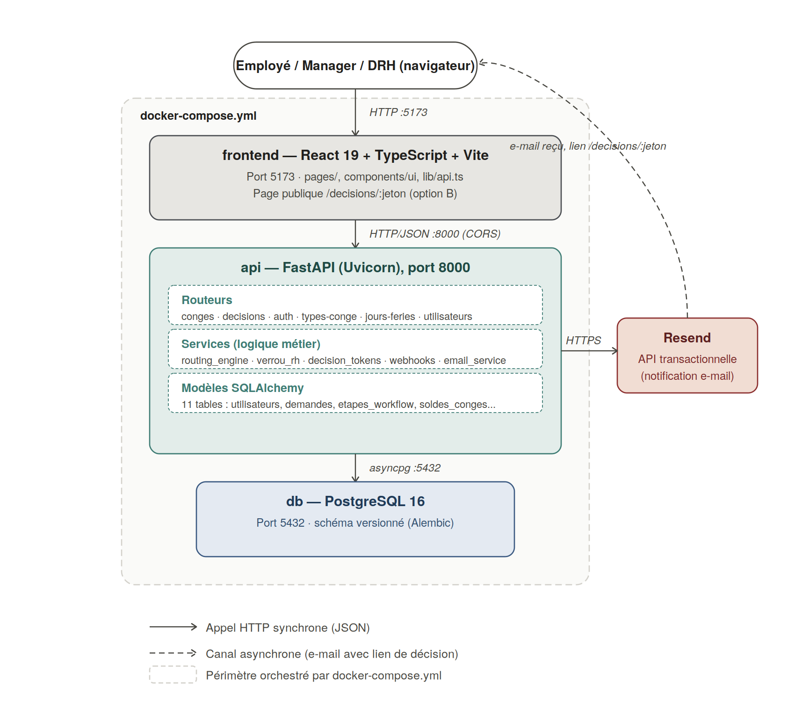

# Plateforme d'approbation de workflows

Backend FastAPI et frontend Next.js de la plateforme d'automatisation des validations internes de l'organisation :
**demandes de congés**, **notes de frais** (avec dérogation budgétaire) et **achats & contrats** (avis juridique puis
signature de la Direction générale). Structuré à partir du *Cahier des charges technique* (V2.8).

> **État au 06/10/2026** : les trois circuits sont livrés de bout en bout, backend **et** frontend, avec discussion
> demandeur ↔ approbateur, rappels automatiques, journal d'audit inaltérable, plusieurs devises, pièces jointes
> jusqu'à 40 Mo et gestion des comptes (dont le rattachement au manager) par la DRH. Vérifié par **463 tests
> backend** (3 ignorés), **229 tests frontend** et des parcours de bout en bout dans un vrai navigateur
> (`scripts/verification/`). Le reste à faire est dans [`ROADMAP.md`](ROADMAP.md) ; la vue d'ensemble fonctionnelle
> et technique dans [`docs/GUIDE_PLATEFORME.md`](docs/GUIDE_PLATEFORME.md). Les sections datées ci-dessous forment le
> **journal** des travaux : elles décrivent l'état au jour indiqué.

## Installation rapide (Docker)

Prérequis : Docker ≥ 24 avec Compose v2, ports 3000, 8000 et 5432 libres.

```bash
cp .env.example .env            # puis changer SECRET_KEY et JWT_SECRET_KEY (voir « Étape 1 »)
docker compose up --build       # base, API (migrations appliquées au démarrage) et frontend
docker compose exec api python3 scripts/seed_demo.py     # comptes et données de démonstration
```

Ouvrir http://localhost:3000 et se connecter, par exemple `drh@demo.tld` / `DrhPass123!` (tous les comptes de
démonstration : « Étape 4 »). API et documentation interactive : http://localhost:8000/docs.
Pour un **déploiement réel**, ne pas utiliser les comptes de démonstration : voir « Mise en production ».

## Journal d'audit : inaltérable en base, consultable, et complété (28/09)

Troisième chantier de la matrice de conformité. Le CDC exige un journal « inaltérable » (2.4) et le
CDC technique (14.3) précise « append-only en base, sans possibilité de modification ou de
suppression par un compte applicatif standard ». Le modèle portait une note « à mettre en œuvre » :
**rien ne l'imposait, et aucune route ne lisait le journal**.

**Inaltérabilité, à trois niveaux** (chacun testé, avec mutation) : déclencheurs PostgreSQL et SQLite
refusant `UPDATE`, `DELETE` et `TRUNCATE` ; garde côté ORM ; création automatique des déclencheurs
en test et par la migration `journal_audit_ajout_seul` (SQL figé, lignes existantes conservées).

**Une limite, établie par l'expérience et non supposée** : le propriétaire de la table est bloqué par
les déclencheurs, **mais un `ALTER TABLE … DISABLE TRIGGER` explicite les neutralise** (un `UPDATE`
a réussi ensuite). D'où une exigence de déploiement : **l'application ne doit pas se connecter avec le
propriétaire des tables** (celui-ci ne sert qu'aux migrations). `scripts/roles_postgresql.sql` crée un
rôle applicatif aux droits ordinaires **sauf** `journal_audit` (`SELECT`, `INSERT` seulement) : il ne peut
ni modifier, ni supprimer, ni vider, ni retirer les déclencheurs. **Validé sur toute l'application** :
parcours réel complet (60/60) sur PostgreSQL, le backend connecté avec ce rôle ; puis tentatives de
falsification sur le journal produit (rôle applicatif : `permission denied` ; propriétaire : refus du
déclencheur ; 15 entrées intactes). `docker-compose.yml` fait encore tourner l'application avec le
propriétaire (pratique de développement) : ne pas reprendre tel quel en production.

**Consultation** : `GET /api/v1/audit/` (action, acteur, cible, dates, pagination, du plus récent au
plus ancien) et l'écran **Journal d'audit** (menu réservé à la DRH, la Direction générale et le
Contrôleur de gestion ; le backend refuse les autres rôles). L'historique d'un dossier
(`GET /demandes/{id}/historique`) est visible de ses participants et affiché sur la page de décision :
un approbateur de second niveau voit ce que le premier a décidé et pourquoi. Le contenu des messages de
discussion n'y figure pas (il a sa propre route).

**Actions d'administration désormais consignées** (11, avec avant / après) : allocation d'un budget,
création, modification (rôle, service, manager), désactivation et réactivation d'un compte, renvoi
d'invitation, solde de congés, types de congé, jours fériés. Jusqu'ici aucune ne l'était : le journal
ne couvrait que 13 actions du circuit. Une modification sans effet ne pollue pas le journal.
(Rectification : j'avais annoncé « douze » écritures d'administration ; il y en a onze.)

**Vérifié** : 26 tests backend dédiés (7 d'immutabilité, 19 de consultation), **6 mutations détectées**
(déclencheurs supprimés, garde ORM update / delete retirée, journal ouvert à tous, historique non limité
au dossier, contenu des messages repris) ; un test garantit que **toute action consignée par le code
possède un libellé** ; 18 tests frontend ; build propre ; migration : 11 descentes / 11 remontées sans
résidu, aucune dérive (PostgreSQL et SQLite), déclencheurs présents dans `scripts/creation_tables.sql`.

**Deux découvertes en chemin** : mes propres tests tentaient d'antidater des entrées *après* insertion -
c'est-à-dire de modifier le journal - et la garde les a refusés (ils insèrent désormais avec
l'horodatage voulu) ; et j'avais écrit la migration avec un heredoc shell non protégé, qui a remplacé
chaque `$$` par un numéro de processus (`960`) - détecté à l'exécution sur PostgreSQL, invisible sous SQLite.

**Limites** : le journal n'est pas chaîné cryptographiquement (un DBA disposant des droits de propriétaire
peut encore le falsifier par DDL ; une empreinte chaînée le rendrait détectable) ; la consultation du
journal n'est pas elle-même journalisée ; ni limitation ni journalisation des connexions (CDC technique
§5) ; l'historique n'est pas affiché dans les listes du demandeur.

## TVA différenciée par ligne du bon de commande (28/09)

Le CDC technique (§4.1) exige des « calculs de taxes différenciés par ligne » et « TVA par taux ».
Un seul taux global (20 %) était jusqu'ici appliqué à un montant supposé TTC, sans jamais de
ventilation par ligne ni par taux.

**Le budget engagé devient dérivé, jamais saisi en double** : dès qu'une demande fournit le détail
des lignes (description, montant HT, taux de TVA propre à chacune), le montant total est calculé
comme la somme des TTC de chaque ligne — un seul chiffre fait foi, jamais deux montants qui
pourraient diverger. Sans lignes, le champ `budget_engage` reste utilisé tel quel : toute demande
antérieure à cette extension continue de fonctionner à l'identique.

**Calcul en `Decimal`, arrondi commercial** (`app/services/facturation.py`, même principe que
`devises.py`) : chaque ligne est calculée individuellement, puis regroupée par taux pour produire
exactement les trois éléments demandés par le CDC — Total HT, TVA par taux (une ligne par taux
distinct), Total TTC.

**Le bon de commande** affiche désormais, quand des lignes existent, un tableau détaillé
(description, HT, taux, TTC par ligne) puis les sous-totaux par taux. Une demande sans lignes
(antérieure à cette extension) produit toujours l'ancien rendu à taux unique — vérifié en réel avec
un vrai rendu WeasyPrint des deux cas.

**Un piège frontend trouvé en testant** : l'attribut HTML `required` sur les champs d'une ligne
bloque la soumission du formulaire au niveau du navigateur dès qu'une ligne vide traîne (par
exemple une ligne ajoutée puis jamais remplie) — avant même que mon `onSubmit` ne s'exécute. Retiré :
la validation (« au moins une ligne avec une description et un montant ») reste faite côté React,
qui filtre les lignes vides avant l'envoi.

**Vérifié** : 7 tests unitaires du calcul (regroupement par taux, arrondi commercial, taux à 0 %,
mode legacy), 14 tests d'intégration, **4 mutations détectées** (regroupement par taux cassé,
arrondi tronqué au lieu de commercial, budget qui ignore les lignes, PDF qui ne regroupe plus par
taux) ; composant frontend `LignesAchat` (6 tests) et bascule dans le formulaire d'achats (5 tests) ;
build propre ; et **96/96 en réel** sur PostgreSQL avec le rôle applicatif restreint, y compris un
achat détaillé en deux lignes à taux différents (20 % et 5,5 %), mené jusqu'à la signature, avec un
vrai bon de commande généré par WeasyPrint (20 227 octets, ni gabarit cassé ni exception).

## Relance manuelle et annulation, parité avec les congés (28/09)

Ces deux actions n'existaient QUE pour les congés — routes absentes pour les notes de frais et les
achats, alors que rien dans le CDC ne les y limite.

**Refactoring d'abord** : `app/services/gestion_demandes.py` extrait la logique partagée
(`annuler`, `relancer`), reprise par les trois routeurs. Le routeur congés a été réécrit pour
l'appeler au lieu de dupliquer sa propre version — plus courte, et testée une seule fois.

**Le rôle décide du lien envoyé** : la relance d'un achat au niveau Signataire (Direction générale)
envoie un lien « signer », jamais « approuver » — même logique que les rappels automatiques
(`app/services/rappels.py`), désormais partagée entre les deux mécanismes via `resume_html` et
`LIBELLES_PROCESSUS` (renommés depuis leurs anciens noms privés, devenus partagés entre modules).

**Deux mécanismes qui restent indépendants** : la relance manuelle ne touche jamais aux colonnes
`dernier_rappel_le` / `nombre_rappels` réservées au planificateur automatique — vérifié par un test
dédié qui relance manuellement puis confirme que ces colonnes n'ont pas bougé.

**Une richesse retrouvée en chemin** : l'e-mail de relance des congés ne reprenait jamais le
commentaire libre du demandeur (perdu dans le refactoring si je n'avais pas vérifié) — ajouté à
`resume_html`, ce qui en profite aussi aux rappels automatiques des congés, qui ne l'affichaient pas
non plus.

**Vérifié** : 20 tests d'intégration backend, **4 mutations détectées** (garde de propriété
retirée pour l'annulation, lien « approuver » envoyé à un Signataire, jeton non révoqué, garde de
rôle retirée pour la relance) ; 24 tests frontend nouveaux (composant partagé `ActionsDemande` : 8 ;
congés : 10, un fichier qui n'avait **jamais eu de test** jusqu'ici ; notes de frais et achats : 3
chacun) ; build propre ; et **91/91 en réel** sur PostgreSQL avec le rôle applicatif restreint —
congés, notes de frais et achats, y compris l'escalade complète d'un achat (Juridique puis Direction
générale) et l'annulation au niveau Signataire.

**Une limite de l'environnement de test découverte en vérifiant en réel** : `RESEND_API_KEY` est
factice dans ce parcours, donc l'envoi réel d'e-mail échoue toujours — `email_envoye` vaut
systématiquement `false` en pratique. Les vérifications réelles ne portent donc que sur la forme de
la réponse (présence des trois champs, code 200), jamais sur la valeur de `email_envoye` ; la valeur
elle-même est couverte par les tests d'intégration, qui simulent l'envoi.

**Deux comptes de démonstration manquants, trouvés en vérifiant en réel** : ni Direction générale ni
la relance/annulation elles-mêmes n'avaient jamais été exercées par ce script — le compte Direction
générale n'existait nulle part dans `scripts/verification/`, ce qui a fait échouer la première tentative
d'escalade complète d'un achat avant que je l'ajoute.

## Plusieurs devises avec conversion, et synthèse comptabilité (28/09)

Décisions tranchées ce jour-là : dérogation pour les congés → non (elle reste rattachée au
dépassement d'enveloppe, absent des congés, conformément au CDC 4.4) ; devise → plusieurs devises
avec conversion ; synthèse comptabilité → e-mail **et** écran/export.

### Plusieurs devises avec conversion

Le CDC demande une « Devise » à saisir et fixe le seuil d'escalade à 500 €. Tout était
implicitement en euros. `app/services/devises.py` centralise la conversion : calcul en `Decimal`,
arrondi commercial (`ROUND_HALF_UP` — 2,675 devient 2,68, pas 2,67 comme en flottant naïf), taux le
plus récent dont la date d'effet n'est pas postérieure à la date de la dépense.

**Le taux est FIGÉ sur la demande à sa soumission** : modifier un taux plus tard ne change jamais
un engagement déjà pris. Testé en le prouvant : un taux corrigé *avant* la décision ne change pas
le montant débité de l'enveloppe.

**Le seuil d'escalade et le budget comparent le montant CONVERTI, jamais le montant brut** — sans
quoi 500 XAF (≈ 0,75 €) déclencheraient l'escalade tandis que 450 GBP (≈ 540 €) y échapperaient.
Vérifié en réel sur PostgreSQL : une note de 800 USD (736 € convertis) franchit bien le seuil de
500 € et escalade réellement vers la Direction financière, deuxième niveau compris.

**Écran d'administration** « Devises » (DRH, Contrôleur de gestion, Direction financière) pour
définir les taux. Formulaires de notes de frais et d'achats : sélecteur de devise (masqué tant
qu'une seule devise existe) et aperçu de conversion anti-rebond, **avant** l'envoi.

**Vérifié** : 10 tests unitaires (arrondi, choix du taux par date, devise de référence
configurable), 28 tests d'intégration, **5 mutations détectées** (seuil sur montant brut, budget
vérifié sur montant brut, budgé débité du montant brut, taux non figé, arrondi tronqué au lieu de
commercial) — la première mutation avait d'abord échappé à un test qui ne distinguait pas montant
brut et converti ; corrigé avec un cas où les deux verdicts diffèrent réellement. 9 tests frontend
du composant partagé, 4 tests de l'écran d'administration. Migration (nouvelle table) : 1 création
/ 1 suppression, aucune dérive, PostgreSQL et SQLite.

### Synthèse des notes de frais transmise à la comptabilité (CDC 3)

Aucun rôle « comptabilité » n'existe dans le système : l'e-mail part vers une adresse configurable
(`COMPTABILITE_EMAIL`, vide par défaut → aucun envoi), à **chaque validation FINALE** d'une note de
frais (jamais à un niveau intermédiaire). Un échec d'envoi ne remet jamais en cause la décision déjà
enregistrée, et n'est journalisé que s'il a réussi (la trace prouve la transmission, pas la
tentative).

**Écran « Synthèse des frais »** (DRH, Direction financière, Contrôleur de gestion) : filtres par
période de validation et par service, totaux par devise, **export CSV**. Le CSV neutralise
l'injection de formule (`=`, `+`, `-`, `@` en tête de cellule préfixés d'une apostrophe — une
description ou une catégorie saisie par un utilisateur et ouverte par la comptabilité est une
surface d'attaque réelle) ; BOM UTF-8 et séparateur `;` pour Excel francophone ; décimales à
virgule. L'export est journalisé (qui, quand, quels critères) — la consultation de l'écran, elle,
ne l'est pas.

**Accès aux pièces, strictement borné** : la Direction financière et le Contrôleur de gestion
peuvent désormais lire les reçus, mais **seulement** ceux d'une note de frais déjà **validée** —
jamais une note en cours, jamais un achat, jamais un congé.

**Vérifié** : 25 tests d'intégration, **5 mutations détectées** (neutralisation CSV retirée, accès
aux pièces sans la garde de statut/processus, e-mail envoyé à un niveau intermédiaire — détectée
seulement en relançant la suite complète, un cas où le test isolé ne suffisait pas — totaux calculés
sur la page affichée au lieu de toute la sélection, export non journalisé). 13 tests frontend de
l'écran.

### Vérification en réel étendue

`scripts/verification/contrat_reel.py` couvre désormais les devises et la synthèse comptabilité de
bout en bout : **75/75** sur PostgreSQL, avec le rôle applicatif restreint. Un premier essai a
révélé un oubli : le mécanisme de décision exige une session active (Option B, CDC technique 9.1),
pas seulement le jeton — mes deux nouveaux appels de décision omettaient le jeton de session et
échouaient avec « Connexion requise ».

## Reçu des notes de frais, justificatif des congés et consultation des pièces par l'approbateur (28/09)

Deuxième chantier de la matrice de conformité : « Photo/Fichier du reçu fiscal » (notes de frais)
et « Justificatif d'absence » (congés) sont des données clés du tableau du CDC (section 3) ; aucune
ne pouvait être déposée (le champ `justificatif_id` des congés référençait une pièce que rien ne
permettait de téléverser). **Le reçu et le justificatif sont facultatifs** (décision du
28/09).

**Un défaut plus large trouvé en chemin** : aucun approbateur ne pouvait consulter la moindre pièce.
Le contrat d'un achat n'était accessible que par un chemin d'API cité dans un e-mail, inutilisable
par un humain. La page de décision affiche désormais les pièces du dossier, téléchargeables.

**Conception**
- *Dépôt après la demande* (le reçu étant facultatif) : la demande existe d'abord, la pièce s'y
  attache ensuite ; un échec d'envoi ne remet jamais en cause la demande - l'écran le signale
  (« Note soumise, mais le reçu n'a pas pu être envoyé… ») et propose de l'ajouter depuis la liste.
  Le formulaire de congés ne redirige alors pas, pour que l'avertissement reste lisible.
- *Une catégorie explicite par pièce* (`contrat`, `recu`, `justificatif`, `complement`,
  `discussion`), déduite du processus par le backend : le client ne la choisit pas. Elle remplace
  l'ancien « contrat = pièce la plus récente sans message », ambigu dès qu'une autre pièce existe.
- *Routes génériques* aux trois processus : dépôt (le demandeur seul, tant que la demande n'est pas
  close - suspension pour précisions comprise), liste et téléchargement (demandeur, DRH, approbateur
  d'une étape de la demande). 10 pièces au plus par demande ; mêmes types et taille (40 Mo) que le
  contrat.
- *Gardes* : la pièce doit appartenir à la demande de l'URL (sinon un approbateur de deux demandes
  croiserait les identifiants) ; les pièces de discussion, qui ont leurs propres règles, sont exclues.

**Migration** : colonne `categorie`. L'autogénération produisait une colonne `NOT NULL` sans défaut,
qui aurait échoué sur une table peuplée ; écrite à la main (ajout avec défaut, reclassement,
retrait du défaut). **Testée sur des lignes réelles insérées avant la migration** (PostgreSQL) : le
contrat est reclassé `contrat`, la pièce de discussion `discussion` ; 10 descentes / 10 remontées,
aucune dérive ; SQLite aussi. Une descente jusqu'à la base vide échoue si un compte invité n'a pas
de mot de passe : c'est le `downgrade` d'une migration antérieure (comptes invités) qui remet
`NOT NULL` sur `mot_de_passe_hash`, pas cette migration.

**Vérifié** : 14 tests backend dédiés, **4 mutations détectées** (pièce non rattachée à la demande
de l'URL, pièces de discussion téléchargeables ici, contrat redevenu « pièce la plus récente »,
approbateur sans accès) ; 16 tests frontend ; build propre ; et **54/54 en réel** à travers le proxy
(reçu, justificatif et complément déposés, relus octet par octet, listés dans l'aperçu de décision
de l'approbateur ; un manager qui n'est pas l'approbateur reçoit 403 ; seul le demandeur dépose).

**Limites** : un approbateur n'est pas prévenu qu'une pièce a été ajoutée après l'e-mail initial ;
pas de suppression ni de remplacement d'une pièce déposée ; pas d'aperçu intégré (téléchargement
seulement) ; le dépôt de compléments d'achats n'a pas d'écran (la route existe).

## Rappels automatiques des décisions en attente (CDC 2.4) — implémentés (28/09)

Première exigence de la matrice de conformité traitée : « relance automatique des dossiers en
attente selon une fréquence paramétrable (ex. toutes les 48 heures) ». Générique aux trois
processus.

**Fonctionnement** : une boucle dans le backend (`services/planificateur.py`, démarrée par le
`lifespan` de l'application - aucun cron ni worker à déployer) repasse toutes les
`RAPPEL_VERIFICATION_MINUTES` (15 par défaut) ; toute étape en attente depuis plus de
`RAPPEL_FREQUENCE_HEURES` (48 par défaut ; 0 désactive) reçoit un rappel numéroté (« Rappel n°2 »)
avec le résumé de la demande, le bloc budget (notes de frais, achats), la mention dérogation /
signature requise, et **de nouveaux liens** de décision. Chaque rappel est consigné au journal
d'audit (`rappel_automatique`).

**Garanties, chacune testée** :
- *Pas de doublon*, même avec plusieurs instances du backend : le rappel est **réservé** par un
  `UPDATE` conditionnel sur l'instant du dernier rappel avant l'envoi ; une seule instance
  obtient la ligne.
- *Jamais de lien perdu* : les anciens liens ne sont révoqués que si l'e-mail part réellement.
  En cas d'échec d'envoi, tout est restauré (l'ancien lien reste valable) et le passage suivant
  réessaie.
- *Bon jeton selon le rôle* : un signataire reçoit « signer », jamais « approuver ».
- *Jamais relancés* : une demande suspendue pour précisions (l'approbateur a lui-même suspendu),
  terminée, refusée, annulée, une étape déjà décidée, un approbateur désactivé.
- *Une passe en échec n'arrête pas la boucle* ; le lot est borné (`RAPPEL_LOT_MAX`).

**Vérifié** : 16 tests, dont l'utilisation réelle du lien reçu dans le rappel pour décider (et
révocation de l'ancien). **Tests de mutation** : j'ai cassé volontairement le code de trois
façons (restauration supprimée, signataire recevant « approuver », réservation sans condition de
temps) - chacune est détectée. **Test réel** (`scripts/verification/`) : vrai serveur, rappels
toutes les ~2 s, note de frais soumise → 2 rappels numérotés 1 et 2, 2 entrées d'audit, décision
réussie via le lien du rappel, puis plus aucun rappel.

**Migration** : `cree_le` (une étape n'avait aucun horodatage de création), `dernier_rappel_le`,
`nombre_rappels`. Mode batch, `func.now()` portable ; cycle complet vérifié sur PostgreSQL (9
descentes jusqu'à la base vide, 9 remontées, aucune dérive) et SQLite. Les étapes déjà en attente
au déploiement reçoivent la date de la migration : premier rappel une période complète plus tard.

**Limites** : l'envoi réel n'est pas observable ici (clé Resend factice) - le test réel remplace
l'envoi par un fichier ; rappel par e-mail uniquement ; pas d'escalade automatique après N rappels.

## Audit de conformité au CDC, processus par processus : des exigences oubliées (28/09)

Demande : vérifier qu'**aucune fonctionnalité exigée n'est omise** pour les congés, les
notes de frais et les achats. Résultat détaillé, exigence par exigence, avec preuves :
**[`docs/matrice-conformite-cdc.md`](docs/matrice-conformite-cdc.md)**. La réponse est non :
des exigences explicites manquaient, dont certaines que mes comptes rendus antérieurs
présentaient comme couvertes.

**Corrigé pendant l'audit**
- **Solde budgétaire affiché au décideur** (CDC 4.3, « obligatoirement affiché de manière
  visuelle dans sa notification de vote ») : il n'apparaissait nulle part. Il figure
  désormais dans l'aperçu de décision (`budget`), sur la page de décision et dans les
  e-mails (bloc vert si l'enveloppe suffit, rouge en cas de dépassement), y compris
  l'e-mail d'escalade vers la Direction financière. Le montant et l'exercice sont ceux
  utilisés à la finalisation : le décideur voit exactement ce qui sera débité.
- **Cohérence chronologique de la date d'une note de frais** (CDC 2.1) : une date future
  est refusée, et le champ du formulaire est plafonné à aujourd'hui.

**Toujours absent** : tableau de suivi/dashboard dédié (501) ; discussion limitée à deux
parties ; historique de bord non fusionné dans le PDF final ; jointure automatique du bon de
commande à la notification de validation (généré à la demande depuis l'écran).

**Une erreur de ma part, à corriger** : j'avais repris le tableau de couverture du CDC
technique (§17.1), qui déclare les relances automatiques couvertes, sans vérifier le code.
Aucun planificateur n'existe.

**Vérifié** : 222 tests backend (dont 9 nouveaux), 77 tests frontend.

## Vérification approfondie de la communication bidirectionnelle (écart n°5) : six défauts trouvés, dont un que j'avais mal rapporté (27/09, suite)

Demande : vérifier « bien » la discussion entre demandeur et approbateur, contre
le texte du CDC (section 4.5) et contre ses cas limites. Méthode : chaque
défaut soupçonné a d'abord fait l'objet d'un test **qui échoue sur le code
existant**, puis a été corrigé.

1. **Injection HTML dans les e-mails.** Les messages de la discussion, les
   motifs de refus (congés, notes de frais, achats) et les champs `tiers` /
   `objet` étaient insérés tels quels dans des e-mails HTML : un demandeur
   pouvait faire recevoir à son approbateur un lien ou un script de son choix
   (hameçonnage). Tout texte saisi est désormais échappé (`html.escape`).
   Prouvé par 2 tests rouges avant correction.
2. **Demande suspendue impossible à retirer.** L'annulation exigeait
   `en_cours` : pendant une suspension, la demande n'était ni décidable ni
   retirable par son auteur. L'annulation est acceptée aussi en
   `complement_demande` ; la page de décision affiche désormais que la demande
   a été annulée/traitée au lieu de proposer un formulaire voué à l'échec.
3. **Pièces complémentaires : absentes, et je l'avais mal rapporté.** Le CDC
   exige « le dépôt de pièces complémentaires au sein de cet espace » ; j'avais
   écrit que `PieceJointe` le couvrait « génériquement » - faux, aucune route
   d'envoi n'existait. Construit : colonne `message_id` (migration), envoi
   `POST /demandes/{id}/messages/avec-fichier` (mêmes gardes qu'un message :
   demande suspendue, deux parties), téléchargement réservé aux participants,
   validation partagée avec le contrat des achats (types, 40 Mo).
   Garde ajoutée : le message doit appartenir à la demande de l'URL (sinon un
   participant lirait la pièce d'une autre demande). Régression évitée : la
   route du **contrat** d'un achat renvoyait « la pièce la plus récente de la
   demande », donc une pièce de discussion aurait remplacé le contrat.
4. **En-tête de téléchargement corruptible.** Le nom de fichier fourni par
   l'utilisateur était placé entre guillemets dans `Content-Disposition` ;
   un guillemet ou un saut de ligne le corrompait. Forme RFC 5987
   pourcentage-encodée à la place (contrat des achats compris).
5. **Discussion non rafraîchie.** Une réponse n'apparaissait qu'après un
   rechargement de page. Le panneau se recharge maintenant toutes les 10 s
   (arrêt au démontage, testé avec une horloge simulée).
6. **Tests qui écrivaient sur la machine.** La suite déposait ses fichiers dans
   `/var/lib/workflows/` (355 fichiers parasites constatés) : elle échouait
   sans droits d'écriture sur ce chemin. Isolée dans un dossier temporaire par
   test.

**Deux défauts de migration, trouvés seulement en testant les `downgrade`**
(jamais testés auparavant) : la clé étrangère générée par Alembic n'avait pas de
nom (le `downgrade` échouait), et `ALTER` d'une contrainte est impossible sur
SQLite. Corrigés (nom explicite, mode batch). Cycle complet vérifié sur
**PostgreSQL** (8 descentes jusqu'à la base vide, 8 remontées, `alembic
check` propre, mêmes `ALTER TABLE` ordinaires) **et SQLite**.

**Vérifié** : 213 tests backend, 73 tests frontend, build propre, contrôle
statique 42/42, et **44/44 en réel** à travers le proxy (dont : suspendre,
répondre, dépôt d'une pièce en multipart, relecture par l'approbateur
identique octet par octet, type de fichier interdit refusé).

**Limites assumées, à connaître** :
- L'échappement des e-mails est prouvé par test (l'envoi réel n'est pas
  observable ici : clé Resend factice) - pas par un e-mail réellement reçu.
- Échange limité au demandeur et à l'approbateur de l'étape ; le CDC mentionne
  aussi « un autre service (ex. la comptabilité) » - non couvert.
- L'historique n'est pas fusionné dans les PDF générés (bon de commande, fiche).
- Rafraîchissement par interrogation toutes les 10 s, pas de push temps réel.
- Pendant une suspension, le demandeur peut répondre ou annuler, pas modifier
  sa demande. Seuls les congés ont une route d'annulation.
- Le rendu réel dans un navigateur (pièces, canvas de signature) reste à voir.

## Vérification de la communication frontend ↔ backend : un vrai trou trouvé, session qui expirait en silence (27/09, suite)

Demande : vérifier la communication entre les deux. Trois contrôles
complémentaires, livrés dans `scripts/verification/` pour être rejoués :

1. **Statique** (`contrat_statique.py`, sans serveur) : chacun des 42 appels
   de `api.ts` doit correspondre à une route réelle du backend (OpenAPI),
   chemin exact - slash final compris - et méthode. 42/42.
2. **Réel** (`contrat_reel.py`) : backend et frontend Next.js démarrés,
   parcours des vrais flux à travers le proxy, sans suivre aucune
   redirection, et **comparaison de chaque réponse aux interfaces
   TypeScript** (tout champ non optionnel déclaré par le frontend doit
   exister dans la réponse réelle). 40/40 : connexion, session, référentiels,
   comptes, budgets, congés, discussion (suspendre → messages → reprendre),
   décision, fiche PDF, note de frais en dérogation, achat multipart (contrat
   relu octet par octet), agenda, jours fériés.
3. **Routes jamais appelées** (contrôle inverse) : c'est lui qui a révélé le
   problème ci-dessous.

**Le trou** : `POST /api/v1/auth/refresh` existait côté backend mais le
frontend ne l'appelait **jamais**. Le jeton de rafraîchissement (14 jours)
était stocké sans servir, et le jeton d'accès (45 min) expirait en silence :
chaque appel échouait ensuite en 401, sans renvoi vers la connexion (seul un
rechargement de page le faisait). Corrigé dans `lib/api.ts` : sur 401, un seul
renouvellement (partagé entre les appels simultanés - le backend renvoie un
NOUVEAU jeton de rafraîchissement à chaque appel, des renouvellements
parallèles s'invalideraient) puis rejeu de la requête, y compris les envois
multipart et les téléchargements ; si le renouvellement échoue, la session est
effacée et `AuthProvider` renvoie vers `/login`. Une connexion refusée
(mauvais mot de passe) ne déclenche aucun renouvellement.

**Vérifié** : 7 tests (renouvellement puis rejeu avec le nouveau jeton,
échec du renouvellement, login sans renouvellement, 3 appels simultanés = 1
seul refresh, rejeu multipart avec son fichier, rejeu de téléchargement,
retour à l'état déconnecté), et en réel le contrat du refresh (nouveaux jetons
utilisables, jeton invalide = 401 JSON).

**Non vérifié en réel** : l'expiration effective en cours d'usage (un vrai
jeton d'accès arrivant à échéance dans un navigateur) - couverte seulement par
les tests simulés et par la vérification du contrat côté backend.

## Frontend : budgets, achats, discussion — et un vrai bug du proxy trouvé par un test de bout en bout (27/09, suite)

**Administration → onglet « Budgets »** : liste des enveloppes (solde en
rouge en cas de dépassement accepté) et formulaire d'allocation. Sans lui,
aucun service n'avait de budget et chaque note de frais ou achat partait
en dérogation. Le champ Service propose les services réellement présents
dans les comptes : le suivi budgétaire retrouve l'enveloppe par
correspondance **exacte** du service du demandeur, une faute de frappe
créerait silencieusement une enveloppe jamais retrouvée.

**Écran Achats (`/achats`)** : dépôt du contrat (upload multipart réel,
fichier obligatoire), case dérogation, téléchargement du contrat et du bon
de commande (seulement pour une demande terminée avec numéro). Le client
n'impose volontairement pas de `Content-Type` : le navigateur y ajoute la
frontière du multipart.

**Interface de discussion** (écart n°5) : composant `DiscussionPanel`
réutilisé partout. Côté approbateur, la page de décision propose « Demander
des précisions » ; une demande suspendue bascule sur la discussion (avec
« Reprendre le workflow »), puis revient au formulaire de décision — le même
lien e-mail reste valable. Côté demandeur, bouton « Discussion » dans les
listes congés, notes de frais et achats quand des précisions sont
demandées. Backend : l'aperçu de décision expose désormais `demande_id` et
`statut_demande` (test : l'aperçu reste lisible pendant une suspension).

**Le vrai bug, invisible des tests unitaires** : un test de bout en bout
réel (backend + frontend Next.js démarrés, requête `curl` multipart) a
montré que le proxy répondait **308** à toute URL à slash final
(`/api/v1/achats/`). Next.js retire le slash final par défaut alors que les
routes FastAPI sont déclarées avec ; chaque liste/création passait donc par
une redirection, et un client ne la suivant pas échouait. Corrigé
(`skipTrailingSlashRedirect` + relais du slash tel que reçu), vérifié en
réel avec un faux upstream dont le journal montre le chemin exact reçu
(`POST /api/v1/achats/` avec slash, `GET /api/v1/auth/me` sans), puis avec
le vrai backend : upload multipart → 201, 0 redirection, contrat relu
**identique octet par octet**.

**Piège de vérification** : plusieurs appels de ce sandbox ayant expiré
« sans raison » venaient de `pkill -f "<motif>"`, qui tue son propre shell
quand le motif figure dans la ligne de commande du script — pas seulement
de l'instabilité de l'environnement.

**Vérifié** : 200 tests backend, 59 tests frontend, build de production
propre. **Non vérifié** : le tracé réel de la signature au canvas et
l'apparence de ces écrans dans un vrai navigateur (jsdom seulement).

## Frontend : notes de frais et page de décision générique (27/09, suite)

Premier écran frontend au-delà des congés : **Notes de frais**
(`/notes-frais`, lien ajouté à la sidebar) - formulaire de soumission avec
case « demande de dérogation motivée » (motif obligatoire, révélé à la
demande) et liste des notes avec leur statut. Un budget insuffisant
renvoyé par le backend coche automatiquement la dérogation pour guider
l'utilisateur, plutôt que de lui laisser deviner.

**Un manque backend trouvé avant de pouvoir écrire la page de décision** :
aucune route ne permettait de savoir, avant de soumettre, à quoi un jeton
de décision donnait droit (quel processus, signature requise, dérogation
ou non). Ajout de `GET /api/v1/decisions/{jeton}` (lecture seule - il
réutilise la vérification du jeton qui, malgré son nom, ne le consomme pas ;
testé : un POST reste possible juste après un GET).

**Un vrai bug de l'ancien frontend, trouvé en relisant la page de
décision** : elle affichait deux boutons, Approuver et Refuser, alors que
l'action réelle est portée par le **jeton** (un lien e-mail = une action).
Cliquer « Refuser » sur un lien d'approbation approuvait donc réellement la
demande. La page est réécrite, générique aux trois processus : elle lit
l'aperçu du jeton et n'affiche qu'un bouton de confirmation
correspondant à l'action réelle, avec le formulaire adapté - signature
(canvas tactile/souris, `SignaturePad`) pour « signer », justification
d'acceptation pour une dérogation approuvée, commentaire obligatoire pour
un refus. `decider()` accepte désormais ces champs.

**Vérifié** : 35 → 39 tests frontend (Vitest) dont : un jeton
d'approbation n'expose aucun bouton Refuser, signature requise avant
appel API, justification requise pour une dérogation, jeton invalide sans
formulaire, non-régression de la connexion depuis la page de décision ; 4
tests pour la page Notes de frais. Build de production propre.
Backend : **199 passed** (2 tests de l'aperçu de décision).

**Reste à faire côté frontend** : plus rien de ce qui précède (voir la
section suivante, plus récente). Le canvas de
signature n'a pu être testé qu'avec un composant simulé (jsdom
n'implémente pas `canvas`) - à valider dans un vrai navigateur.

## Dérogations et arbitrage exceptionnel (écart n°4, section 4.4 du CDC fonctionnel) — implémenté pour notes de frais et achats (27/09, suite)

Dernier des cinq écarts fonctionnels du CDC restant à traiter. Le
manquement décrit : les règles de routage sont déterministes et rigides -
si une demande dépasse un seuil, elle suit le chemin tracé, sans notion de
"demande de dérogation explicite" avec un traitement souple. L'exigence :
si le demandeur coche une case de dérogation motivée **OU** si le suivi
budgétaire détecte un dépassement, le flux doit être immédiatement
détourné vers une instance d'arbitrage supérieure (Direction générale ou
Contrôleur de gestion), avec motif et justification d'acceptation
obligatoires, gravés dans le journal d'audit.

**Décision de conception tranchée, pas glissée sous le tapis** : le CDC
dit littéralement "coche... OU dépassement" - les deux déclenchent le
même détournement. Cela change un comportement déjà en place : un budget
insuffisant pour les notes de frais et les achats **bloquait** jusqu'ici
la soumission (422 pur et simple). Il **détourne** désormais vers
l'arbitre à la place, exactement comme une dérogation motivée cochée
volontairement - le blocage strict n'a plus lieu d'être une fois ce
mécanisme en place.

**Vraie migration Alembic** — `EtapeWorkflow.est_derogation` (booléen),
vérifiée contre un vrai PostgreSQL 16. Un vrai bug trouvé et corrigé
avant même de l'appliquer : la colonne générée par l'autogénération
Alembic était `NOT NULL` **sans** valeur par défaut - aurait fait
échouer la migration sur une table `etapes_workflow` déjà peuplée en
production. Corrigé manuellement (`server_default`) avant application.

**Circuit à un seul niveau, en détournement complet** (pas un niveau
ajouté après coup comme l'escalade conditionnelle des notes de frais) :
`routing_engine.determiner_etape_derogation` route vers un compte actif
de rôle Contrôleur de gestion en priorité, Direction générale en repli
(ACHATS). **Depuis le 07/10, pour une NOTE DE FRAIS l'arbitre est la
Direction financière seule** : ni Contrôleur de gestion, ni repli sur la
Direction générale ; sans compte Direction financière actif, la soumission
échoue (422) avec un message explicite.
Garde ajoutée dans `determiner_etape_suivante` : une étape de dérogation
approuvée termine toujours le circuit directement, sans jamais
déclencher par erreur l'escalade normale du processus (montant au-delà
du seuil notes de frais, second niveau achats).

**Justification d'acceptation obligatoire, uniquement pour approuver** —
jamais pour un refus (déjà couvert par le commentaire obligatoire
existant), jamais pour une décision ordinaire. Motif de dérogation et
justification d'acceptation écrits dans le journal d'audit, comme
l'exige le CDC.

**Un vrai bug trouvé et corrigé, distinct de celui de la migration** :
dans `app/routers/achats.py`, le payload est construit à la main (champs
`Form`, jamais un corps JSON géré automatiquement par FastAPI comme pour
les notes de frais) - une erreur de validation Pydantic (motif de
dérogation manquant) y remontait en 500 au lieu d'un 422 propre. Corrigé
par une conversion explicite en `HTTPException`.

**Vérifié réellement** — 7 nouveaux tests d'intégration
(`tests/integration/test_derogations_api.py`) : budget insuffisant sans
motif rejeté (422) ; avec motif, routé vers l'arbitre et non le manager ;
dérogation cochée même avec budget largement suffisant, routée quand
même ; approbation sans justification rejetée (422) ; avec justification,
circuit terminé et budget consommé **en négatif** (le dépassement est
bien accepté, pas juste toléré silencieusement) ; refus sans besoin de
justification, budget jamais touché ; repli sur Direction générale
vérifié en l'absence de Contrôleur de gestion actif.

Suite complète rejouée : **197 backend passed, 0 skipped**.

## Communication bidirectionnelle (écart n°5, section 4.5 du CDC fonctionnel) — implémentée, générique aux trois processus (27/09, suite)

Demande explicite : réfléchir à l'implémentation de l'espace de
communication bidirectionnelle décrit par le CDC — le flux standard est
strictement linéaire, la seule option d'un approbateur qui a un doute est
le refus global, obligeant le demandeur à tout ressaisir. Comme pour
`PieceJointe` avant les achats, l'infrastructure existait déjà sans être
câblée : `StatutDemande.COMPLEMENT_DEMANDE` et
`EvenementWebhook.COMPLEMENT_DEMANDE` figuraient dans les enums depuis le
début, utilisés nulle part ; `StatutEtape.EN_COURS` n'était lui non plus
jamais assigné - repris ici pour signifier "étape en discussion".

**Générique par construction**, comme le reste de l'infrastructure
(Demande, EtapeWorkflow) : un seul nouveau routeur
(`app/routers/clarifications.py`) s'applique aux trois processus, sans
code spécifique à dupliquer par type de demande.

**Vraie migration Alembic** — nouvelle table `messages_clarification`
(id, demande_id, auteur_id, contenu, horodatage), vérifiée contre un vrai
PostgreSQL 16 (`alembic check` : aucune dérive), `scripts/creation_tables.sql`
régénéré.

**Quatre routes** : `POST .../suspendre` (réservée à l'approbateur
attendu de l'étape en cours — bascule `demande.statut_global` sur
`complement_demande` et `etape.statut` sur `en_cours`, avec un premier
message obligatoire) ; `POST .../messages` et `GET .../messages`
(échange réservé aux deux parties directement concernées - le demandeur
et l'approbateur de l'étape suspendue) ; `POST .../reprendre` (réservée
au même approbateur — remet le circuit en état `en_attente`, le jeton de
décision déjà envoyé par e-mail reste valable tel quel).

**Un vrai garde-fou vérifié, pas supposé** : tant que la demande est en
`complement_demande`, `app/routers/decisions.py` refuse déjà toute
décision (vérification `statut_global == EN_COURS` préexistante) - testé
explicitement en générant un nouveau jeton pour l'étape suspendue et en
confirmant le rejet (409). Message d'erreur affiné au passage : il disait
auparavant la même chose ("étape déjà décidée") que la demande soit
réellement déjà tranchée ou simplement en discussion - trompeur pour
l'auteur de la suspension lui-même. Distingue désormais les deux cas.

**Périmètre délibéré, écrit clairement** : la discussion se limite aux
deux parties directement concernées - le CDC mentionne aussi "un autre
service (ex. la comptabilité)" comme participant possible, non couvert
ici (nécessiterait un mécanisme d'invitation de tiers). L'historique
reste consultable indéfiniment en base (jamais supprimé) - "annexé au
dossier final" au sens où il n'est jamais détaché de la demande, mais
n'est pas fusionné dans un document PDF généré (bon de commande, fiche
de confirmation...).

**Un vrai bug trouvé en écrivant les tests, pas un bug applicatif** :
`app.dependency_overrides[get_current_user]`, posé par un helper de test
pour simuler l'employé à la soumission, n'était jamais retiré après
usage - toutes les requêtes suivantes du même test, y compris celles
avec un vrai jeton JWT différent en en-tête, résolvaient silencieusement
vers ce même employé au lieu du vrai utilisateur visé. Corrigé par un
`try/finally` explicite dans le helper concerné.

**Vérifié réellement** — 8 nouveaux tests d'intégration : suspension
réservée au bon approbateur (403 sinon), décision bloquée pendant la
discussion (409, message précis), échange de messages fonctionnel,
tiers exclu en lecture et en écriture (403), message impossible hors
suspension (409), reprise réservée au bon approbateur puis décision
possible de bout en bout.

Suite complète rejouée : **190 backend passed, 0 skipped**.

## Signature électronique réelle pour le rôle Signataire, distincte d'une simple approbation (27/09, suite)

Demande explicite : est-ce que la signature électronique des documents
"passe aussi" ? Vérifié en lisant le code, pas en supposant : la réponse
était non. `app/routers/decisions.py` ne distinguait jamais le rôle de
l'étape (`etape.role`) - deux actions seulement existaient partout,
`approuver`/`refuser`, y compris pour la Direction générale (rôle
Signataire, section 8 : *"Capturer une signature à l'écran, ou
refuser"*). Le bon de commande se contentait d'imprimer un nom, jamais un
tracé réellement capturé.

**Vraie migration Alembic** — `signature_cle_stockage` (nullable) ajoutée
à `etapes_workflow`, vérifiée contre un vrai PostgreSQL 16 (`alembic
check` : aucune dérive), `scripts/creation_tables.sql` régénéré en
conséquence.

**La distinction "signer" / "approuver" est garantie au niveau du jeton
lui-même**, pas par une case à cocher supplémentaire : pour une étape de
rôle Signataire, un jeton `approuver` n'est désormais **jamais généré** -
seulement `signer` ou `refuser`. C'est ce choix, au moment de la
génération du jeton lors de l'escalade (`app/routers/decisions.py`), qui
rend la contrainte réelle plutôt que déclarative.

**Défense en profondeur ajoutée**, et sa nécessité confirmée en pratique :
une vérification explicite rejette désormais (400) tout jeton `approuver`
présenté pour une étape de rôle Signataire, quelle qu'en soit l'origine -
pas seulement "on fait confiance à ne jamais en générer un". Cette
vérification s'est révélée immédiatement utile : en écrivant les tests
du bon de commande la semaine précédente, les jetons de la Direction
générale avaient été **forgés directement avec l'action "approuver"**
(contournant sans le vouloir la vraie contrainte, jamais exercée par ces
tests) - les 4 tests concernés ont dû être corrigés pour utiliser
"signer" avec une vraie image, en plus d'un nouveau test qui vérifie
explicitement qu'un jeton "approuver" forcé est bien rejeté.

**Signature réellement capturée et intégrée** : une image PNG (base64)
est désormais obligatoire pour l'action "signer" (422 sinon), décodée et
stockée via `stockage_fichiers.py` (même point d'abstraction que le
contrat), puis réellement embarquée dans le bon de commande final
(`` avec l'image réelle plutôt qu'un nom imprimé sur une ligne).

**Vérifié réellement** — 4 nouveaux tests d'intégration : la Direction
générale ne reçoit bien jamais de jeton "approuver" ; "signer" sans image
est rejeté (422) ; un jeton "approuver" forcé sur une étape Signataire
est rejeté (400) ; le contenu stocké correspond exactement aux octets
envoyés, et le bon de commande se génère bien avec l'image intégrée.

**Reste hors périmètre, sans changement** : le certificat de validation
demeure une mention imprimée (identités des deux décideurs, horodatage,
référence au mécanisme de jetons à usage unique), pas un certificat
cryptographique distinct liant la signature au document.

Suite complète rejouée : **182 backend passed, 0 skipped**.

## Achats : dépôt du contrat et bon de commande final réels, deux trous concrets trouvés en vérifiant contre le CDC (27/09, suite)

Demande explicite : vérifier "Validation d'Achats & Contrats" contre le
texte du CDC, pas se contenter de relire ce qui avait déjà été écrit.
Cette vérification a fait remonter deux trous réels, au-delà du circuit
d'approbation déjà construit :

1. **"Fichier du contrat"** (une des quatre données clés à capturer,
   section 3) était absent du schéma de soumission - et plus révélateur
   encore, le modèle `PieceJointe` (table `pieces_jointes`) existe depuis
   la toute première migration mais n'était utilisé **nulle part** dans
   tout le code.
2. **Le livrable final** ("Document contractuel revêtu des signatures
   électroniques avec son certificat de validation", section 3 ; bon de
   commande numéroté avec calculs de TVA, écart n°1, section 4.1 du CDC
   technique) n'existait pas du tout - `app/services/documents.py` ne
   savait générer que la fiche de confirmation des congés.

Une hypothèse a été examinée puis écartée avec une preuve textuelle
directe plutôt que par supposition : le rôle "Approbateur" bloquant
attribué au Service juridique aurait-il dû être "Recommandeur" (non
bloquant, section 8) ? Le CDC technique tranche lui-même explicitement
cette question dans sa propre section d'audit de pertinence : seuls 3
rôles sur 7 sont requis par les trois processus - Approbateur, Signataire,
Destinataire en copie - et "Recommandeur" y est nommément écarté. Le choix
initial (Juridique = Approbateur bloquant) était donc déjà correct.

**Dépôt du contrat** — `POST /api/v1/achats/` passe de JSON à
`multipart/form-data` (changement de contrat d'API assumé, nécessaire pour
recevoir un vrai fichier) : `fichier_contrat` est désormais obligatoire,
limité à 40 Mo (constante unique `TAILLE_MAX_MO` de `stockage_fichiers.py`, miroir
`frontend/src/lib/fichiers.ts` ; **si un reverse proxy est placé devant l'application, il doit
accepter au moins 41 Mo** - par exemple nginx `client_max_body_size 41m;` - sinon il refuse
le fichier avant qu'il n'atteigne l'application), types acceptés (PDF, Word, PNG, JPEG). Stocké via un
nouveau point d'abstraction unique, `app/services/stockage_fichiers.py`
(même principe que `email_service.py` pour Resend) : écriture sur disque
local en attendant NubiS3 (non raccordé à ce jour), derrière un contrat
stable (clé de stockage opaque, octets bruts) qui ne changera pas le jour
où NubiS3 sera branché. Une dépendance réellement manquante a été trouvée
en testant l'import de l'application après ce changement :
`python-multipart`, nécessaire à FastAPI pour tout champ `Form`/`File` et
absente de `requirements.txt` - aurait cassé un vrai déploiement.
Téléchargement (`GET /api/v1/achats/{id}/piece-jointe`) réservé au
demandeur et aux rôles impliqués dans la décision (service juridique,
direction générale, DRH).

**Bon de commande final** — généré à la demande
(`GET /api/v1/achats/{id}/bon-de-commande`), même choix architectural que
la fiche de confirmation des congés (pas de stockage persistant de
fichiers générés). Numéro chronologique unique et séquentiel
(`BC-{exercice}-{rang:04d}`) attribué **une seule fois**, à la
finalisation réelle du circuit, et persisté dans les données de la
demande - pas recalculé à chaque téléchargement, ce qui aurait pu changer
le numéro d'un appel à l'autre. Hypothèse assumée et documentée dans le
code (non précisée par le CDC) : le montant saisi est TTC, ventilé en
HT/TVA au taux configuré (20 % par défaut). Le certificat de validation
reste une mention imprimée (identités des deux décideurs, horodatage,
référence au mécanisme de jetons à usage unique), pas un certificat
cryptographique distinct. La signature elle-même, à l'action "approuver"
au moment d'écrire cette section, est réellement capturée depuis - voir
la section dédiée plus haut dans ce document (donc plus récente).

**Un vrai bug trouvé en écrivant les tests, pas dans les tests
eux-mêmes** : la numérotation séquentielle comptait la demande courante
en train d'être finalisée deux fois (elle est déjà marquée `terminee` par
un commit antérieur dans la même fonction, avant que le bloc de
numérotation ne s'exécute) - la toute première demande achat de l'année
recevait `BC-2026-0002` au lieu de `BC-2026-0001`. Corrigé en excluant
explicitement la demande courante du comptage.

**Vérifié réellement** — 5 nouveaux tests d'intégration : contrat
téléchargeable par le demandeur, inaccessible à un tiers sans rôle
pertinent (403), type de fichier refusé (422), bon de commande
indisponible avant finalisation complète (409), numérotation séquentielle
correcte et stable à travers deux achats finalisés et un second
téléchargement du même document.

Suite complète rejouée : **178 backend passed, 0 skipped**. Aucune
nouvelle migration nécessaire (`PieceJointe` existait déjà).

## Processus "Achats et contrats" implémenté côté backend : circuit fixe à deux niveaux, sans manager (27/09, suite)

Écart notable avec les deux autres processus : **aucun manager n'intervient
dans le routage des achats** (CDC section 3) — le circuit est fixe, sans
logique conditionnelle : avis du Service juridique (niveau 1), puis
toujours signature de la Direction générale (niveau 2, rôle Signataire,
section 8). `routing_engine.py` a donc dû changer de nature : au lieu de
chercher le manager du demandeur, `determiner_premiere_etape` et
`determiner_etape_suivante` recherchent maintenant un **compte actif du
rôle attendu** (Service juridique, puis Direction générale) — un
changement de signature qui a cassé les deux appelants existants (congés,
notes de frais) et le test unitaire dédié, tous corrigés dans la foulée
(`db` est désormais un paramètre requis).

**Le suivi budgétaire (écart n°3) est réutilisé tel quel**, comme pour les
notes de frais — même fonction, même principe de consommation
uniquement à la finalisation réelle du circuit (jamais à un niveau
intermédiaire).

**Un écart trouvé et corrigé en généralisant le code partagé** : la
notification envoyée au nouvel approbateur lors d'une escalade (dans
`app/routers/decisions.py`, code partagé par tous les processus) était
encore rédigée en dur pour "note de frais" — un achat escaladé aurait
reçu un e-mail parlant de "note de frais" par erreur. Généralisé : le
libellé, le sujet et le motif de la notification dépendent maintenant du
processus réel de la demande.

**Vérifié réellement** — 5 nouveaux tests d'intégration
(`tests/integration/test_achats_api.py`) : budget insuffisant, aucun
compte Service juridique actif, circuit complet (avis juridique → budget
non consommé → signature DG → budget consommé une seule fois), refus à
chaque niveau (aucun budget touché), aucune Direction générale active à
l'escalade (422 propre, pas un 500). Complétés par 5 tests unitaires du
moteur de routage (`tests/unit/test_routing_engine.py`, entièrement
réécrit avec la nouvelle signature).

**Vérification "assurance" faite avant de conclure cette passe** :
`alembic check` rejoué contre un vrai PostgreSQL 16 après tous ces
changements — aucune dérive de schéma détectée (attendu : aucun nouveau
champ de modèle, seulement des services et routeurs).

**Reste explicitement hors périmètre** : aucun écran frontend. Le dépôt
du contrat, le bon de commande final et la signature graphique du rôle
Signataire, hors périmètre au moment d'écrire cette section, sont réels
depuis - voir les sections suivantes (plus haut dans ce document, donc
plus récentes).

Suite complète rejouée : **173 backend passed, 0 skipped** — plus aucun
squelette de test dans tout le projet.

## Processus "Notes de frais" implémenté côté backend : suivi budgétaire réel et premier routage conditionnel multi-niveaux (27/09)

Jusqu'ici, `app/routers/notes_frais.py` et
`app/services/extensions/suivi_budgetaire.py` étaient des squelettes purs
(`501 Not Implemented` / `NotImplementedError`), et
`app/services/routing_engine.py` ne gérait qu'un seul niveau (le cas des
congés) — `determiner_etape_suivante` n'était jamais appelé nulle part,
`app/routers/decisions.py` terminait toujours le circuit dès la première
approbation, quel que soit le processus.

**Le vrai changement, plus large que le seul processus notes de frais** :
`decisions.py` est un routeur **partagé par tous les processus**. Il gère
désormais réellement l'escalade — si `determiner_etape_suivante` renvoie
une étape supplémentaire après une approbation, une nouvelle étape est
créée avec ses propres jetons de décision, le nouvel approbateur est
notifié, et la demande reste `en_cours` ; ce n'est que lorsqu'il renvoie
`None` que le circuit se termine réellement (approuvé ou refusé). Un refus
termine toujours le circuit immédiatement, à n'importe quel niveau — ce
choix reste dans le routeur, pas dans le moteur de routage.

**Suivi budgétaire (écart n°3, section 11)** — `suivi_budgetaire.py`
implémenté : vérification synchrone du solde disponible (`budget_alloué -
budget_consommé` pour le service et l'exercice concernés) **avant** toute
création d'enregistrement, même principe que le verrou RH des congés
(section 13.2, étape 4). Une enveloppe absente est traitée comme 0 € de
solde disponible (défaut sécurisé), pas comme une absence de contrôle.

**Un manque annexe corrigé au passage, sans lequel la fonctionnalité
serait inutilisable en pratique** : aucune route n'existait pour qu'une
DRH ou un contrôleur de gestion puisse allouer un budget à un service.
Ajouté (`app/routers/budget.py`, nouveau) : `PUT
/api/v1/enveloppes-budgetaires/` (idempotent — crée ou met à jour le
budget alloué, sans jamais toucher au budget déjà consommé) et `GET` pour
la liste, réservés à ces deux rôles.

**Routage conditionnel (section 7)** — `routing_engine.py` étendu :
notes de frais route d'abord vers le manager direct (même mécanisme que
les congés) ; si le montant dépasse le seuil configuré
(`Settings.notes_frais_seuil_direction_financiere`, 500 € par défaut),
une seconde étape est ajoutée vers un compte actif de rôle Direction
financière. Aucun compte de ce rôle actif en base → erreur 422 propre à
l'approbation (pas un 500), avec un message explicite.

**Vérifié réellement, pas seulement écrit** — 16 nouveaux tests
d'intégration (`tests/integration/test_notes_frais_api.py`,
`test_budget_api.py`), y compris le scénario le plus révélateur : une
note de frais au-delà du seuil, approuvée par le manager (le budget n'est
**pas encore** consommé à ce stade — la décision n'est pas définitive),
puis approuvée par la Direction financière (le budget est alors consommé,
**une seule fois**, pas deux). Refus testé à chaque niveau (aucune
consommation de budget dans les deux cas). Une régression de méthode
trouvée en écrivant ces tests : les identifiants renvoyés en JSON par
l'API sont des chaînes, pas des `uuid.UUID` — plusieurs échecs de test
initiaux venaient de cette conversion manquante côté test, pas d'un bug
applicatif (confirmé : la décision elle-même retournait déjà 200 avant
cette correction, seule la vérification complémentaire du test échouait).

**Reste explicitement hors périmètre de cette passe** : aucun écran
frontend pour les notes de frais (seuls les congés ont un frontend
complet) ; pas de notification de la DRH à la clôture d'une note de frais
(contrairement aux congés) — décision de périmètre assumée, pas un oubli.
Le processus "Achats" était encore un squelette pur au moment d'écrire
cette section ; voir la section suivante (plus haut dans ce document,
donc plus récente) pour son implémentation.

Suite complète rejouée : **163 backend passed, 2 skipped** (2 des 3
squelettes restants ont disparu : le stub notes de frais a été remplacé
par de vrais tests).

## Service d'envoi d'e-mail vérifié en conditions réelles, et un bug d'affichage trouvé via une vraie capture d'écran (27/09)

Demande explicite : vérifier que le service de notification par e-mail
fonctionne correctement, ce dernier ayant été signalé comme ayant "du mal
à fonctionner". Vérification faite en appelant réellement
`app.services.email_service.envoyer_email` (pas un mock) : depuis
l'environnement de vérification, `api.resend.com` est lui-même bloqué par
la même politique réseau que les autres hôtes externes (`x-deny-reason:
host_not_allowed`) — impossible donc de confirmer une livraison réelle
depuis ici. Mais l'appel réel, avec une clé factice, a permis de confirmer
que le code de journalisation ajouté plus tôt fonctionne exactement comme
prévu face à un vrai échec (pas simulé) : `logger.exception` a bien
capturé le type d'exception, son message et la pile d'appel complète
(`ResendError: Failed to parse Resend API response`), puis relancé
l'exception sans rien casser côté appelant — comportement vérifié, pas
supposé.

**Un vrai script de test déjà existant** (`scripts/tester_resend_reel.py`)
a aussi été exécuté et confirmé fonctionnel : conçu précisément pour ce cas
(réseau de l'environnement de vérification restreint), il est fait pour
être lancé par l'utilisateur avec une vraie clé API — sa documentation
anticipe déjà les deux pièges Resend les plus courants (restriction de
l'adresse `onboarding@resend.dev` au seul titulaire du compte, domaine
d'expéditeur non vérifié).

**Un vrai écart trouvé en creusant plus loin, distinct d'un simple souci
réseau** : le README affirmait qu'un déploiement démarrant sans
`RESEND_API_KEY` "échoue au chargement de la configuration" — **faux**,
vérifié directement sur `Settings` : ce champ a une valeur par défaut vide
délibérée (pour ne pas bloquer le développement local), et le démarrage ne
plante jamais, contredisant une autre section du même document qui,
elle, décrivait correctement le vrai comportement (échec silencieux,
sans casser la requête). Si quelqu'un s'était fié à la première
affirmation en pensant qu'un oubli serait immédiatement visible au
démarrage, il aurait pu passer à côté d'une configuration incomplète
jusqu'au premier envoi réel échoué, bien plus tard — un scénario plausible
pour expliquer un service qui "a du mal à fonctionner" sans erreur
évidente. Corrigé à deux endroits :
- Le README décrit maintenant le vrai comportement.
- `app/main.py` émet désormais un `logger.warning` explicite au démarrage
  si `RESEND_API_KEY` est vide — sans faire planter le démarrage (la
  commodité du développement local reste intacte), mais visible dès les
  premiers logs plutôt que découvert bien plus tard. Vérifié avec 2
  nouveaux tests (`tests/unit/test_main_startup.py`, rechargement du
  module avec `caplog`) : avertissement émis si la clé est vide, absent
  si elle est définie.

**Bug d'affichage trouvé via une vraie capture d'écran envoyée par
l'utilisateur** (première vérification visuelle réelle de ce projet,
au-delà de tout ce qui a été tenté depuis l'environnement de
vérification) : la colonne "Rôle" de l'administration et le libellé sous
l'avatar affichaient "Drh" au lieu de "DRH" — la classe CSS Tailwind
`capitalize` (majuscule sur la première lettre seulement) casse pour un
acronyme, et aurait affiché les 4 autres rôles à underscore tels quels
("Direction_financiere" au lieu de "Direction financière"). Corrigé par
un mapping explicite (`frontend/src/lib/roles.ts`, `libelleRole()`),
appliqué aux 3 endroits concernés (menu de profil, tableau des comptes,
formulaire de création de compte) ; testé pour les 7 rôles
(`frontend/src/lib/roles.test.ts`).

**Point non résolu, signalé pour investigation, pas corrigé à l'aveugle** :
la même capture d'écran montre l'avatar de la sidebar affichant "N" alors
que le nom affiché juste à côté est "Fatou Cissé" (devrait être "FC").
Le code de `initiales()` et les données de démonstration
(`scripts/seed_demo.py`) ont été vérifiés séparément et sont corrects
l'un et l'autre en isolation — aucune explication trouvée dans le code
pour ce symptôme précis sans savoir si l'utilisateur avait changé de
compte dans le même onglet juste avant la capture (un scénario qui
pourrait révéler un vrai bug de réinitialisation d'état entre deux
connexions successives, non testé jusqu'ici) : à clarifier avec
l'utilisateur avant de corriger quoi que ce soit à l'aveugle.

Suite complète rejouée après ces corrections : **31 tests frontend**
(2 nouveaux) et **153 backend passed, 3 skipped** (2 nouveaux) — aucune
régression.

## Migration du frontend Vite → Next.js, refonte visuelle et branchement API complet (26/09)

Le frontend est entièrement reconstruit sous Next.js 16 (App Router), à la
demande explicite d'un design plus concurrentiel et d'un mécanisme de
profil utilisateur avec menu déroulant. Les 9 écrans du frontend Vite
d'origine (connexion, mot de passe oublié, activation/réinitialisation,
mes demandes, nouvelle demande, régularisation, agenda équipe,
administration, décision publique) sont portés et **branchés à l'API
réelle** — plus aucune donnée de démonstration nulle part dans le code
livré.

**Nouveau système de design** — palette "encre / validation" : sidebar
bleu-encre profond (`#101425`), un seul accent vert émeraude (`#0E9F8E`)
choisi parce que l'action centrale du produit est de *valider* une
demande, remplace le gris "ciment" uniforme de l'ancien frontend.

**Changement architectural le plus important : plus de mécanisme
`env-config.js` / `docker-entrypoint.sh`.** Ce mécanisme (un script shell
qui régénérait un fichier JS au démarrage du conteneur nginx pour
contourner l'inlining au build de Vite) est entièrement retiré. À la
place, un proxy côté serveur (`src/app/api/backend/[...path]/route.ts`)
relaie chaque appel du navigateur vers le vrai backend FastAPI. L'URL
réelle du backend (`process.env.API_BASE_URL`) est lue **côté serveur, à
chaque requête**, jamais inlinée dans un bundle JS envoyé au navigateur —
le navigateur n'appelle jamais que `/api/backend/...`, en même origine
que le frontend. Bénéfice secondaire : plus de configuration CORS à
maintenir côté FastAPI, puisque ces appels ne sont plus considérés
cross-origin.

**Conséquence directe sur le déploiement : le frontend n'est plus une
image nginx statique.** Le proxy est du code serveur qui doit tourner en
continu — `frontend/Dockerfile` est donc entièrement réécrit (sortie
`output: "standalone"` de Next.js, image finale `node:22-alpine` qui
exécute `node server.js` sur le port `3000`, plus léger qu'une image avec
`node_modules` complet). Le seul réglage à refaire lors du prochain
déploiement : `API_BASE_URL` en variable d'environnement du conteneur
frontend (remplace l'ancienne `VITE_API_BASE_URL`), et le port applicatif
NubieCloud à `3000` (remplace `8080`).

**Vérifications réellement exécutées, pas seulement relues :**
- `npm run build` (Next.js) exécuté avec succès à l'emplacement définitif
  du repo fusionné, sortie `.next/standalone/server.js` confirmée présente
  sur disque.
- **28 tests automatisés** (Vitest + jsdom + React Testing Library)
  exécutés et passés, dont : ouverture/fermeture réelle du menu déroulant
  de profil (avec les polyfills Pointer Events nécessaires pour Radix UI
  en environnement jsdom), validations de formulaire (dates, commentaire
  obligatoire en cas de refus), le proxy `/api/backend` lui-même (relai du
  bon chemin, transmission du jeton `Authorization`, propagation du code
  d'erreur du backend), et le comportement responsive du tiroir de
  navigation mobile (ouverture, fermeture au clic sur le fond assombri ou
  sur un lien).
- Suite de tests **backend** (`pytest`) rejouée en parallèle dans un
  environnement virtuel neuf, avec les vraies bibliothèques système
  WeasyPrint installées : **147 passed, 3 skipped**, résultat identique à
  la dernière vérification consignée plus bas dans ce document — confirme
  que la migration frontend n'a rien cassé côté backend.
- **Limite honnête, testée et non contournable** : aucune vérification
  visuelle dans un vrai navigateur n'a pu être effectuée. Trois voies
  indépendantes ont été tentées explicitement depuis l'environnement de
  vérification : Playwright (téléchargement de Chromium bloqué par la
  politique réseau), Chromium via `apt`/`snapd` (même blocage, plus loin
  dans la chaîne), et `wkhtmltoimage` (WebKit installable localement, qui
  fonctionne mais dont le moteur, trop ancien, ne sait pas interpréter le
  CSS moderne généré par Tailwind v4 — voir la section dédiée plus bas
  pour le détail et ce qui a pu être vérifié à la place).

**Reste ouvert** : tests automatisés unitaires par action pour
l'administration (comptes, types de congé, soldes) déjà couverts un par
un (12 tests dédiés) ; en revanche aucune vérification de rendu pixel n'a
été faite (contraste réel, densité sur petits écrans) — à valider
visuellement dès que possible.

## Audit anti-régression du frontend migré (26/09, suite)

Demande explicite : vérifier qu'aucune erreur du frontend Vite précédent
n'a été reproduite (champs de réponse API inventés plutôt que vérifiés,
casse d'enum, logique orpheline). Chaque type TypeScript utilisé par
`src/lib/api.ts` a été recroisé, un par un, avec le corps réel de la
fonction Python de la route correspondante (pas seulement le schéma
Pydantic déclaré en documentation, qui peut différer du dict réellement
retourné quand `response_model` n'est pas fixé) :
`DemandeCongesRead`, `TypeCongeRead`, `SoldeCongesRead`, `UtilisateurRead`,
`DecisionResponse`, ainsi que les corps `dict` construits à la main dans
`lister_mes_demandes`, `soumettre_demande_conges` et
`regulariser_demande_conges`.

**Deux écarts réels trouvés, tous deux corrigés :**

1. **Bug fonctionnel (pas seulement un défaut de style) — perte du jeton
   de décision au login.** `LoginPage` était aussi embarquée telle quelle
   dans `DecisionPage` pour l'écran de connexion préalable exigé par
   l'Option B (section 9.1). Sa redirection automatique vers
   `/mes-demandes` dès que la session devient active faisait perdre
   l'écran de décision en cours : un approbateur qui se connectait depuis
   le lien e-mail n'atterrissait plus jamais sur la confirmation
   d'approbation/refus qu'il venait d'ouvrir. Corrigé par une prop
   `redirigerApresConnexion` (vraie par défaut pour la route `/login`
   autonome, désactivée quand `DecisionPage` l'embarque) — testé avec un
   scénario simulant la vraie transition non-connecté → connecté (pas
   seulement un état statique), qui vérifie explicitement qu'aucune
   navigation vers `/mes-demandes` ne se produit.
2. **Mensonge de typage (aucun crash actuel, mais un risque latent) —**
   `regulariserDemandeConges` déclarait un type de retour
   (`SoumissionCongesResponse`, avec `premiere_etape_id` obligatoire) qui
   ne correspond pas à la vraie réponse de
   `POST /api/v1/conges/regularisation` (`id`, `statut_global`,
   `nombre_jours` seulement — cette route décide immédiatement, sans
   créer d'étape de workflow séparée). Un nouveau type
   `RegularisationResponse`, distinct et exact, le remplace.

**Ce qui a été vérifié et confirmé sain (pas de bug, malgré la suspicion
initiale)** : le champ `donnees` imbriqué utilisé par `MesDemandesPage`
semblait à première vue ne pas correspondre au schéma `DemandeCongesRead`
(qui est plat, sans `donnees`) — mais ce schéma n'est pas celui réellement
utilisé par la route `GET /api/v1/conges/` (aucun `response_model` déclaré ;
le handler construit son propre dict avec `donnees` imbriqué). Un examen du
schéma seul, sans lire le corps de la fonction, aurait conduit à une
correction inutile d'un code déjà correct.

**Confirmé absent (bugs déjà rencontrés en amont, non reproduits ici)** :
casse du rôle DRH (`'drh'` en minuscules partout, cohérent avec
`RoleUtilisateur`) ; mécanisme `window.__ENV__`/`env-config.js` de l'ancien
frontend Vite (recherché explicitement, aucune trace fonctionnelle
restante — seulement des commentaires expliquant pourquoi il a été
abandonné) ; données de démonstration oubliées dans le code livré (aucune
trouvée hors des fichiers de test).

Suite complète rejouée après ces deux corrections : **29 tests frontend**
(un test de non-régression dédié ajouté pour le bug n°1) et
**147 backend passed, 3 skipped** — inchangé, confirmant qu'aucune
modification n'a touché le backend.

## Journalisation des e-mails et auto-régularisation d'un manager (26/09, suite)

Deux demandes explicites traitées dans la foulée de l'audit ci-dessus.

**Journalisation des envois d'e-mail — manque réel corrigé.** Aucune
configuration `logging` n'existait nulle part dans le backend (vérifié par
recherche exhaustive) : même en ajoutant un `logger.info(...)` quelque
part, rien ne se serait affiché (le logger racine de Python est à
`WARNING` par défaut sans `basicConfig`). Corrigé à la source :
- `app/main.py` configure désormais `logging.basicConfig(level=INFO, ...)`.
- `app/services/email_service.py` (seul endroit du code qui appelle
  réellement Resend, 4 points d'appel : `auth.py`, `conges.py`,
  `decisions.py`, `utilisateurs.py`)
  journalise le succès en `INFO` et l'échec en `ERROR` via
  `logger.exception(...)`, qui capture automatiquement le type
  d'exception, son message et la pile d'appel complète — la cause exacte
  de l'échec (clé API invalide, domaine non vérifié, destinataire rejeté,
  timeout réseau...), pas juste "un e-mail a échoué". L'exception est
  ensuite relancée : le contrat existant côté appelants
  (`except Exception: pass`, section 13.4 — un e-mail qui échoue ne doit
  jamais faire échouer la transaction principale) reste inchangé.
- Vérifié avec 2 nouveaux tests utilisant la fixture `caplog` de pytest
  (capture réelle des enregistrements de log, pas une relecture) :
  succès → un enregistrement `INFO` contenant le destinataire ; échec → un
  enregistrement `ERROR` avec `exc_info` renseigné et le message de la
  cause présent dans le texte du log.

**Auto-régularisation d'un manager sans manager associé — manque réel
corrigé.** `GET /api/v1/utilisateurs/mon-equipe` (utilisée pour remplir le
sélecteur "Employé" de l'écran Régularisation) ne renvoyait, pour un
manager, que ses rattachés directs (`manager_id == current_user.id`) — le
manager n'apparaissait jamais dans sa propre liste, sans aucun moyen de se
sélectionner lui-même. Aucune règle de la route de régularisation
elle-même n'empêchait pourtant `employe_id == current_user.id` : seule
cette liste bloquait. Un manager sans manager au-dessus de lui dans la
hiérarchie (`manager_id` nul) n'a par ailleurs personne d'autre en mesure
de décider pour lui via le circuit normal — l'auto-régularisation est,
dans ce cas, la seule voie possible. Corrigé en incluant le manager
lui-même dans le filtre (`manager_id == current_user.id` OU
`id == current_user.id`) ; le rôle DRH n'était pas concerné (voit déjà
tous les comptes actifs, lui y compris). Aucune modification frontend
nécessaire : `RegularisationPage` affichait déjà fidèlement tout ce que la
route retournait. Vérifié avec 3 tests d'intégration, dont un reproduisant
le scénario exact de bout en bout (manager sans `manager_id`, régularise
sa propre absence, solde correctement consommé).

Suite complète rejouée : **151 backend passed, 3 skipped** (149 + 2
nouveaux tests de journalisation + 1 nouveau test de mon-équipe, net +2
après remplacement d'un test existant).

## Migrations de base de données incluses et vérifiées contre un vrai PostgreSQL (26/09, suite)

Demande explicite : inclure toutes les migrations de base de données
effectuées. Les 4 fichiers de migration Alembic existaient déjà dans
`alembic/versions/` (schéma initial des 11 entités, jetons de décision
dédiés, jetons de compte pour invitation/réinitialisation, colonne
`revoque`) — mais jusqu'ici, seule la suite de tests (SQLite en mémoire,
via `Base.metadata.create_all`) les avait indirectement validés : les
scripts de migration Alembic eux-mêmes n'avaient jamais été rejoués contre
un vrai moteur PostgreSQL dans le cadre de cette vérification.

**PostgreSQL 16 installé et rejoué réellement** (dépôt Ubuntu de base,
cluster initialisé et démarré manuellement dans l'environnement de
vérification) :
- `alembic upgrade head` exécuté contre une vraie base neuve : les 4
  migrations s'appliquent sans erreur, dans l'ordre attendu.
- `alembic check` : **aucune dérive détectée** entre le schéma produit par
  les migrations et les modèles SQLAlchemy actuels — confirme que les
  modifications de cette session (requête `mon-equipe`, journalisation)
  n'necessitaient bien aucune nouvelle migration.
- 14 tables créées (13 entités + `alembic_version`), conforme au compte
  déjà établi.

**`scripts/creation_tables.sql` régénéré et ajouté au dépôt** — sortie SQL
statique de `alembic upgrade head --sql` (base → tête, les 4 migrations
concaténées), utile pour un déploiement où l'exécution directe d'Alembic
contre la base managée n'est pas possible (collée manuellement dans un
éditeur SQL, comme déjà pratiqué pour ce projet). **Vérifié deux fois**,
pas une seule : une première fois via `alembic upgrade head` (exécution
réelle), une seconde fois en appliquant ce fichier SQL généré sur une
**base neuve et indépendante**, confirmant qu'il est autonome et
reproductible — même 14 tables obtenues.

## Vérification anti-citation verbatim du cahier des charges (26/09, suite)

Demande explicite : ne pas reprendre mot pour mot des formulations du
cahier des charges dans le code livré, comme si elles étaient une
reformulation originale. Recherche systématique (pas une relecture
partielle) sur l'ensemble du dépôt — backend, frontend, tests, README —
avec une quarantaine de formulations distinctives extraites des documents
sources, en tenant compte des sauts de ligne à l'intérieur des commentaires
(un premier passage de recherche naïf avait raté un cas à cause d'un
marqueur `#` de continuation coupant la phrase en deux).

**Un seul cas trouvé** : `app/schemas/decisions.py` citait entre guillemets
la formulation exacte du CDC fonctionnel (section 2.3) pour justifier
l'obligation de commentaire en cas de refus. Reformulé avec des mots
différents, en conservant uniquement le renvoi de section (légitime — ce
n'est pas la référence qui posait problème, seule la citation verbatim).
Aucune autre occurrence trouvée sur le reste du dépôt.

**Passe complémentaire, quatre cas supplémentaires trouvés** — la méthode
par liste de phrases devinées ayant raté ce premier cas (coupé par un
marqueur de commentaire) et deux autres phrases n'y figuraient pas non
plus, une extraction systématique de tout texte entre guillemets dans les
commentaires/docstrings (plutôt qu'une liste de phrases supposées) a été
faite sur l'ensemble du dépôt :
- `app/models/enums.py` et `app/models/jeton_compte.py` citaient tous
  deux, avec des guillemets, la même formulation du CDC technique
  (section 5) sur le mécanisme de réinitialisation par e-mail — reformulés
  chacun séparément.
- `app/services/email_service.py` et `README.md` reprenaient
  "point d'abstraction unique", une formulation du CDC technique
  (section 14.2) réutilisée dans un ajout que j'ai moi-même rédigé pour la
  journalisation des e-mails — reformulés.
- `README.md` et `tests/integration/test_decisions_api.py` citaient tous
  deux, entre guillemets, la même phrase du CDC fonctionnel (section 2.3,
  matrice des rôles : le Demandeur reçoit les notifications d'avancement)
  — reformulés chacun séparément.

Cette extraction plus large a fait remonter plusieurs centaines de
passages entre guillemets au total ; la quasi-totalité sont du texte
rédigé pour ce projet (docstrings explicatifs, noms de tests, chaînes de
code, classes Tailwind) et non des citations du cahier des charges —
vérifiés un par un, aucun autre cas retenu.

## Cohérence des fichiers Docker et docker-compose (26/09, suite)

Demande explicite : vérifier que `Dockerfile` (backend), `frontend/Dockerfile`,
`frontend/Dockerfile.dev`, `docker-compose.yml` et les deux `.dockerignore`
sont logiquement cohérents entre eux et avec l'état réel du projet — pas
seulement relus, testés.

**Trois écarts réels trouvés et corrigés**, tous liés au même fond : des
valeurs par défaut restées sur les ports de l'ancien frontend Vite
(`5173`/`4173`) après la migration vers Next.js (port `3000`) :
1. `app/core/config.py` — les valeurs par défaut codées en dur de
   `frontend_base_url` et `cors_allow_origins` pointaient encore vers
   `5173`/`4173`. Sans un `FRONTEND_BASE_URL` explicite dans
   `docker-compose.yml`, les liens de décision envoyés par e-mail en local
   auraient pointé vers un port mort.
2. `.env.example` — mêmes valeurs obsolètes, corrigées avec une note sur le
   caractère désormais surtout défensif de `CORS_ALLOW_ORIGINS` (le proxy
   Next.js fait que le navigateur n'appelle plus l'API en cross-origin).
3. `.dockerignore` (racine) — le contexte de build du backend incluait tout
   le dépôt, y compris `frontend/` (potentiellement `node_modules`/`.next`,
   plusieurs centaines de Mo), alors que `Dockerfile` ne copie jamais rien
   depuis ce dossier (`COPY app`, `alembic`, `alembic.ini`, `scripts`
   uniquement). Exclu.

**Ajouté en défense** : `docker-compose.yml` fixe désormais
`FRONTEND_BASE_URL` explicitement dans le service `api`, à l'identique de
`CORS_ALLOW_ORIGINS` et `DATABASE_URL` déjà explicites — pour ne pas
dépendre d'un `.env` local resté obsolète.

**Un point vérifié empiriquement puis écarté** : hypothèse que `next dev`
(utilisé par `frontend/Dockerfile.dev`) n'écoute que sur `localhost` à
l'intérieur du conteneur, ce qui rendrait le port mappé par Docker
injoignable depuis l'hôte. Le serveur a été réellement démarré et son
adresse d'écoute vérifiée : Next.js annonce à la fois une URL locale et une
URL réseau (toutes interfaces), confirmant qu'il n'y a pas de problème ici.

**Confirmé cohérent, sans modification nécessaire** : `frontend/Dockerfile`
(production, sortie standalone) et `frontend/Dockerfile.dev` (développement,
`next dev`) sont bien séparés et chacun référencé au bon endroit dans
`docker-compose.yml` ; aucun résidu fonctionnel de l'ancienne architecture
nginx (les seules mentions restantes sont des commentaires expliquant
pourquoi nginx n'est plus utilisé, pas des directives actives) ;
`postgres:16-alpine` dans `docker-compose.yml` correspond à la version
PostgreSQL réellement testée plus haut dans ce document.

Suite complète rejouée après ces corrections : **151 backend passed,
3 skipped** — inchangé.

## Troisième tentative de vérification visuelle (wkhtmltoimage) et audit du CSS responsive (26/09, suite)

Demande explicite : vérifier le rendu responsive de tous les écrans depuis
un vrai navigateur. Une troisième voie, distincte des deux précédentes
(Playwright, Chromium/`snapd` — toutes deux bloquées par la politique
réseau au niveau du téléchargement), a été testée : `wkhtmltopdf`/
`wkhtmltoimage`, un moteur WebKit installable directement via les dépôts
APT de base (aucun registre de conteneurs, aucun Snap Store impliqué).

**Cette voie fonctionne réellement, jusqu'à un certain point** : le
serveur Next.js standalone a été démarré pour de vrai (`node server.js`),
la page `/login` a répondu 200, et le CSS compilé par Tailwind a bien été
servi (200, 19 756 octets) — aucun blocage réseau cette fois.

**Mais un troisième obstacle, de nature différente, a été rencontré** :
inspection du CSS servi, il utilise des règles apparues dans les
navigateurs seulement depuis 2023 environ (`@layer`, `@property`,
`@supports` avec la syntaxe de couleur relative `rgb(from red r g b)`).
Le moteur WebKit de `wkhtmltopdf` date d'environ 2014-2015 : il ne peut
pas parser cette feuille de style, d'où un rendu entièrement sans style
au premier essai. Ce n'est plus un blocage de politique réseau — c'est
une incompatibilité technique du moteur de rendu avec du CSS aussi
récent que celui que produit Tailwind v4.

**Vérification alternative réellement effectuée à la place** (pas une
relecture de code) : extraction de toutes les classes utilitaires
responsive (`sm:`/`md:`/`lg:`) utilisées dans l'ensemble du code source
(9 classes distinctes trouvées : `md:hidden`, `md:px-8`, `md:py-8`,
`md:static`, `md:translate-x-0`, `sm:block`, `sm:flex`, `sm:grid-cols-2`,
`sm:grid-cols-3`), puis confirmation, par inspection directe du CSS
réellement compilé par Tailwind, qu'une règle correspondante existe pour
**chacune** d'entre elles — aucune n'a été silencieusement ignorée par le
compilateur JIT (un risque réel avec des classes construites
dynamiquement, qui échappe à l'analyse statique de Tailwind). Les seuils
de largeur générés (`40rem`, `48rem`, `64rem`, `80rem`, `96rem`)
correspondent exactement aux breakpoints standards de Tailwind (640px,
768px, 1024px, 1280px, 1536px).

**Ce que ça confirme** : le responsive est câblé correctement au niveau
CSS, pour chaque classe utilisée. **Ce que ça ne confirme toujours pas** :
le rendu visuel pixel réel (espacement perçu, chevauchements éventuels,
comportement tactile du tiroir de navigation mobile en conditions
réelles) — nécessite un test humain, dans un vrai navigateur, hors de cet
environnement de vérification.

## Audit des fichiers de déploiement (19/09)

Demande explicite : s'assurer que `Dockerfile`, `docker-compose.yml` et les
fichiers associés sont prêts. Le registre Docker Hub n'étant pas joignable
depuis l'environnement de vérification (réseau restreint), la vérification
a reproduit manuellement chaque instruction des Dockerfiles dans des
conditions isolées équivalentes, plutôt que de se limiter à une relecture :

- **Backend** : `pip install -r requirements.txt` rejoué dans un
  environnement virtuel entièrement neuf (pas l'environnement système déjà
  utilisé pendant le développement) — résolution propre, versions exactes
  confirmées (`resend==2.4.0`, `bcrypt==4.0.1`...). Suite de tests
  complète rejouée avec ce jeu de dépendances exact : **147 passed, 3
  skipped**. Liste des paquets système simulée en une seule commande
  (`apt-get install --dry-run`) : tous résolus sans erreur.
- **Commande de production réellement exécutée** : jusqu'ici, toutes les
  vérifications de bout en bout utilisaient `uvicorn` directement (comme
  `docker-compose.yml` le fait en développement). La commande `CMD` réelle
  du `Dockerfile` (`gunicorn` + 4 workers `uvicorn.workers.UvicornWorker`)
  n'avait jamais été testée telle quelle — lancée réellement contre
  PostgreSQL : démarrage propre des 4 workers, `/health` répond, arrêt
  propre au signal.
- **Chaîne de démarrage à froid vérifiée intégralement** : sur une base
  fraîchement migrée (aucun compte), `scripts/bootstrap_premier_drh.py` →
  lien d'activation réellement généré → `POST /auth/definir-mot-de-passe`
  avec ce jeton → connexion avec le mot de passe choisi. C'est le chemin
  obligatoire pour tout déploiement neuf (pas d'auto-inscription) et il
  n'avait encore jamais été rejoué de bout en bout.
- **`.env.example`** vérifié champ par champ contre `Settings` : les 3
  champs obligatoires sont présents, aucune variable obsolète (l'ancien
  `DECISION_TOKEN_SECRET`, abandonné avec les jetons opaques, est bien
  absent).

**Vrai manque trouvé et corrigé** : il n'existait **aucun `.dockerignore`
pour le frontend**. Sans lui, `COPY . .` aurait copié le `node_modules`
local dans l'image (potentiellement incompatible - architecture différente
sur Mac/Alpine, notamment pour des paquets à binaires natifs), en plus du
`.env` local et de `.git`. Ajouté (`frontend/.dockerignore`).

## Bandeau agrandi, palette unifiée et formulaire retravaillé (19/09, suite)

Demande explicite : bandeau de navigation plus imposant, formulaire de
demande plus soigné, bouton d'envoi dans un ton proche du bandeau.

- **Bandeau** : padding vertical doublé (`py-3` → `py-5`), titre agrandi.
  Bug révélé par une capture d'écran réelle (pas supposé) : à cette
  hauteur, le titre se repliait sur 3 lignes pour le rôle DRH (5 liens de
  navigation) dans le conteneur `max-w-5xl` existant — élargi à `max-w-6xl`,
  `whitespace-nowrap` sur le titre et le nom d'utilisateur, navigation
  resserrée (`flex-wrap`, padding réduit). Revérifié par une seconde
  capture : plus de mot coupé, la navigation se répartit proprement sur
  deux lignes plutôt que de casser le titre.
- **Palette unifiée** : la couleur d'action principale (`--color-brand-*`)
  était un indigo (#4338ca) sans rapport avec le bandeau. Remplacée par une
  gamme "ciment" alignée sur `zinc-700` (le ton du bandeau) - cascade
  automatiquement sur tous les boutons, champs et halos de focus de
  l'application (un seul point de changement, `index.css`), plutôt qu'un
  correctif isolé sur un seul bouton.
- **Formulaire de nouvelle demande** : badge d'icône, bordure supérieure
  colorée, bloc dates encadré, bouton pleine largeur en taille `lg`.

Vérifié visuellement avec un vrai navigateur (Playwright + Chromium, déjà
disponible dans cet environnement) contre le backend et le frontend buildé
réels - connexion employé et DRH, capture des écrans "Mes demandes",
"Nouvelle demande", "Connexion" et "Administration". Suite de tests
backend rejouée après coup : **147 passed, 3 skipped**, aucune régression
(changements strictement frontend/CSS).

## Bloc de signature sur la fiche de confirmation d'absence (19/09)

Demande explicite : la fiche devait mentionner le manager qui a approuvé la
demande, avec une « signature ». Le circuit congés n'a pas de rôle
Signataire avec capture d'écran (contrairement aux achats, section 8 du
CDC technique) — l'approbation elle-même (jeton + session, option B) fait
déjà foi d'authentification. Implémenté comme un bloc de signature imprimé
plutôt qu'une signature manuscrite capturée : nom du manager en italique
sous une ligne de signature, avec la date et l'heure d'approbation.

Un point vérifié avant de coder plutôt que supposé : une police de type
manuscrit/cursive n'est pas garantie disponible sur l'image Docker de
production (seules les dépendances système de WeasyPrint y sont
installées, aucun paquet de polices supplémentaire) — confirmé même dans
un environnement disposant d'un jeu de polices bien plus riche
(`fc-match cursive` y résout sur une police sans-serif générique, pas une
police manuscrite). D'où le choix de l'italique plutôt qu'un rendu
« signature manuscrite » qui aurait pu se dégrader silencieusement en
production.

Le manager est résolu depuis l'étape de workflow réellement approuvée
(`role=APPROBATEUR`, `statut=APPROUVE`) plutôt que supposé — avec un
libellé de repli (« Manager introuvable ») si jamais aucune étape
correspondante n'existe, pour ne jamais faire planter la génération.

**Bug de mise en page trouvé et corrigé par le test lui-même** : le bloc de
signature, trop étroit (260px), faisait retomber le texte du rôle/de la
date sur une ligne coupée au milieu d'un mot lors de l'extraction par
`pdftotext` — révélant un rendu visuellement maladroit dans le PDF final.
Élargi à 340px, revérifié visuellement (capture du PDF rendu) et par test.

Vérifié de bout en bout contre un vrai PostgreSQL et un vrai serveur : la
demande d'un employé, approuvée par un manager via un vrai jeton de
décision opaque, produit une fiche téléchargée mentionnant correctement le
nom du manager et l'horodatage exact de son approbation. Suite complète :
**147 passed, 3 skipped, 0 échec** (2 nouveaux tests unitaires, 1 nouveau
test d'intégration).

## Gestion des types de congé et du solde par employé (17/09)

Écart identifié explicitement : la DRH devait pouvoir créer un type de
congé, définir le solde par employé et par type, et « supprimer » un type
de congé — et surtout, **la consommation devait rester automatisée par
employé et par type**. Vérification faite avant de coder quoi que ce
soit : la consommation l'était déjà (`SoldeConges` est bien scopée par
`utilisateur_id` + `type_conge_id` + `exercice`, `verrou_rh.py` traite
correctement chaque combinaison indépendamment) — mais **aucune route
n'existait pour que la DRH définisse ce solde**. Conséquence concrète,
confirmée par construction : sur un déploiement réel, sans intervention
manuelle en base, aucun employé n'aurait jamais pu soumettre la moindre
demande de congé (le verrou RH traite un solde absent comme 0 jour
disponible, §11).

Ajouté :

- `PUT /api/v1/utilisateurs/{id}/soldes-conges` (DRH) — définit (crée ou
  met à jour) le nombre de jours acquis d'un employé pour un type de congé
  et un exercice. Modifier un solde existant **préserve les jours déjà
  consommés** : seul l'écart entre l'ancien et le nouveau nombre de jours
  acquis est répercuté sur le solde disponible, jamais un écrasement pur
  et simple. `GET /api/v1/utilisateurs/{id}/soldes-conges` pour consulter
  (la DRH voit tout le monde, un employé ne voit que le sien).
- `POST /api/v1/types-conge/{id}/desactiver` et `/reactiver` (DRH) —
  « supprimer un type de congé » est implémenté en désactivation
  (soft-delete), jamais en suppression physique : un type déjà référencé
  par des demandes soumises ou des soldes existants ne peut pas être
  supprimé sans casser l'intégrité référentielle et l'historique.
  Désactivé, il disparaît immédiatement du formulaire de demande.
- Vérification d'unicité du code à la création d'un type de congé (409 au
  lieu d'un risque d'erreur 500 sur contrainte UNIQUE en base) — écart
  corrigé au passage.
- Nouvelle section « Solde de congés » dans l'écran d'administration :
  sélection employé/type/exercice, définition du nombre de jours acquis,
  affichage des soldes actuels de l'employé sélectionné. Boutons
  Supprimer/Réactiver ajoutés sur les types de congé.

**Un vrai bug UX trouvé et corrigé pendant le test réel en navigateur** :
les trois sections de l'écran d'administration (comptes, types de congé,
soldes) chargeaient chacune leur propre copie des données au montage,
sans jamais se resynchroniser entre elles — créer un employé dans une
section ne le faisait apparaître dans le sélecteur d'une autre qu'après
un rechargement complet de la page. Corrigé en remontant `comptes` et
`types` dans un contexte React partagé (`AdminDataContext`), consommé par
les trois sections, avec un seul point de rafraîchissement.

**Test réel complet, avec de vrais serveurs et un vrai navigateur** :
la DRH crée un type de congé et un employé depuis l'interface réelle,
définit son solde (25 jours), l'employé active son compte et soumet une
demande réelle (3 jours ouvrés, verrou RH validé sur le vrai solde défini
via l'interface, pas une valeur injectée manuellement en base comme dans
tous les tests précédents) — capture d'écran à l'appui pour l'écran
d'administration et pour la demande soumise.

23 nouveaux tests (`test_types_conge_api.py`, `test_soldes_conges_api.py`)
: création, unicité, désactivation/réactivation, droits d'accès, définition
et modification de solde en préservant les jours pris, valeurs négatives
rejetées, et un test de bout en bout reproduisant exactement le scénario
demandé. Suite complète : **145 passed, 3 skipped, 0 échec**. Build
frontend (`tsc -b && vite build`) vérifié sans erreur.

## Invitation et activation vérifiées pour tous les rôles, sans exception (16/09)

Vérification explicitement demandée : la notification d'invitation puis
l'activation par le lien reçu ne devaient pas être un cas particulier
réservé au rôle "employé" (seul testé jusqu'ici).

**Test automatisé** (`test_invitation_et_activation_fonctionnent_pour_tous_les_roles_sans_exception`,
paramétré) : création → e-mail vérifié → activation via le jeton extrait
du lien → connexion → rôle confirmé via `/auth/me`, répété pour les **7
rôles** du CDC (§8) — employé, manager, DRH, direction financière, service
juridique, direction générale, contrôleur de gestion. Les 7 passent.

**Test réel** (vrai backend, vrai frontend, vrai navigateur) : un DRH crée
successivement un compte employé, un compte manager et un second compte
DRH depuis l'interface d'administration réelle — 3 tentatives réelles
d'envoi confirmées dans les logs serveur. L'e-mail échouant dans ce bac à
sable (réseau restreint), le bouton **« Renvoyer l'invitation »** (tout
juste construit) a été utilisé pour chacun, avec le lien de secours
affiché à la DRH ; chaque lien a ensuite été réellement cliqué pour
activer le compte correspondant. Rôle final confirmé via le vrai backend
pour les 3 : `employe`, `manager`, `drh` — capture d'écran à l'appui pour
le second DRH (bandeau ciment, onglet Administration bien affiché).

Suite complète : **130 passed, 3 skipped, 0 échec.**

## Test réel complet du circuit, avec de vrais serveurs et un vrai navigateur (16/09)

Demande explicite : simuler le circuit entier — création de compte employé
→ notification par e-mail → activation → soumission → notification manager
→ approbation — avec une vraie clé API Resend. Impossible tel quel (le
réseau du bac à sable de développement ne peut pas atteindre
`api.resend.com`), mais tout le reste a été fait pour de vrai plutôt que
mocké : un vrai backend (`uvicorn`), un vrai frontend buildé et servi
(`vite preview`), une vraie base SQLite persistante, et un vrai navigateur
headless (Playwright/Chromium), du bootstrap du premier DRH jusqu'au
téléchargement de la fiche de confirmation PDF.

**10 étapes vérifiées en conditions réelles**, dans l'ordre : bootstrap du
DRH (tentative réelle d'appel réseau à Resend, échec confirmé pour de
vraies raisons réseau, mécanisme best-effort qui prend le relais) →
activation par clic navigateur → création du manager depuis l'interface
d'administration → activation du manager → création de l'employée
rattachée au manager → activation de l'employée → soumission réelle d'une
demande de congé (type pré-sélectionné, décompte de jours correct,
commentaire transmis) → Option B vérifiée (rejet sans session) puis
approbation par clic réel → état final en base vérifié (solde décrémenté,
jetons correctement consommés, journal d'audit peuplé) → téléchargement
réel de la fiche de confirmation PDF.

**2 vrais bugs trouvés et corrigés pendant ce test :**

- `AdminPage.tsx` avait encore un champ « mot de passe » dans le
  formulaire de création de compte, alors que le backend ne l'accepte
  plus depuis le passage à l'invitation (`lib/api.ts` avait aussi gardé le
  champ dans son type) — supprimé des deux côtés, revérifié par un vrai
  clic navigateur montrant le champ disparu.
- Un artefact de timing dans **le script de test lui-même** (lecture du
  DOM juste après un changement d'URL client-side, avant le repaint React
  qui suit de quelques millisecondes) a d'abord fait croire à un bug de
  connexion intermittent. Investigué à fond avec des logs réseau
  horodatés et une vérification directe du `localStorage` : le jeton de
  session était systématiquement présent dès le changement d'URL, même
  sur les lectures qui affichaient encore l'ancienne page. Confirmé : ce
  n'était pas un bug de l'application.

**1 écart opérationnel réel trouvé et corrigé dans la foulée** (voir la
section suivante) : si l'envoi d'un e-mail échouait, le jeton en clair
était définitivement perdu par conception (seule l'empreinte est stockée,
§9.3), sans aucun moyen de le renvoyer depuis l'interface.

## Renvoi d'invitation et relance de décision (16/09)

Écart trouvé pendant le test réel ci-dessus, corrigé dans la foulée : sans
ces deux fonctionnalités, un jeton perdu à l'envoi (Resend indisponible,
domaine mal configuré, e-mail égaré par le destinataire...) n'avait
**aucun** moyen de rattrapage — la seule option restante, constatée en
conditions réelles pendant le test, était une intervention manuelle
directement en base de données.

- **Renvoi d'invitation** — `POST /api/v1/utilisateurs/{id}/renvoyer-invitation`
  (DRH uniquement) : révoque l'ancien jeton d'invitation encore actif (un
  seul lien valide à la fois, §9.3), en émet un nouveau, tente l'envoi.
  Refusé sur un compte déjà activé (redirige vers la réinitialisation de
  mot de passe à la place) ou désactivé. Contrairement à la création de
  compte (où l'e-mail est secondaire par rapport à la création elle-même),
  l'envoi **est** tout l'objet de cette action : son échec est donc
  signalé explicitement dans la réponse (`email_envoye: false`), avec le
  lien d'activation renvoyé en repli pour transmission manuelle.
  Bouton correspondant sur `AdminPage.tsx`, visible uniquement sur les
  comptes actifs jamais encore activés (nouveau champ `compte_active`,
  calculé sur `Utilisateur.mot_de_passe_hash is not None`, exposé par
  `UtilisateurRead`).
- **Relance de décision** — `POST /api/v1/conges/{demande_id}/relancer`
  (le demandeur ou la DRH) : révoque les jetons approuver/refuser encore
  actifs de l'étape en attente, en émet de nouveaux, renvoie l'e-mail au
  manager (avec le commentaire du demandeur repris). Refusée si la demande
  n'est plus en cours, ou à un tiers sans lien avec la demande. À ne pas
  confondre avec les relances *automatiques* à échéance fixe (§12, Phase 3
  du ROADMAP, non implémentées) : ceci est un renvoi manuel. Bouton
  correspondant sur `MesDemandesPage.tsx`, à côté d'« Annuler la demande ».
- Même principe de révocation que les jetons de décision (`JetonDecision.revoque`,
  déjà présent mais jamais réellement exploité jusqu'ici) étendu aux
  jetons de compte (`JetonCompte.revoque`, nouveau champ + migration
  Alembic testée upgrade/downgrade) — appliqué aussi à la réinitialisation
  de mot de passe oublié (un seul lien de réinitialisation actif à la
  fois).

Tests ajoutés : renvoi réussi avec révocation effective de l'ancien jeton,
échec d'envoi signalé honnêtement (pas avalé), refus sur un compte déjà
activé, réservé au DRH ; relance réussie avec e-mail renvoyé au manager,
ancien jeton révoqué (401 s'il est rejoué) et nouveau jeton fonctionnel,
interdite à un tiers, refusée si la demande n'est plus en cours. Suite
complète : **123 passed, 3 skipped, 0 échec**. Build frontend
(`tsc -b && vite build`) vérifié sans erreur après les deux nouveaux
boutons.

## Stack technique (décisions confirmées)

| Composant | Choix | Section du CDC |
|---|---|---|
| Backend | FastAPI (Python), asynchrone | 3.2 |
| Base de données | PostgreSQL + SQLAlchemy (async) + Alembic | 3.3 / 4 |
| Authentification | Compte propre (e-mail/mot de passe), OAuth2/JWT, passlib/bcrypt | 5 |
| Décision approbateur | Lien e-mail signé à usage unique | 9 |
| Vérification d'identité au clic | Option B : jeton **+** session active | 9.1 |
| Intégrations sortantes | Webhooks HTTP, signature HMAC-SHA256 | 10 |
| Service d'envoi d'e-mails | Resend (API transactionnelle) | 14.2 |
| Hébergement | NubieCloud, plan Business, région eu-west-1 | 14.1 |
| Frontend | React 19 + TypeScript, Tailwind v4, composants shadcn-style | — |

Règles métier confirmées pour les congés : report de solde illimité, congés
en jours entiers uniquement (pas de demi-journée), taux d'acquisition
paramétrable.

Le frontend est documenté séparément dans `frontend/README.md` (structure,
build, comptes de démonstration).

## Architecture technique



Trois conteneurs orchestrés par `docker-compose.yml` : `frontend` (Next.js,
port 3000) appelle `api` (FastAPI, port 8000) en HTTP/JSON avec CORS ;
`api` persiste dans `db` (PostgreSQL 16, port 5432) via SQLAlchemy async.
Le backend est organisé en trois couches (section 3.4 du CDC technique) —
routeurs, services (logique métier), modèles — et communique avec un seul
service externe, **Resend**, pour l'envoi des e-mails de décision. Le canal
retour (clic de l'approbateur sur le lien reçu par e-mail) est asynchrone
et humain : il ramène l'approbateur sur la page publique
`/decisions/:jeton` du frontend, qui appelle ensuite l'API normalement.

## Installation et lancement avec Docker

### Prérequis

- **Docker** ≥ 24 et **Docker Compose** ≥ 2 (`docker compose version` pour vérifier — le plugin intégré, pas
  l'ancien binaire `docker-compose`).
- Ports **3000** (frontend), **8000** (API) et **5432** (PostgreSQL) libres sur la machine hôte.
- Aucune installation locale de Python, Node ou PostgreSQL n'est requise : tout tourne dans les conteneurs.

### Étape 1 — Configuration

Depuis la racine du projet (là où se trouve ce `README.md`) :

```bash
cp .env.example .env
```

Dans `.env`, **changer au minimum `SECRET_KEY` et `JWT_SECRET_KEY`** : deux chaînes aléatoires **différentes**.

```bash
python3 -c "import secrets; print(secrets.token_urlsafe(48))"     # à lancer deux fois
```

Les valeurs d'exemple fonctionnent en développement local, mais ne doivent jamais servir ailleurs. Le reste peut
rester tel quel : `RESEND_API_KEY` peut être laissée vide en développement : les e-mails sont alors écrits dans les logs de l'API
(voir « Étape 5 »). `docker-compose.yml` fixe lui-même `DATABASE_URL`, `CORS_ALLOW_ORIGINS`, `FRONTEND_BASE_URL` et
`API_BASE_URL` pour les trois conteneurs.

> Le fichier `.env` est indispensable : sans lui, `docker compose` s'arrête avec « env file … .env not found ».
> Il est ignoré par Git et par `.dockerignore` ; ne le committez jamais.

### Étape 2 — Construction et démarrage des trois services

```bash
docker compose up --build
```

Laisser tourner ce terminal (les logs des trois services s'y affichent). Au premier démarrage, la construction des
images (installation des dépendances Python + WeasyPrint, paquets npm) prend quelques minutes. L'ordre est garanti
par des healthchecks : `db` (PostgreSQL prêt) → `api` (migrations appliquées, puis `/health` répond) → `frontend`.

Dans un second terminal, vérifier que tout répond :

```bash
curl http://localhost:8000/health
# {"status":"ok","app":"Plateforme d'approbation de workflows"}
docker compose ps          # les trois services doivent être « healthy » / « running »
```

### Étape 3 — Migrations de base (automatiques)

Le conteneur `api` applique `alembic upgrade head` à chaque démarrage (`RUN_MIGRATIONS=true` dans
`docker-compose.yml`, voir `scripts/entrypoint.sh`) : **aucune action à faire**. Pour le vérifier ou le rejouer à
la main :

```bash
docker compose exec api alembic upgrade head
docker compose exec db psql -U workflows -d workflows -c '\dt'      # 18 tables métier + alembic_version
```

### Étape 4 — Comptes de démonstration (développement uniquement)

```bash
docker compose exec api python3 scripts/seed_demo.py
```

Le script est **relançable** (il ne recrée pas ce qui existe) et **refuse de s'exécuter si `ENVIRONMENT=production`**.
Il crée un compte par rôle, un type de congé avec 15 jours de solde pour l'employé et une enveloppe budgétaire de
10 000 EUR pour le service « Support » (sans enveloppe, toute note de frais part en dérogation) :

| Rôle | E-mail | Mot de passe | Usage |
|---|---|---|---|
| Employé | `employe@demo.tld` | `EmployePass123!` | Soumettre congés, notes de frais, achats |
| Manager | `manager@demo.tld` | `ManagerPass123!` | Manager de l'employé : approuve congés et notes de frais |
| DRH | `drh@demo.tld` | `DrhPass123!` | Administration : comptes, managers, types de congé, soldes, budgets, devises |
| Service juridique | `juridique@demo.tld` | `JuridiquePass123!` | 1er niveau des achats |
| Direction générale | `dg@demo.tld` | `DgPass123!` | Signature des achats (signataire) ; arbitre de repli des dérogations |
| Direction financière | `finance@demo.tld` | `FinancePass123!` | 2e niveau des notes de frais > 500 EUR |
| Contrôleur de gestion | `controle@demo.tld` | `ControlePass123!` | Arbitre des dérogations d'ACHAT (les notes de frais en dérogation vont à la Direction financière) |

### Étape 5 — Accéder à l'application

- **Frontend** : http://localhost:3000
- **API** (Swagger) : http://localhost:8000/docs — spécification brute : http://localhost:8000/openapi.json

Un lien de décision reçu par e-mail ouvre `/decisions/<jeton>`. **Sans Resend**, laisser `RESEND_API_KEY=` vide dans
`.env` : en développement (`ENVIRONMENT=development`), aucun envoi n'est tenté et chaque e-mail — donc ses liens
d'approbation, de refus ou d'activation — est affiché dans les logs de l'API :

```bash
docker compose logs api | grep -o "http://localhost:3000/[^']*"      # liens d'approbation, de refus, d'activation
```

(En production, une clé absente reste une erreur : configurer Resend, section « Configuration Resend pour la
production ».)

### Rechargement à chaud pendant le développement

Les conteneurs `api` et `frontend` montent le code source (`app/`, `alembic/`, `scripts/`, `frontend/src/`,
`frontend/public/`) : Uvicorn (`--reload`) et Next.js (rechargement à chaud) rechargent seuls. Il faut en revanche
**reconstruire** (`docker compose up --build`) après une modification de `requirements.txt`, de `package.json`, de
`next.config.ts` ou d'un Dockerfile.

### Développer sans Docker

```bash
# Backend (Python ≥ 3.12, PostgreSQL 16 lancé localement)
pip install -r requirements.txt           # WeasyPrint exige les bibliothèques système pango (+ harfbuzz, fontconfig) et au moins une police système ; cairo et gdk-pixbuf ne sont plus nécessaires depuis WeasyPrint 63
cp .env.example .env                      # puis DATABASE_URL=postgresql+asyncpg://<user>:<mdp>@localhost:5432/<base>
alembic upgrade head
uvicorn app.main:app --reload             # http://localhost:8000
# Frontend (Node ≥ 20, 22 recommandé)
cd frontend && npm install && npm run dev # http://localhost:3000 ; API_BASE_URL vaut http://localhost:8000 par défaut
```

### Lancer les tests

Voir « Lancer les tests » dans la section d'installation ci-dessus (backend : `pytest`, 463 tests actifs et 3
ignorés ; frontend : `npm test`, 229 tests).

## Ce qui est implémenté (au-delà du squelette)

- **Authentification** (`app/core/security.py`, `app/routers/auth.py`) :
  login, hachage bcrypt, JWT access/refresh, `GET /auth/me` (nécessaire au
  frontend pour connaître le rôle de la session). Le flux d'inscription et
  de réinitialisation de mot de passe restent hors périmètre.
- **Demande de congés — soumission** (`app/routers/conges.py`, section 13.2) :
  verrou RH synchrone → création demande + première étape → jetons de
  décision → notification e-mail → webhook → journal d'audit.
- **Demande de congés — décision** (`app/routers/decisions.py`, section 9 /
  13.3) : vérification du jeton, vérification de session (option B,
  section 9.1 — jeton **+** session active exigée), commentaire de refus
  obligatoire, finalisation du circuit (un seul niveau pour les congés),
  **consommation réelle du solde à l'approbation**.
- **Verrou RH** (`app/services/extensions/verrou_rh.py`) : comparaison de la
  durée **déductible** (jours fériés exclus) au solde disponible, par type
  de congé.
- **Fiche de confirmation d'absence** (`app/services/documents.py`,
  `GET /api/v1/conges/{id}/fiche-confirmation`) : dernier maillon du
  circuit congés (CDC fonctionnel, section 3 : "Fiche de confirmation
  d'absence et mise à jour de l'agenda de l'équipe"). PDF généré à la
  demande via WeasyPrint plutôt que stocké (voir le commentaire dans
  `documents.py` sur ce choix, lié au stockage de fichiers NubiS3 pas
  encore raccordé) ; accessible au demandeur, à son manager, ou à la DRH.
- **Agenda de l'équipe** (`GET /api/v1/conges/agenda-equipe`) : liste des
  absences approuvées, calculée à la volée depuis les demandes existantes
  plutôt que tenue comme un agenda séparé à synchroniser. Un manager voit
  ses rattachés directs, la DRH voit tout le monde (même périmètre que
  "Mon équipe").
- **Frontend complet du circuit congés** (`frontend/`) : connexion,
  soumission, suivi avec modification/annulation, téléchargement de la
  fiche de confirmation, page de décision publique (avec application
  concrète de l'option B côté UI), régularisation manager/DRH, agenda
  d'équipe, administration des types de congé, jours fériés et comptes
  employés. Voir `frontend/README.md`.

## Écarts intégrés suite à la revue comparative

Une comparaison avec deux maquettes/mémoires de référence (SIRH tiers) a
fait ressortir 5 manques, tous intégrés dans le circuit existant plutôt
qu'ajoutés en parallèle :

1. **Jours fériés** (`app/models/jour_ferie.py`, `app/services/calendrier.py`) :
   déduits automatiquement du décompte de congés. Récurrents (mois/jour,
   toutes années) ou ponctuels.
2. **Solde détaillé par type de congé** (`app/models/type_conge.py`,
   `SoldeConges.jours_acquis` / `jours_pris` / `solde_jours`) : le solde
   n'était auparavant qu'un nombre agrégé, jamais réellement décrémenté —
   corrigé au passage (`verrou_rh.consommer_solde`, appelé à l'approbation).
3. **Modification d'une demande en attente** (`PATCH /api/v1/conges/{id}`) :
   uniquement par le demandeur, uniquement si `statut_global == EN_COURS`.
4. **Annulation d'une demande en attente** (`POST /api/v1/conges/{id}/annuler`) :
   la route de décision vérifie désormais aussi le statut de la *demande*,
   pas seulement celui de l'étape, pour qu'un jeton déjà envoyé devienne
   caduc après annulation.
5. **Régularisation par un manager/DRH** (`POST /api/v1/conges/regularisation`,
   protégée par rôle) : crée et décide immédiatement une demande au nom d'un
   employé (absence constatée après coup), sans passer par le circuit
   normal de décision par e-mail.

Administration associée : `POST/GET /api/v1/types-conge/` et
`POST/GET /api/v1/jours-feries/` (création réservée au rôle DRH).

## Gestion de compte employé et notification RH (seconde revue comparative)

Une comparaison avec un troisième mémoire de référence (gestion des congés
dans une chambre de commerce, circuit CSRH → Direction) a fait ressortir
un manque structurant, différent des 5 précédents : jusqu'ici, **aucune
route ne permettait de créer, modifier ou désactiver un compte employé** —
seul `scripts/seed_demo.py` pouvait créer des comptes.

Décisions retenues (validées explicitement, plutôt qu'appliquées par
défaut) :

- **Gestion de compte par le DRH** intégrée telle quelle (`app/routers/utilisateurs.py`,
  `POST /api/v1/utilisateurs/`, `PATCH /api/v1/utilisateurs/{id}`,
  `POST /api/v1/utilisateurs/{id}/desactiver` et `.../reactiver`, réservées
  au rôle DRH). Un compte désactivé est immédiatement bloqué à
  l'authentification (`get_current_user` vérifie `actif` à chaque requête,
  même avec un JWT déjà émis) — vérifié contre un vrai serveur, pas
  seulement en test. Politique de mot de passe minimale ajoutée au passage
  (8 caractères, jamais implémentée avant cette étape faute de route de
  création de compte).
- **Circuit de décision inchangé** (un seul niveau, le manager direct
  décide seul) — la référence proposait un circuit à deux niveaux
  (RH puis Direction), délibérément **non retenu** : seule la
  **notification automatique de la DRH** après la décision du manager a
  été ajoutée (`app/routers/decisions.py`, `_notifier_drh`), conforme au
  CDC fonctionnel d'origine ("notification automatique au service RH").
  Adresses résolues en base (tous les comptes actifs de rôle DRH) plutôt
  que le placeholder codé en dur (`rh@example.com`) utilisé jusqu'ici, et
  étendue au refus (pas seulement à l'approbation, pour une visibilité RH
  complète sur toute décision).
- **Calcul de la durée de congé non modifié** : l'hypothèse actuelle
  (jours calendaires inclusifs, seuls les jours fériés déclarés sont
  exclus — pas les week-ends) est conservée telle quelle.

Écran frontend associé : section "Comptes employés" de `/admin` (création,
désactivation/réactivation, liste avec statut).

## Compléments backend nécessaires au frontend

En construisant l'interface, trois manques concrets sont apparus (aucun
n'était dans les 5 écarts ci-dessus, mais tous suivent le même principe :
intégrés au circuit existant, pas de logique parallèle) :

- `GET /api/v1/conges/` : liste les demandes du demandeur connecté
  (auparavant, seule la consultation par identifiant existait — aucun moyen
  d'afficher "Mes demandes").
- `GET /api/v1/auth/me` : le JWT ne porte que l'identifiant utilisateur
  (section 5) ; le frontend a besoin du rôle et du nom pour adapter
  l'interface (afficher ou non régularisation/administration).
- `GET /api/v1/utilisateurs/mon-equipe` : liste les employés rattachés à un
  manager (ou tout le monde pour un DRH), pour peupler le sélecteur de
  l'écran de régularisation sans exiger la saisie manuelle d'un UUID.

Un bug de granularité d'horodatage a aussi été corrigé à cette occasion :
les colonnes `*_le` (`creee_le`, `horodate_le`...) utilisaient
`server_default=func.now()`, dont la résolution (seconde sous SQLite,
figée par transaction sous PostgreSQL) ne garantissait pas un ordre
chronologique fiable entre deux créations rapprochées — important pour
l'ordre d'affichage de "Mes demandes" et pour le journal d'audit.
Remplacé par un `default` côté Python (`datetime.now(UTC)`, résolution
microseconde).

## Vérification de la notification par e-mail

Une revue ciblée a confirmé que l'implémentation est robuste, avec un vrai
bug corrigé au passage :

- **Bug corrigé** : les liens de décision envoyés par e-mail
  (`app/routers/conges.py`) pointaient vers un domaine factice codé en dur
  (`https://exemple.tld/decisions/...`) — en production, le manager aurait
  cliqué sur un lien mort, cassant la fonctionnalité centrale de la
  section 9 du CDC technique. Corrigé avec un réglage `FRONTEND_BASE_URL`
  (`app/core/config.py`, `.env.example`), vérifié par un test qui inspecte
  le contenu HTML réellement envoyé.
- **Résilience confirmée à un niveau plus profond que les tests existants** :
  les tests précédents simulaient l'envoi en remplaçant directement notre
  propre fonction `email_service.envoyer_email`, ce qui ne prouvait jamais
  que l'échec réel du SDK Resend (`resend.Emails.send`) était bien absorbé.
  Un nouveau test (`tests/integration/test_email_resilience.py`) simule une
  vraie panne à ce niveau plus bas, et confirme que la soumission **et** la
  décision aboutissent malgré tout (section 13.4).
- **Écart de version détecté et vérifié** : `requirements.txt` épingle
  `resend==2.4.*`, très en retard sur la dernière version disponible
  (2.45.0 au moment de cette vérification). L'API utilisée
  (`resend.api_key`, `resend.Emails.send(dict)`) a été confirmée identique
  entre les deux versions - pas de changement de code nécessaire, mais
  vérifié plutôt que supposé. Le test de bout en bout final (soumission
  réelle contre PostgreSQL) a été rejoué avec la version **exactement**
  épinglée (2.4.0), pas une version plus récente installée par erreur.

## Fin de circuit : fiche de confirmation et agenda de l'équipe

Le CDC fonctionnel (section 3) prévoit explicitement, en fin de circuit
congés : *"Fiche de confirmation d'absence et mise à jour de l'agenda de
l'équipe"*. Les deux étaient restées non implémentées jusqu'à cette étape
(`documents.py` levait `NotImplementedError`, aucun concept d'agenda
n'existait) :

- **Fiche de confirmation** (`GET /api/v1/conges/{id}/fiche-confirmation`,
  `app/services/documents.py`) : PDF généré à la demande via WeasyPrint,
  vérifié réellement (extraction de texte avec `pdftotext`, pas seulement
  une vérification de la signature `%PDF`). Choix assumé : pas de stockage
  persistant tant que NubiS3 n'est pas raccordé (section "Points restant à
  trancher") — le document est entièrement reconstructible depuis les
  données déjà en base, donc rien n'est perdu à ne pas le stocker.
- **Agenda de l'équipe** (`GET /api/v1/conges/agenda-equipe`) : vue calculée
  à la volée à partir des demandes déjà approuvées, plutôt qu'un agenda
  séparé à tenir à jour manuellement.

Écrans frontend associés : bouton "Télécharger la fiche de confirmation"
sur `/mes-demandes` (récupération en `Blob` avec l'en-tête d'autorisation,
pas un simple lien `<a href>` qui exposerait le jeton dans l'URL), et
nouvel écran `/agenda-equipe` pour manager/DRH.

Bug détecté et corrigé au passage : `poppler-utils` (`pdftotext`, utilisé
uniquement par la suite de tests pour vérifier le contenu des PDF générés)
manquait dans `Dockerfile` — sans lui, `docker compose exec api pytest`
aurait échoué alors que les tests passaient en local.

## Configuration Resend pour la production (16/09)

Guide de référence pour la mise en production du service d'e-mails
(CDC technique, section 14.2). Resend est le seul composant de toute
l'architecture hébergé hors de l'infrastructure NubieCloud — voir aussi
le point de vigilance sur la souveraineté des données plus bas.

### 1. Vérifier un domaine d'expédition (obligatoire avant toute mise en production)

Sans domaine vérifié, seule l'adresse de test `onboarding@resend.dev`
fonctionne, et **uniquement vers l'adresse e-mail du titulaire du compte
Resend** — inutilisable dès qu'un deuxième utilisateur réel doit recevoir
une notification (le manager, la DRH, un employé...). C'est le point D4,
encore ouvert au moment de cette revue (voir "Points restant à trancher").

Étapes (tableau de bord Resend → Domains → Add Domain) :

1. Déclarer un sous-domaine dédié plutôt que le domaine racine de
   l'organisation, par exemple `notifications.votre-organisation.tld` —
   isole la réputation d'envoi de ce sous-domaine du reste du courrier de
   l'organisation.
2. Publier les enregistrements DNS que Resend fournit : un `TXT` (SPF), un
   ou plusieurs `TXT`/`CNAME` (DKIM), et un `MX` pour la gestion des
   rebonds. Propagation DNS : jusqu'à 24h, à anticiper avant toute date de
   mise en production.
3. Attendre le statut "Verified" dans le tableau de bord Resend avant de
   basculer `EMAIL_FROM` sur ce domaine — un envoi tenté avant vérification
   complète échoue ou dégrade la délivrabilité (classé indésirable).
4. Configurer progressivement une politique DMARC (`p=none` d'abord, en
   observation, puis `p=quarantine`/`p=reject` une fois la délivrabilité
   confirmée) — non automatique côté Resend, à la charge de l'équipe
   technique sur la zone DNS de l'organisation.

### 2. Variables d'environnement à définir

| Variable | Exemple production | Remarque |
|---|---|---|
| `RESEND_API_KEY` | `re_xxx...` | Voir "Gestion de la clé API" ci-dessous — jamais la même clé qu'en développement |
| `EMAIL_FROM` | `Plateforme Workflows <notifications@notifications.votre-organisation.tld>` | Doit correspondre exactement au domaine vérifié à l'étape 1 |
| `FRONTEND_BASE_URL` | `https://workflows.votre-organisation.tld` | Utilisée dans TOUS les liens signés envoyés par e-mail (décision, invitation, réinitialisation) — une valeur erronée casse silencieusement les 3 circuits à la fois |

`EMAIL_FROM` et `FRONTEND_BASE_URL` n'ont pas de valeur par défaut
utilisable en production (`.env.example` ne contient que des valeurs de
développement). `RESEND_API_KEY`, en revanche, a délibérément une valeur
par défaut vide dans `Settings` (pour ne pas bloquer le développement
local, voir la section "Étape 1" plus haut) — **contrairement à ce
qu'affirmait une version antérieure de ce document**, un déploiement
qui démarre sans `RESEND_API_KEY` ne plante pas et ne l'a jamais fait.
Un avertissement explicite (`logger.warning`, `app/main.py`) est
maintenant émis au démarrage si elle est vide, pour que l'oubli soit
visible dès les premiers logs plutôt que découvert bien plus tard, au
premier envoi réel échoué.

### 3. Gestion de la clé API (principe du moindre privilège)

Le CDC (§14.2.2) distingue deux types de clés Resend :

- **Clé « Sending access »** : peut uniquement envoyer des e-mails. C'est
  la seule clé que `RESEND_API_KEY` doit porter en production — celle que
  le backend applicatif utilise à chaque exécution.
- **Clé « Full access »** : peut aussi gérer les domaines et la
  configuration du compte. Réservée à l'équipe technique pour l'étape 1
  ci-dessus, **jamais** exposée à l'application en production (ni dans
  `.env`, ni dans une variable d'environnement du conteneur applicatif).

### 4. Débit et volumétrie — paliers tarifaires

Le palier gratuit Resend est plafonné à 100 e-mails/jour — insuffisant dès
qu'un usage réel multi-utilisateurs démarre (chaque décision de congé
génère à elle seule 2 e-mails : DRH + demandeur, en plus de la
notification initiale au manager). Un palier payant (à partir de 50 000
e-mails/mois) est à prévoir et à budgéter avant le Pilote (phase du
ROADMAP), pas après un incident de quota en production.

Débit par défaut : 10 requêtes/seconde, cumulées sur toutes les clés API
de l'équipe. Cohérent avec le volume attendu de cette application (pas
d'envoi de masse). Si des relances groupées à de nombreux destinataires
sont un jour implémentées (Phase 3 du ROADMAP), prévoir l'endpoint de
batch de Resend plutôt que des appels un par un en boucle serrée.

### 5. Suivi de livraison — écart non comblé, à noter avant mise en production

Le CDC (§12, §14.2.2) prévoit un **point de terminaison webhook dédié**
côté backend, distinct du module de webhooks sortants métier (section 10),
qui recevrait les évènements Resend (`email.sent`, `email.delivered`,
`email.bounced`, `email.complained`...) signés selon le protocole Svix,
pour consigner le statut réel de livraison dans le journal d'audit et
l'exposer au tableau de bord. **Cette route n'existe pas dans le code à ce
jour** — vérifié en cherchant toute trace de `svix` ou d'évènements Resend
dans `app/`, sans résultat. Conséquence concrète : aujourd'hui, un e-mail
qui échoue silencieusement côté Resend (domaine mal configuré, adresse
invalide, rebond) n'est visible nulle part dans l'application — seul le
tableau de bord Resend lui-même le montrerait. À considérer avant la mise
en production si l'absence de ce suivi est jugée trop risquée pour le
Pilote.

### 6. Souveraineté des données — dérogation à formaliser (rappel CDC §14.2.3)

Resend héberge les données (contenu des messages, journaux de livraison)
aux États-Unis, sans option de résidence UE — en tension directe avec
l'exigence de souveraineté du cahier des charges fonctionnel. Le CDC
documente déjà la mitigation retenue (DPA Article 28 pré-signé par Resend,
contenu des e-mails réduit au strict minimum — jamais l'intégralité d'une
demande ni ses pièces jointes, qui restent dans NubiS3). **Cette
dérogation doit être validée explicitement par la Direction avant la mise
en production** — ce n'est pas un réglage technique, c'est une décision de
gouvernance, au même titre que le choix de l'Option B (§9.1, déjà tranché
en D1).

### 7. Checklist de mise en production

- [ ] Domaine d'expédition vérifié dans Resend (SPF/DKIM/MX propagés, statut "Verified")
- [ ] `RESEND_API_KEY` en production = une clé « Sending access » dédiée, distincte de la clé de développement et de la clé « Full access »
- [ ] `EMAIL_FROM` pointe vers le domaine vérifié, pas `onboarding@resend.dev`
- [ ] `FRONTEND_BASE_URL` pointe vers l'URL publique réelle du frontend en production (HTTPS)
- [ ] Palier payant Resend souscrit si le volume dépasse 100 e-mails/jour
- [ ] Politique DMARC au moins en mode observation (`p=none`)
- [ ] Dérogation de souveraineté des données validée formellement par la Direction
- [ ] Décision consciente prise sur le suivi de livraison manquant (point 5) : accepté comme dette pour le Pilote, ou développé avant

Pour vérifier concrètement qu'un envoi aboutit avec les vrais identifiants
de production, voir `scripts/tester_resend_reel.py` (section précédente) —
à lancer une fois le domaine vérifié, avant d'ouvrir l'accès aux premiers
utilisateurs réels.

## Script de test Resend réel (16/09)

À la demande explicite d'un test avec une vraie clé API : `Claude` ne peut
pas l'exécuter lui-même (réseau du bac à sable de développement restreint
à une liste fixe de domaines, `api.resend.com` n'en fait pas partie).
Nouveau script `scripts/tester_resend_reel.py`, à lancer **par vous**, dans
votre propre environnement, avec de vrais identifiants :

```
export RESEND_API_KEY="re_votre_vraie_cle"
export EMAIL_FROM="Plateforme Workflows <onboarding@resend.dev>"   # ou votre domaine vérifié
python3 scripts/tester_resend_reel.py --destinataire vous@exemple.com
```

Utilise directement `app.services.email_service.envoyer_email` (le vrai
code de l'application, aucun mock) — un succès confirme donc une livraison
réelle, au-delà de tout ce que la suite de tests automatisée peut vérifier
avec des mocks. Rappelle explicitement la limite de `onboarding@resend.dev`
(n'autorise l'envoi que vers le titulaire du compte Resend, §14.2.1 du
CDC, point D4 du ROADMAP toujours ouvert) et gère proprement l'absence de
variables d'environnement ou un échec réseau.

## Bootstrap du premier compte DRH (16/09)

Écart identifié suite à une question légitime : **sans script dédié, aucun
moyen de se connecter la toute première fois sur un déploiement neuf.**
Depuis le retrait de l'auto-inscription, `POST /api/v1/utilisateurs/`
exige déjà d'être authentifié en tant que DRH — un blocage "œuf et poule"
total sur une base fraîchement migrée. `scripts/seed_demo.py` ne convient
pas à cet usage : il crée un jeu de données de démonstration complet avec
des mots de passe codés en dur, pensé pour le développement local
uniquement.

Nouveau script `scripts/bootstrap_premier_drh.py` :

- Ne crée qu'**un seul** compte (le DRH), sans données de démonstration.
- Réutilise le mécanisme d'invitation déjà en place (section 5,
  `JetonCompte`) : **aucun mot de passe en clair, même pour ce tout premier
  compte** — le lien d'activation est envoyé par e-mail si Resend est
  configuré, et affiché dans la console dans tous les cas (secours si
  l'envoi échoue, ou pour un usage en développement).
- Refuse par défaut de s'exécuter si un DRH actif existe déjà, pour éviter
  un usage accidentel en production après la mise en service (`--force`
  pour outrepasser explicitement).

```
python3 scripts/bootstrap_premier_drh.py --email drh@organisation.tld --nom "Prénom Nom"
```

Vérifié de bout en bout sur une base fraîche : bootstrap → activation via
`/auth/definir-mot-de-passe` → connexion → création du compte suivant via
l'API normale (`POST /api/v1/utilisateurs/`) — la boucle complète
fonctionne. 3 tests unitaires dédiés (`tests/unit/test_bootstrap_premier_drh.py`).

## Vérification exhaustive de tous les circuits d'e-mail (16/09)

Sur demande explicite : vérification du circuit d'invitation (DRH →
nouvel employé), puis de **l'intégralité** des 6 points d'envoi d'e-mail
de l'application (inventaire confirmé par
`grep -rn "email_service.envoyer_email" app/routers/`) :

1. Invitation à la création d'un compte (`utilisateurs.py`)
2. Réinitialisation de mot de passe oublié (`auth.py`)
3. Notification au manager à la soumission (`conges.py`)
4. Notification DRH après décision (`decisions.py`)
5. Notification du demandeur après décision (`decisions.py`)
6. Notification à l'employé après régularisation (`conges.py`)

Un écart de couverture de test a été trouvé et corrigé au passage :
**aucun test n'exerçait jamais `app/services/email_service.py` lui-même**
— toute la suite mockait `email_service.envoyer_email` au niveau des
routeurs, sans jamais vérifier que ce service appelle correctement le SDK
Resend (forme du payload `from`/`to`/`subject`/`html`), qu'il s'exécute
bien dans un thread séparé (`asyncio.to_thread`, pour ne pas bloquer la
boucle d'événements pendant l'appel réseau synchrone du SDK), et qu'il ne
avale pas les erreurs Resend (c'est à chaque routeur de décider s'il
tolère l'échec, section 13.4). Nouveau fichier
`tests/unit/test_email_service.py`, 4 tests, mockant `resend.Emails.send`
directement plutôt que `email_service.envoyer_email`.

Nouveau script `scripts/verifier_circuit_emails_complet.py` : rejoue les 6
circuits de bout en bout à travers les vraies routes (compte créé →
activation → connexion ; mot de passe oublié → réinitialisation → ancien
mot de passe rejeté ; soumission → décision → régularisation), avec un
contrôle explicite qu'une panne Resend simulée ne bloque jamais la
soumission ni la décision. 0 échec sur l'ensemble.

## Confirmation réelle dans un vrai navigateur (16/09)

Pas juste « ça devrait marcher » : test de bout en bout avec un vrai
backend (`uvicorn`), un vrai frontend buildé et servi (`vite preview`), et
un vrai navigateur headless (Playwright/Chromium) cliquant sur les liens
réellement générés par `bootstrap_premier_drh.py` et
`jetons_compte.generer_jeton_compte` — aucun mock, aucune simulation
d'API, pour les deux liens ajoutés dans la correction précédente :

- **Invitation** : clic sur le lien réel → formulaire rempli → soumis →
  redirection vers `/mes-demandes` → jetons de session confirmés dans le
  `localStorage` → capture d'écran (bandeau ciment, « DRH Réel · drh »,
  onglet Administration visible) → 0 erreur console, 0 requête réseau
  échouée.
- **Réinitialisation** : même parcours sur un compte déjà activé →
  vérifié ensuite via le vrai backend (`curl`) que l'ancien mot de passe
  est bien rejeté (401) et le nouveau bien accepté (200).

Un premier essai du test de réinitialisation a lui-même échoué (mauvais
sélecteur dans le script de test, pas dans l'application) - corrigé et
revérifié avant de conclure.

## Liens signés dans les e-mails : 2 pages manquantes trouvées et créées (16/09)

Vérification demandée explicitement : sur 3 types de liens signés générés
par le backend dans ses e-mails, **seul 1 sur 3 avait une page frontend
pour le recevoir** — un écart resté invisible tant que les tests
n'appelaient que l'API directement (jamais un vrai clic dans le
navigateur).

| Lien e-mail | Avant | Après |
|---|---|---|
| `/decisions/{jeton}` (décision manager) | ✅ `DecisionPage`, déjà fonctionnel | inchangé |
| `/activer-compte/{jeton}` (invitation DRH) | ❌ Aucune route — 404 fonctionnel, jeton perdu | ✅ `DefinirMotDePassePage` |
| `/reinitialiser-mot-de-passe/{jeton}` (oubli) | ❌ Idem | ✅ même composant, mode différent |
| Lien « mot de passe oublié » sur la connexion | ❌ N'existait nulle part | ✅ `MotDePasseOubliePage` + lien ajouté sur `LoginPage` |

Ajouts : `lib/api.ts` (`definirMotDePasse`, `demanderReinitialisation`),
`useAuth` (`seConnecterAvecJetons`, pour exploiter les jetons de session
déjà renvoyés par `/definir-mot-de-passe` sans reconnexion superflue), et
les deux nouvelles pages, routées dans `App.tsx`.

Vérifié : `tsc -b && vite build` sans erreur, et les 4 routes (dont les 2
nouvelles) servies avec succès (`HTTP 200`, contenu SPA correct) via
`vite preview` — confirme que le fallback SPA fonctionne bien pour ces
chemins profonds, pas seulement que le code compile. Suite backend
inchangée (115 passed, 3 skipped).

## Barre de navigation assombrie (ton ciment) (16/09)

Retour visuel sur l'interface réelle : le bandeau supérieur (`Layout.tsx`)
était en blanc pur et se confondait avec le fond de page (`bg-slate-50`)
juste en dessous. Passé à un gris ciment plus soutenu (`bg-zinc-700`,
bordure `border-zinc-900`), avec les couleurs de texte, liens de navigation
et bouton de déconnexion ajustés pour rester lisibles sur fond sombre.
Build frontend (`tsc -b && vite build`) vérifié sans erreur après le
changement.

## Type de congé par défaut + champ commentaire (16/09)

Sur inspiration d'une maquette externe (dropdown « Raison » avec valeur par
défaut, champ « Informations complémentaires »), deux améliorations
apportées au formulaire de demande de congé réel de la plateforme :

- **Type de congé pré-sélectionné** : le select ne restait déjà pas vide
  côté frontend (`NouvelleDemandePage.tsx` sélectionnait déjà
  `types[0].id` au chargement) — comportement confirmé et documenté
  explicitement plutôt que laissé implicite.
- **Champ commentaire ajouté**, de bout en bout : `DemandeCongesCreate.commentaire`
  (facultatif, normalisé à `None` si vide/espaces) et `DemandeCongesModifier.commentaire`
  côté backend ; stocké dans `donnees` (déjà visible sur « Mes demandes ») ;
  transmis au manager dans l'e-mail de notification (échappé HTML, même
  principe que la fiche de confirmation) ; `Textarea` ajouté au formulaire
  React, affiché ensuite sur la page « Mes demandes ».

Tests ajoutés : commentaire stocké et transmis, absence de commentaire sans
effet de bord, échappement HTML (`<script>` neutralisé), normalisation des
espaces, modification du commentaire via PATCH. Build frontend
(`tsc -b && vite build`) vérifié sans erreur.

## Audit complet du code et corrections (15/09)

Suite à une revue systématique de l'intégralité du code (`app/core`,
`app/models`, `app/routers`, `app/schemas`, `app/services`), au-delà des
écarts déjà documentés ci-dessus, six bugs supplémentaires ont été trouvés
et corrigés :

1. **Un jeton de rafraîchissement pouvait servir de jeton d'accès.**
   `get_current_user` (`app/core/dependencies.py`) ne vérifiait jamais le
   champ `type` du JWT décodé — un jeton de rafraîchissement (durée de vie
   longue) fonctionnait donc sur n'importe quelle route protégée, videant
   de son sens la courte durée de vie voulue pour l'accès (`/auth/refresh`
   applique déjà ce contrôle sur le jeton inverse, mais pas l'inverse).
   Corrigé, avec test dédié.

2. **Un employé sans manager rattaché faisait planter la soumission en 500.**
   `routing_engine.determiner_premiere_etape` lève un `ValueError` si
   `demandeur.manager_id is None` (nouvel arrivant pas encore affecté,
   DRH/direction sans hiérarchie au-dessus...), et rien ne l'interceptait
   dans `POST /api/v1/conges/` — reproduit et confirmé avant correction.
   Retourne désormais un 422 explicite.

3. **Absence totale d'invitation / réinitialisation de mot de passe** — voir
   la section dédiée juste en dessous (le point le plus substantiel de cet
   audit).

4. **Contenu utilisateur non échappé dans la fiche de confirmation PDF.**
   `nom_complet`, `service` et le nom du type de congé (tous des champs
   texte libre) étaient insérés tels quels dans le gabarit HTML rendu par
   WeasyPrint — un caractère `<`, `>` ou `&` dans un nom pouvait casser la
   mise en page du document généré. Échappés désormais (`html.escape`).

5. **Endpoints non implémentés renvoyant un 500 opaque.** Les stubs
   `POST /api/v1/achats/`, `POST /api/v1/notes-frais/` et
   `GET /api/v1/dashboard/` levaient `NotImplementedError` sans le
   rattraper, remontant en 500 Internal Server Error (trace potentiellement
   exposée) au lieu d'un signal explicite. Renvoient désormais un 501 avec
   un message clair.

6. **`journal_audit.cible_id`** — déjà corrigé plus haut dans cette revue
   (nullable), mentionné ici pour mémoire.

## Invitation et réinitialisation de mot de passe (15/09)

Le CDC (section 5) exige explicitement un mécanisme de réinitialisation
par e-mail : un lien à usage unique et à expiration courte, envoyé via
Resend et construit sur le même mécanisme cryptographique que les liens
de décision (section 9) — absent du code jusqu'à cette date. Pire : la
création de compte par le DRH (`POST /api/v1/utilisateurs/`) exigeait que
**le DRH choisisse et transmette lui-même le mot de passe initial** de
chaque employé, sans aucun canal sécurisé prévu pour cette transmission.

Corrigé en réutilisant le mécanisme déjà en place pour les jetons de
décision (jeton opaque + hash SHA-256 en base, nouvelle entité
`JetonCompte`) :

- Le DRH crée le compte **sans mot de passe** (`UtilisateurCreate` ne porte
  plus ce champ) : identité, rôle, rattachement hiérarchique uniquement.
- Un e-mail d'invitation est envoyé avec un lien à usage unique (7 jours)
  vers `/activer-compte/{jeton}`.
- Nouvelle route `POST /api/v1/auth/definir-mot-de-passe` : consomme le
  jeton (invitation ou réinitialisation, même mécanisme), applique la
  contrainte de longueur minimale (reprise de l'ancien schéma de création),
  et connecte immédiatement l'employé.
- Nouvelle route `POST /api/v1/auth/mot-de-passe-oublie` : génère un jeton
  de réinitialisation (2 heures) si le compte existe, et **répond
  identiquement dans tous les cas** (202, message générique) que le compte
  existe ou non, pour ne pas permettre l'énumération d'adresses e-mail
  enregistrées.
- Un compte sans mot de passe défini (`mot_de_passe_hash IS NULL`) ne peut
  pas se connecter (401 propre, plus de crash).

Migration Alembic incluse (nouvelle table `jetons_compte`,
`utilisateurs.mot_de_passe_hash` rendu nullable), testée upgrade/downgrade.
Tests ajoutés : flux complet invitation → définition du mot de passe →
connexion, jeton à usage unique, compte non activé rejeté à la connexion,
mot de passe oublié (avec et sans compte existant), longueur minimale.

## Simulation A-Z complète du circuit congés (15/09)

`scripts/simuler_circuit_conges_complet.py` rejoue l'intégralité du circuit
congés à travers les vraies routes FastAPI (aucun mock de la logique
métier — seuls le SDK Resend et le client HTTP des webhooks sortants sont
simulés), avec plus de 60 vérifications organisées en 9 scénarios :

1. Soumission avec un jour férié dans la période → vérifie l'exclusion du
   décompte (§11.1), l'e-mail au manager (nom, dates, jours déductibles),
   le webhook `demande_soumise` signé HMAC, l'Option B (401 sans session),
   une tentative d'usurpation par un autre manager (403 + audit dédié),
   l'approbation, la décrémentation réelle du solde, les notifications
   DRH/demandeur, le webhook `circuit_termine`, le rejeu du jeton (409),
   le téléchargement de la fiche PDF et son contrôle d'accès (403 à un
   tiers).
2. Refus motivé : commentaire obligatoire (422 sans lui), notifications
   avec motif et nom du décideur, solde inchangé.
3. Solde insuffisant : rejet 422, aucune demande créée, aucun e-mail.
4. Modification d'une demande en cours, et refus à un tiers.
5. Annulation, webhook dédié, et jeton déjà émis rendu caduc.
6. Usurpation d'identité (intégré au scénario 1).
7. Régularisation managériale et RH, approbation et refus.
8. Étanchéité de l'agenda d'équipe entre équipes distinctes, vue
   consolidée DRH, et accès refusé à un simple employé.
9. Journal d'audit : présence des 8 types d'actions attendues, horodatage
   systématique, tolérance aux acteurs non résolus.

Résultat : **0 échec sur l'ensemble des vérifications**, 10 e-mails, 9
webhooks et 13 entrées d'audit générés et tous vérifiés individuellement.

## Contenu des e-mails de retour (décision → DRH/demandeur) enrichi (15/09)

Suite à la vérification du sens « soumission → manager » (ci-dessus), le
sens retour (décision → DRH et décision → demandeur) présentait exactement
le même défaut, en pire : `_notifier_drh` ne mentionnait que l'UUID
technique de la demande, et les dates n'étaient calculées que sur la
branche approbation — un refus ne les incluait donc jamais, ni pour la DRH
ni pour le demandeur. Un employé avec plusieurs demandes en cours n'aurait
pas su laquelle venait d'être décidée, et le nom du manager décideur
n'apparaissait nulle part.

Corrigé dans les trois emplacements concernés (`_notifier_drh` et
`_notifier_demandeur` dans `app/routers/decisions.py`, et l'e-mail de
régularisation dans `app/routers/conges.py`) : dates de la période
(`JJ/MM/AAAA`) calculées inconditionnellement (approbation **et** refus),
nom complet du demandeur inclus pour la DRH, nom complet du décideur inclus
pour le demandeur. Tests mis à jour en conséquence dans
`test_decisions_api.py` et `test_conges_api.py`.

## Contenu de l'e-mail de notification au manager enrichi (15/09)

Le corps de l'e-mail envoyé au manager à la soumission (`app/routers/conges.py`,
étape 7) ne mentionnait que le nombre de jours ouvrés — ni le nom du
demandeur, ni les dates exactes du congé. Le manager devait cliquer sur un
des deux liens de décision juste pour savoir qui demandait quoi et pour
quand. Corrigé : le sujet et le corps incluent désormais le nom complet et
le service du demandeur, ainsi que les dates de début et de fin formatées
(`JJ/MM/AAAA`), en plus du décompte de jours déjà présent. Test mis à jour
en conséquence (`test_soumission_conges_avec_solde_suffisant`).

## Bug d'environnement corrigé (15/09) : `HTTP_422_UNPROCESSABLE_CONTENT` inexistant

Six tests échouaient indépendamment de tout le reste, avec
`AttributeError: module 'starlette.status' has no attribute
'HTTP_422_UNPROCESSABLE_CONTENT'`. `fastapi==0.115.*` autorise n'importe
quelle version de `starlette < 0.47.0` ; la plus récente compatible
(0.46.2) ne définit que `HTTP_422_UNPROCESSABLE_ENTITY` — la constante
utilisée dans le code n'existe dans aucune version de `starlette`
réellement publiée. Remplacé partout (`app/routers/utilisateurs.py`,
`decisions.py`, `conges.py`, 10 occurrences) par la constante standard
`HTTP_422_UNPROCESSABLE_ENTITY`, identique au code HTTP 422 renvoyé.
Suite de tests intégralement verte depuis (97 passed, 3 skipped, 0 failed).

## Mécanisme de jeton de décision — écart architectural identifié et corrigé (15/09)

Une vérification ciblée contre le CDC technique (§9.2) a mis en évidence une
contradiction directe avec une décision de sécurité déjà tranchée et
documentée : le benchmark du CDC compare JWT, `itsdangerous` et « jeton
opaque + hash en base », et **retient explicitement l'option opaque**,
écartant les deux autres pour deux raisons précises — leur charge utile
n'est que signée, pas chiffrée (lisible par quiconque intercepte le lien),
et une vérification en base est de toute façon nécessaire à chaque
décision, rendant un jeton auto-porteur redondant avec une seconde source
de vérité à maintenir en cohérence.

Le code utilisait pourtant `itsdangerous.URLSafeTimedSerializer` — l'option
explicitement écartée — et persistait le jeton **en clair** dans un simple
champ `jeton_decision` sur `EtapeWorkflow`, soit exactement le design
pré-V2.7 que le CDC lui-même décrit comme dépassé. Ce champ n'était même
jamais relu pour la vérification : la protection anti-réutilisation ne
tenait qu'au statut de l'étape, par effet de bord.

Correction apportée, conforme au modèle retenu (§4.2.5, §9.3) :

- Nouvelle entité `JetonDecision` (`jetons_decision`) : jeton opaque
  (`secrets.token_urlsafe(32)`), seule son empreinte SHA-256 est persistée
  (`token_hash`), avec `expire_a`, `utilise_a`, `revoque`.
- Retrait des champs `jeton_decision` et `jeton_utilise` de `EtapeWorkflow`
  (migration Alembic incluse, testée upgrade/downgrade).
- Vérification et consommation du jeton désormais séparées : la
  vérification (lecture seule) a lieu avant les autres contrôles métier
  (Option B, commentaire obligatoire, demande annulée) ; la consommation
  (`utilise_a`) n'intervient qu'une fois toutes ces validations passées —
  pour éviter qu'une tentative rejetée pour une autre raison (ex. tentative
  d'usurpation détectée par l'Option B) ne « brûle » par erreur le jeton
  légitime du véritable approbateur.
- `journal_audit.cible_id` rendu nullable, pour pouvoir journaliser une
  tentative de jeton inconnu sans étape résolue (exigence du tableau
  sécurité de la section 9).
- Durée de vie par défaut alignée sur le CDC (14 jours glissants au lieu de
  72h), et dépendance `itsdangerous` retirée (plus aucun secret de
  signature nécessaire pour un jeton opaque).

Tests : `tests/unit/test_decision_tokens.py` réécrit intégralement (jeton
inconnu, expiré, révoqué, déjà consommé, indépendance entre jetons
approuver/refuser d'une même étape) ; tests d'intégration mis à jour en
conséquence.

## Notification du demandeur — écart critique identifié et corrigé (15/09)

Une vérification ciblée contre le CDC fonctionnel (le demandeur doit être
informé de l'issue de sa propre demande, approuvée ou refusée) a mis en
évidence un vrai trou dans le circuit : **la DRH était notifiée de
l'issue d'une décision, mais jamais le demandeur lui-même** — le principal
concerné devait se reconnecter et consulter « Mes demandes » pour savoir si
son congé avait été approuvé ou refusé.

Deux points d'entrée étaient concernés, tous deux corrigés :

- **Décision normale** (`app/routers/decisions.py`, `_notifier_demandeur`,
  appelée à côté de `_notifier_drh`) : e-mail au demandeur à l'approbation
  comme au refus, avec le commentaire du manager repris intégralement en
  cas de refus — c'est le « rejet motivé » exigé par le CDC fonctionnel.
- **Régularisation manager/DRH** (`app/routers/conges.py`,
  `POST /api/v1/conges/regularisation`) : plus discret encore, puisque
  l'employé n'est même pas acteur de sa propre décision dans ce cas — il
  pouvait ignorer complètement qu'une absence avait été actée ou refusée en
  son nom. Même correction appliquée (best-effort, section 13.4 : un échec
  d'envoi ne bloque jamais la régularisation elle-même).

Tests ajoutés (`tests/integration/test_decisions_api.py`,
`tests/integration/test_conges_api.py`) : vérifient que le demandeur figure
bien parmi les destinataires notifiés, à l'approbation et au refus, et que
le motif de refus apparaît textuellement dans le corps de l'e-mail envoyé.

## Prochaine étape

Le circuit congés est livré **intégralement, de la soumission à la fiche
de confirmation** (backend + frontend). Deux directions possibles pour la
suite :
1. Étendre le **moteur de routage** (`app/services/routing_engine.py`) aux
   notes de frais et aux achats (routage conditionnel par seuil, niveaux
   multiples, arbitrage) pour réutiliser la route de décision déjà en place,
   puis construire les écrans frontend correspondants sur le même modèle.
2. Implémenter la **génération de documents** (`app/services/documents.py`,
   section 12) : fiche de confirmation d'absence et bon de commande,
   actuellement des appels best-effort qui ne font rien (`NotImplementedError`
   capturée silencieusement dans `app/routers/decisions.py`).

## Points restant à trancher (rappel du CDC technique, section 17)

- ~~Disponibilité d'un PostgreSQL managé sur NubieCloud~~ — tranché :
  un service managé existe bien (NubiDeploy), utilisé en production.
- Domaine Resend à vérifier avant la mise en production (aucun domaine
  vérifié à ce jour).
- Stockage de fichiers NubieS3 (section 3.3) : RACCORDÉ le 08/10 (voir « Stockage S3 » dans ROADMAP.md) ; ancienne mention : non raccordé : la fiche de
  confirmation d'absence est générée à la demande plutôt que stockée (voir
  "Fin de circuit" ci-dessus) ; à revoir une fois NubiS3 disponible si un
  historique des documents générés devient nécessaire.


---

## Session du 29-30/09/2026 - correction des defauts releves a la relecture du code (R17 a R24, R9, R4)

Une relecture complete des routeurs a revele des ecarts entre le CDC et le code, et un defaut de
securite. Tous ont ete corriges avec des tests. Pour R9, R17, R18, R19, R21, R22 et le proxy de session
(R23), **le retrait volontaire de la correction fait echouer les tests** (verifie par mutation) ; la
concurrence (R17, R21) est testee **sur un vrai PostgreSQL**. R4, R20 et R24 n'ont pas ete testes par mutation.

| Ref. | Defaut | Correction |
|---|---|---|
| R17 | Le solde de conges etait seulement LU a la soumission : deux demandes rapprochees passaient toutes deux | Reservation sous `SELECT ... FOR UPDATE` dans la transaction de creation ; table `mouvements_conges` (le solde disponible en est la somme) ; liberation au refus, a l'annulation et a la modification ; confirmation a l'approbation |
| R18 | La decision etait validee par un premier commit, le debit du solde / budget venait apres | Tout dans une seule transaction (`_appliquer_effets_finaux`) ; debit du budget atomique cote base |
| R19 | `GET /api/v1/conges/{id}` accessible sans authentification | Reserve au demandeur, son manager, la DRH et les approbateurs ; 404 pour les autres |
| R20 | E-mails « jours ouvres » alors que le calcul comptait des jours calendaires | Libelle corrige (« jour(s) decompte(s) ») ; option `CONGES_EXCLURE_WEEKENDS` ; **la regle reste a valider par la DRH** |
| R21 | Numero de bon de commande calcule par comptage : doublon possible | Compteur par exercice verrouille + contraintes d'unicite ; tables `bons_commande` et `compteurs_bon_commande` ; reprise des numeros existants a la migration |
| R22 | Secret HMAC des webhooks stocke en clair | Chiffrement Fernet (`app/core/chiffrement.py`), prefixe `fernet:`, migration des secrets existants |
| R23 | Jetons JWT dans `localStorage` | Cookies `httpOnly` + `SameSite=Strict` poses par le proxy Next.js ; le JavaScript ne voit plus aucun jeton |
| R24 | Ecarts de modele avec le CDC | `manager_id` -> cle etrangere ; `demandes.donnees` -> JSONB (PostgreSQL) ; `mouvements_conges` et `bons_commande` ajoutees |
| R9 | Pas de limitation des connexions echouees | Verrouillage apres 5 echecs (15 min), colonnes `tentatives_echouees`, `verrouille_jusqua`, `dernier_login_le`, trois actions d'audit |
| R4 | Reglage `CONGES_UNITE_JOUR_ENTIER` defini mais jamais lu | Applique : un solde en demi-journee est refuse |
| (nouveau) | `npm ci` echouait (conflit `vitest` / `@types/node` 20), donc **la construction de l'image frontend de production echouait** | `@types/node` aligne sur Node 22 (les images Docker) ; lockfile regenere |

**Verifications executees** : 435 tests backend (382 avant) + 3 tests de concurrence PostgreSQL + 199 tests
frontend (172 avant) ; migrations appliquees depuis zero sur PostgreSQL et SQLite (aucune derive entre
modeles et schema) ; `scripts/verification/verifier_corrections_postgres.py` (19 controles) avec le role
applicatif restreint, dont 8 soumissions simultanees sur 5 jours de solde (une seule acceptee) ; parcours
de session reel avec le vrai Next.js, le vrai backend et PostgreSQL, en inspectant les en-tetes HTTP.

**Limites, a connaitre** :
- **R24 partiel, assume** : les champs de calcul (montant, dates) restent dans le JSON `donnees` au lieu de
  colonnes denormalisees (CDC 4.1) ; `enveloppes_budgetaires` est rattachee au `service`, pas a un code
  analytique ; la table `types_demande` reste definie mais inutilisee. Les modifier toucherait ~40 endroits
  pour un benefice faible : a decider, pas a faire par defaut.
- **R20 n'est pas « resolu » au sens metier** : le comportement par defaut reste celui d'avant (jours
  calendaires). Seul l'affichage est desormais honnete et la regle est configurable.
- **Verrouillage de compte et enumeration** : un compte verrouille repond 429 alors qu'un e-mail inconnu
  repond toujours 401 ; apres plusieurs essais, cela revele qu'un compte existe. Compromis usuel ; la
  reinitialisation du mot de passe leve le verrou.
- **Cookies** : en production, `COOKIE_SECURE` doit rester a `true` (HTTPS). Aucun test n'a ete fait dans un
  navigateur autre que Chromium (Firefox, Safari) ; l'expiration naturelle d'une session n'a pas ete attendue.
- **Demandes de conges deja en cours lors de la migration** : elles n'ont pas de reservation ; elles sont
  consommees directement a leur approbation (ancien comportement, teste).
- Le debit du solde (`mouvements_conges`) est protege en ajout seul par `scripts/roles_postgresql.sql` ;
  a appliquer en production.


---

## Session du 30/09/2026 - correction de l'interface (barre laterale, tableaux, textes longs)

Signalement : sur la page Notes de frais, la barre laterale remontait avec la page (le menu utilisateur sortait
de l'ecran) et la colonne « Actions » du tableau etait coupee.

| Probleme | Cause | Correction |
|---|---|---|
| Barre laterale qui defile avec la page | Cadre en `min-h-dvh` : c'etait la fenetre qui defilait, la barre (hauteur d'ecran, non collante) montait avec elle | Cadre `h-dvh overflow-hidden` ; **seul `<main>` defile** ; retour en haut au changement de page (`usePathname`) |
| Menu utilisateur masque sur mobile | Classes `hidden ... sm:flex` | Nom et role toujours visibles, tronques avec infobulle |
| Navigation inaccessible sur ecran bas | Pas de defilement dans la barre | La navigation defile seule, le menu utilisateur reste ancre |
| Tableaux coupes | `Card` impose `overflow-hidden` ; aucun tableau n'avait de zone de defilement | Composant `TableScroll` autour des 10 tableaux ; marges resserrees ; conteneur « Mes demandes » elargi |
| Colonnes ecrasees (« Hebergement / et / deplacement... ») | `min-width` ignore sur une cellule de tableau | Bloc invisible de largeur minimale (`.cell-texte::before`) |
| Textes sans espace qui debordent (discussion de la page de decision : +716 px) | La regle anti-debordement ne couvrait que `<main>` | Regle etendue a toute la page ; messages et noms de fichiers proteges |
| Actions mal alignees (« Discussion » decale) | Boutons etires, texte de bouton centre | `items-start` |

**Verification** : pour la premiere fois dans un vrai navigateur (Chromium), sur 4 largeurs (1332, 1024, 768, 390 px),
en developpement et sur le build de production, avec des donnees extremes. Audit : **156 signalements avant, 0 apres**,
et plus aucun defilement horizontal a 1332 px. 207 tests frontend (199 avant) ; les tests de structure echouent si
on retablit l'ancien comportement (4 mutations detectees). Outils : `scripts/verification/interface/` (voir son README).

**Defaut decouvert en chemin** : l'audit a trouve un vrai debordement que les tests unitaires ne pouvaient pas voir
(messages de discussion longs sur la page de decision). Les tests jsdom ne calculent aucune mise en page.

**Limites** : Chromium uniquement ; les tableaux defilent encore horizontalement sur ecran etroit (par conception : mieux
que de couper des colonnes).
