# Guide de la plateforme d'approbation de workflows

**Objectif de ce document** : vous permettre de comprendre la plateforme de bout en bout, puis de l'expliquer à vos supérieurs, sans vous appuyer sur autre chose que ce qui existe réellement dans le code.

- **Partie 1 — Fonctionnel** : les trois processus (congés, notes de frais, achats et contrats), de la création du compte jusqu'à la décision finale ; ce que fait chaque rôle ; les communications échangées.
- **Partie 2 — Technique** : les technologies, l'organisation du code, les graphes d'appels, le modèle de données, la sécurité.
- **Partie 3 — Écarts connus et questions probables** : ce qu'il faut savoir avant de présenter le projet.

---

## 0. Comment lire ce document (et sur quoi il s'appuie)

**Sources utilisées** : le code de l'archive `plateforme-workflows-complet.zip` (backend FastAPI et frontend Next.js), le *Cahier des Charges Technique* V2.8 et la ROADMAP du projet. Le *Cahier des Charges Fonctionnel* n'a pas été fourni : quand ce guide cite une règle « du CDC fonctionnel », elle vient des commentaires du code et du CDC technique, pas d'une lecture directe.

**Ce qui est vérifié** : chaque comportement décrit a été relevé dans le code (routeurs, services, modèles). Les tables des routes et le graphe d'appels ont été **générés automatiquement** à partir du code source, pas rédigés de mémoire.

**Ce qui est vérifié par exécution** (30/09/2026, après la campagne de correction) : 435 tests backend, 3 tests de concurrence sur un vrai PostgreSQL, 199 tests frontend, le build Next.js, les migrations depuis zéro, et un parcours de session réel (vrai Next.js, vrai backend, PostgreSQL) inspecté au niveau des en-têtes HTTP.

**Interface vérifiée dans un vrai navigateur** : Chromium (via Playwright, mode sans affichage), sur 4 largeurs d'écran (1332, 1024, 768 et 390 px), en développement **et** sur le build de production : connexion par le formulaire, cookies de session, toutes les pages principales avec des données extrêmes (textes de 700 caractères sans espace, noms de fichiers interminables). Résultat : 0 texte coupé, 0 débordement.

**Ce qui n'est pas vérifié** : Firefox et Safari ; l'expiration réelle d'une session et le clic sur le lien d'un vrai e-mail ; aucun e-mail réel n'a été envoyé.

**Convention** : la mention **⚠ Écart** signale un point où le code diffère du cahier des charges ou présente un risque. Ils sont regroupés en Partie 3.

---

## 1. La plateforme en une minute

Une application web interne qui remplace les circuits papier et les échanges d'e-mails informels par un **circuit de validation traçable**. Trois processus :

| Processus | Ce que l'employé demande | Qui valide |
|---|---|---|
| **Congés** | Une absence sur une période | Son manager direct (un seul niveau) ; la DRH est informée |
| **Notes de frais** | Le remboursement d'une dépense | Son manager ; puis la Direction financière si le montant dépasse un seuil |
| **Achats et contrats** | L'engagement d'une dépense auprès d'un fournisseur, avec le contrat | Le Service juridique, puis la Direction générale qui **signe** |

**Les idées à retenir** :

1. **Un seul moteur pour les trois processus** : une demande, des étapes, des jetons de décision, un journal d'audit. Seules les règles changent d'un processus à l'autre.
2. **Le décideur agit depuis son e-mail** : il reçoit un lien « Approuver » et un lien « Refuser ». Il doit **se connecter** avant que sa décision soit enregistrée (« Option B »), pour qu'un e-mail transféré ne permette à personne de décider à sa place.
3. **Tout est tracé** dans un journal d'audit que la base de données refuse de modifier.
4. **Des contrôles à la soumission** : solde de congés, budget du service. Une demande incohérente est bloquée avant d'arriver chez le décideur.
5. **Trois exceptions gérées** : dérogation (dépassement budgétaire), discussion (suspendre pour demander des précisions), régularisation (absence constatée après coup).

---

## PARTIE 1 — LE FONCTIONNEL

## 2. Les acteurs

### 2.1 Les sept rôles d'un compte

Chaque compte porte **un seul rôle** (`utilisateurs.role`).

| Rôle | Ce qu'il représente | Rôle principal dans la plateforme |
|---|---|---|
| **Employé** | Tout salarié | Soumet ses demandes, les suit, échange en cas de question |
| **Manager** | Supérieur hiérarchique direct | Approuve ou refuse les congés et notes de frais de son équipe ; régularise des absences |
| **DRH** | Ressources humaines | Administre les comptes, soldes, types de congé, jours fériés ; est informée de chaque congé |
| **Direction financière** | Finance | Second niveau des notes de frais au-dessus du seuil ; synthèse des frais ; taux de change |
| **Service juridique** | Juridique | Premier niveau des achats (avis) ; consulte le contrat |
| **Direction générale** | Direction | Signe les achats ; consulte le journal d'audit ; arbitre de repli des dérogations |
| **Contrôleur de gestion** | Contrôle budgétaire | Arbitre prioritaire des dérogations d'achat ; gère les enveloppes budgétaires |

> Le manager d'un employé n'est pas déduit du rôle : il est enregistré **compte par compte** (`utilisateurs.manager_id`). Sans manager rattaché, un employé **ne peut pas soumettre** un congé ni une note de frais (message : « contactez la DRH »).

### 2.2 Les rôles d'étape

Une demande avance par **étapes**. Chaque étape a un rôle. Le code définit sept rôles d'étape, mais **seuls deux sont utilisés** dans les circuits actuels :

| Rôle d'étape | Utilisé ? | Où |
|---|---|---|
| **Approbateur** | Oui | Manager, Direction financière, Juridique, arbitre de dérogation |
| **Signataire** | Oui | Direction générale sur un achat (dessine sa signature) |
| Destinataire en copie | Non, en tant qu'étape | La DRH reçoit un simple e-mail d'information sur les congés |
| Recommandeur, Accusé de réception, Exécutant de tâche, Éditeur | Non | Prévus au CDC, non requis par le cahier fonctionnel (backlog) |

### 2.3 Qui peut soumettre quoi

**Tout utilisateur connecté** peut soumettre un congé, une note de frais et une demande d'achat : aucune restriction de rôle sur la soumission.

---

## 3. De la création du compte à la première connexion

Il n'y a **pas d'inscription libre**. Créer un compte est un acte RH.

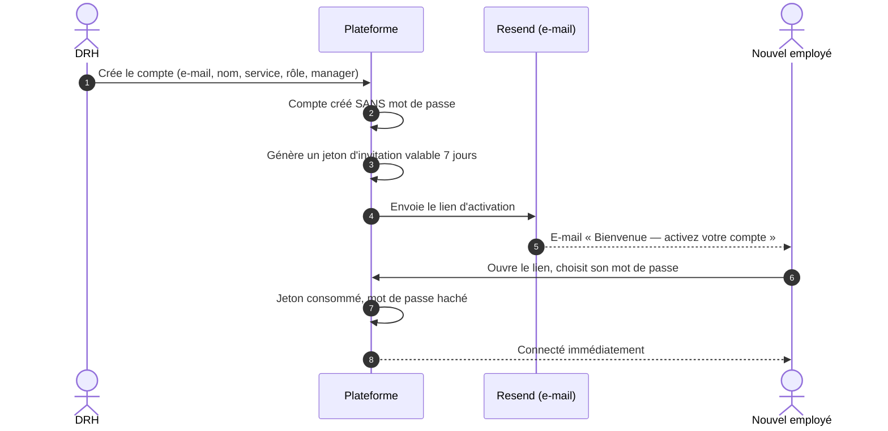

### Étapes détaillées

1. **Le tout premier DRH** est créé par le script `scripts/bootstrap_premier_drh.py` : sans lui, personne ne pourrait créer le premier compte (le script refuse de s'exécuter si un DRH existe déjà, sauf option explicite).
2. **Le DRH crée un compte** (`POST /api/v1/utilisateurs/`) : e-mail unique, nom, service, rôle, manager. Aucun mot de passe n'est choisi par le DRH.
3. **Un e-mail d'invitation** part avec un lien valable **7 jours**. Si l'e-mail n'arrive pas, le DRH peut **renvoyer l'invitation** : l'ancien lien est révoqué, un seul lien reste valide, et le lien est aussi affiché au DRH pour le transmettre autrement.
4. **L'employé définit son mot de passe** sur la page d'activation ; il est connecté aussitôt.
5. **Connexion habituelle** : e-mail et mot de passe. La session dure **45 minutes**, renouvelable automatiquement pendant **14 jours**. Les jetons sont placés dans des **cookies `httpOnly`** par le serveur frontal : le navigateur ne les voit jamais (voir section 17).
   **Après 5 échecs consécutifs, le compte est verrouillé 15 minutes** : même le bon mot de passe est alors refusé (réponse 429). Le lien « mot de passe oublié » lève le verrou.
6. **Mot de passe oublié** : un lien de réinitialisation valable **2 heures** est envoyé. La réponse est **identique** que l'e-mail existe ou non, pour ne pas révéler qui a un compte.
7. **Désactivation** : le DRH désactive un compte au lieu de le supprimer, pour conserver l'historique. Un compte désactivé ne peut plus se connecter.

### Ce que le DRH doit préparer avant les premiers usages

| À préparer | Par qui | Pourquoi |
|---|---|---|
| **Types de congé** (congé payé, maladie…) | DRH | Le solde est tenu par type |
| **Solde de congés** de chaque employé (jours acquis, **en jours entiers**, par type et par exercice) | DRH | Sans ligne de solde, le solde est **considéré comme nul** et toute demande est refusée. Une demi-journée est refusée à la saisie |
| **Jours fériés** (fixes ou récurrents chaque année) | DRH | Ils ne sont pas décomptés du solde |
| **Enveloppes budgétaires** par service et par exercice | DRH ou Contrôleur de gestion | Sans enveloppe, le budget disponible est **0** : toute dépense exige une dérogation |
| **Taux de change** si des dépenses sont saisies hors devise de référence | DRH, Contrôleur de gestion ou Direction financière | Sans taux à la date de la dépense, la saisie est refusée |
| **Comptes de rôle Service juridique, Direction générale, Direction financière, Contrôleur de gestion** | DRH | Le routage est bloqué s'il n'existe aucun compte actif de ce rôle |

---

## 4. Le mécanisme commun à tous les processus

Avant de détailler chaque processus, voici ce qu'ils partagent.

### 4.1 Le cycle de vie d'une demande

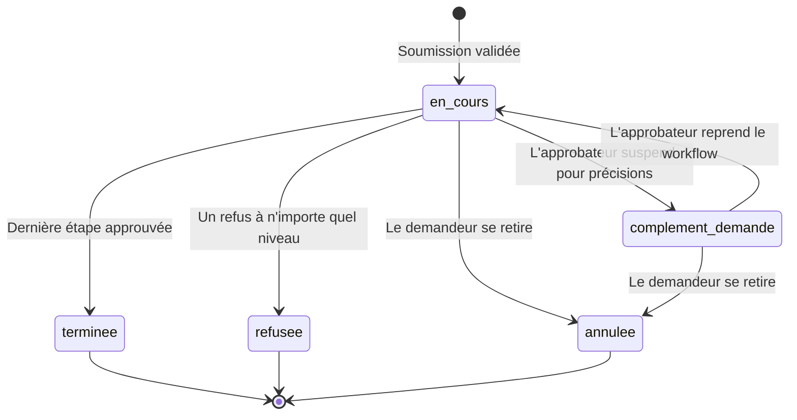

| Statut de la demande | Signification |
|---|---|
| `en_cours` | Une étape attend une décision |
| `complement_demande` | L'approbateur a suspendu la décision pour demander des précisions |
| `terminee` | Toutes les étapes sont approuvées |
| `refusee` | Un décideur a refusé (un refus clôt toujours le circuit) |
| `annulee` | Le demandeur a retiré sa demande |

Chaque **étape** a son propre statut : `en_attente`, `en_cours` (en discussion), `approuve`, `refuse`.

### 4.2 Le lien de décision en un clic

1. À chaque étape, le serveur fabrique **deux jetons** aléatoires : un pour l'action positive (« approuver », ou « signer » pour un signataire), un pour « refuser ».
2. Seule l'**empreinte** (SHA-256) du jeton est stockée : le jeton en clair n'existe que le temps de construire le lien de l'e-mail.
3. Le décideur clique. La page de décision affiche un résumé de la demande, sans consommer le lien.
4. Il doit être **connecté**, et son compte doit être **celui attendu** pour cette étape. Sinon la décision est refusée et la tentative est journalisée.
5. Un lien ne sert **qu'une fois**. Il expire au bout de **14 jours**. Une relance ou un rappel **révoque** l'ancien couple de liens et en émet un nouveau.

### 4.3 Règles de décision communes

| Règle | Détail |
|---|---|
| Refus | **Commentaire obligatoire** |
| Signature | L'action « signer » exige une image de signature |
| Dérogation | Approuver ou signer une étape de dérogation exige une **justification d'acceptation** |
| Étape en discussion | Impossible de décider tant que l'approbateur n'a pas repris le workflow |
| Demande annulée ou clôturée | Les liens déjà envoyés ne fonctionnent plus |

---

## 5. Workflow n°1 — Les congés

### 5.1 Vue d'ensemble

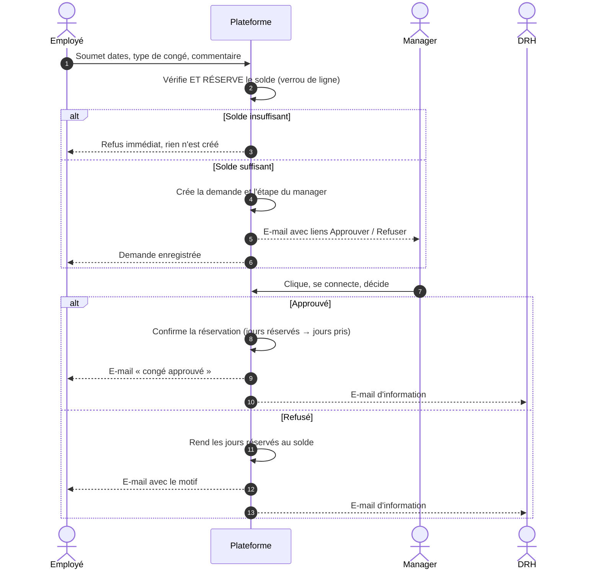

### 5.2 Pas à pas

| # | Qui | Action | Détail vérifié dans le code |
|---|---|---|---|
| 1 | Employé | Remplit le formulaire de congé | Type de congé (actif), date de début, date de fin, commentaire facultatif ; la date de fin ne peut pas précéder la date de début |
| 2 | Plateforme | **Verrou RH : vérification et réservation** | Calcule la durée, puis **réserve** les jours sur le solde du type de congé (exercice de la date de début) sous **verrou de ligne** : deux demandes simultanées sont traitées l'une après l'autre. Solde insuffisant : réponse 422, **aucune demande créée, rien n'est réservé**. Chaque réservation est écrite dans le journal `mouvements_conges` |
| 3 | Plateforme | Trouve le décideur | Le manager direct du demandeur. Sans manager : 422 |
| 4 | Plateforme | Crée la demande, l'étape et les deux jetons | Statut `en_cours` |
| 5 | Plateforme | E-mail au manager | Nom, service, dates, nombre de jours, commentaire, liens Approuver et Refuser |
| 6 | Plateforme | Webhook `demande_soumise` (si un abonné existe) et écriture au journal | — |
| 7 | Manager | Clique, se connecte, décide | Refus : commentaire obligatoire |
| 8 | Plateforme | Si **approuvé** : confirme la réservation. Si **refusé** : rend les jours | Approuvé : jours réservés → jours pris (le solde disponible ne bouge pas, il a déjà baissé à la soumission). Refusé : les jours reviennent au solde. Dans les deux cas, **dans la même transaction que la décision** |
| 9 | Plateforme | Statut final | `terminee` ou `refusee` : **le circuit congés n'a qu'un niveau** |
| 10 | Plateforme | E-mails de fin | Au **demandeur** (avec le motif en cas de refus) et à **chaque DRH actif** (pour information) |
| 11 | Employé, manager, DRH | Fiche de confirmation d'absence (PDF) | Disponible seulement pour une demande `terminee`, pour le demandeur, son manager ou la DRH |

### 5.3 Ce que chaque rôle fait dans le processus congés

| Rôle | Actions |
|---|---|
| **Employé** | Soumettre ; consulter ses demandes ; **modifier** tant qu'elle est `en_cours` (le solde est revérifié) ; **annuler** ; **relancer** son manager ; échanger dans la discussion ; télécharger sa fiche PDF |
| **Manager** | Approuver ou refuser ; suspendre pour précisions ; voir son **agenda d'équipe** (absences approuvées) ; **régulariser** une absence ; lister son équipe |
| **DRH** | Recevoir l'information de chaque décision ; relancer n'importe quelle demande ; régulariser ; définir soldes, types de congé, jours fériés ; consulter le solde de tout employé ; voir l'agenda de tous |

### 5.4 Les cas particuliers

| Cas | Comportement |
|---|---|
| **Régularisation** | Un manager ou la DRH crée **et décide immédiatement** une absence constatée après coup, au nom d'un employé. Pas de lien e-mail. Si approuvée, le solde est réservé puis confirmé sur-le-champ (même chemin que le circuit normal). L'employé est prévenu par e-mail |
| **Modification** | Le demandeur change ses dates tant que la demande est `en_cours` : l'ancienne réservation est libérée et la nouvelle prise dans la même transaction. Si le nouveau solde est insuffisant, **l'ancienne réservation reste intacte**. Le manager n'est pas renotifié (ROADMAP R25) |
| **Annulation** | Le demandeur se retire : les jours réservés sont rendus au solde |
| **Relance manuelle** | Le demandeur ou la DRH renvoie la notification avec de **nouveaux liens** ; les anciens ne valent plus |
| **Rappels automatiques** | Toutes les 48 h (paramétrable), les décisions en attente sont relancées. Une étape suspendue en discussion n'est **jamais** relancée |
| **Discussion** | Voir la section 9.3 |
| **Dérogation** | Non applicable aux congés (décision du 28/09) |

> **⚠ Décision RH en attente (R20)** — La durée d'un congé est comptée en **jours calendaires**, week-ends compris ; seuls les jours fériés déclarés sont retirés. Les e-mails disent désormais « jour(s) décompté(s) » (et non plus « ouvrés », ce qui était inexact). Une option `CONGES_EXCLURE_WEEKENDS=true` compte seulement du lundi au vendredi. **La DRH doit trancher la règle avant tout usage réel.**

---

## 6. Workflow n°2 — Les notes de frais

### 6.1 Circuit

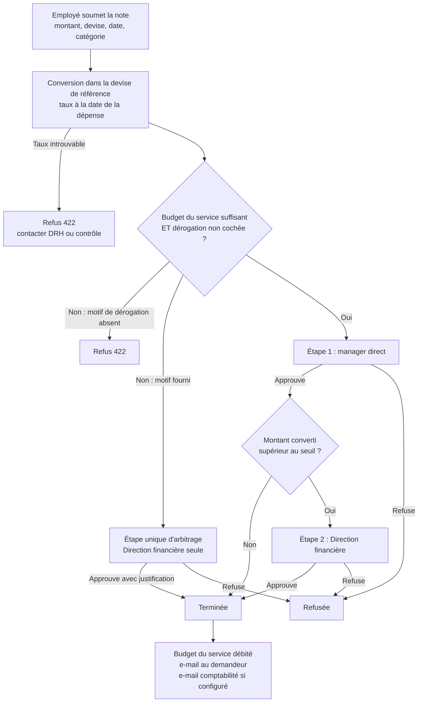

### 6.2 Pas à pas

| # | Qui | Action | Détail vérifié |
|---|---|---|---|
| 1 | Employé | Saisit montant, devise, date de la dépense, catégorie, description | Case « dérogation motivée » facultative |
| 2 | Plateforme | **Convertit** dans la devise de référence (EUR par défaut) | Taux le plus récent à la date de la dépense ; taux et montant converti **figés** dans la demande |
| 3 | Plateforme | **Contrôle budgétaire** | Budget disponible = alloué − consommé, pour le **service du demandeur** et l'**année de la dépense**. Sans enveloppe : 0 |
| 4 | Plateforme | Choisit le circuit | Budget insuffisant **ou** case cochée : circuit de **dérogation**, motif obligatoire. Sinon circuit normal |
| 5 | Manager (ou arbitre) | Reçoit l'e-mail | Il voit un **bloc budgétaire** : solde disponible, montant demandé, solde après validation (vert ou rouge) |
| 6 | Manager | Décide | — |
| 7 | Plateforme | **Seuil** | Si le montant **converti** dépasse **500 €** (valeur par défaut, paramétrable), création d'une étape 2 vers la Direction financière |
| 8 | Direction financière | Décide | Elle reçoit aussi le bloc budgétaire |
| 9 | Plateforme | À la validation finale | **Débite** le budget du service ; envoie un e-mail de synthèse à la comptabilité **si** une adresse est configurée ; prévient le demandeur |

### 6.3 Ce que chaque rôle fait

| Rôle | Actions |
|---|---|
| **Employé** | Soumettre ; joindre des pièces ; suivre ; annuler ; relancer ; discuter |
| **Manager** | Approuver ou refuser le niveau 1 |
| **Direction financière** | Approuver ou refuser le niveau 2 ; **arbitre seule des notes de frais en dérogation** ; consulter la **synthèse des frais** (écran et export CSV) ; définir les taux de change |
| **Contrôleur de gestion** | Arbitrer les dérogations d'**achat** en priorité ; gérer les **enveloppes** ; synthèse ; taux ; journal d'audit |
| **Direction générale** | Arbitre de repli si aucun Contrôleur de gestion actif ; journal d'audit |
| **DRH** | Définir enveloppes et taux ; synthèse ; relancer |

> **À retenir sur la dérogation** : c'est un **détournement complet** du circuit, pas un niveau ajouté. L'arbitre décide seul, et son approbation **termine** la demande, même au-dessus du seuil. L'arbitre doit saisir une **justification d'acceptation**.

---

## 7. Workflow n°3 — Les achats et contrats

### 7.1 Circuit

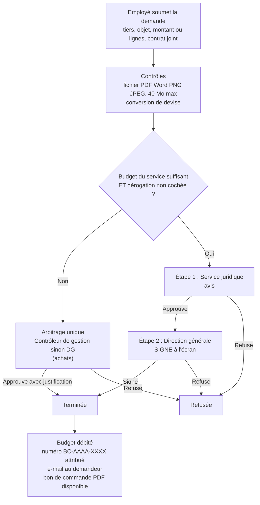

### 7.2 Pas à pas

| # | Qui | Action | Détail vérifié |
|---|---|---|---|
| 1 | Employé | Saisit le fournisseur (tiers), l'objet, et soit un **budget engagé**, soit le **détail des lignes** | Chaque ligne : description, montant **HT**, taux de TVA propre |
| 2 | Employé | **Dépose le contrat** | Obligatoire. PDF, Word, PNG ou JPEG, 40 Mo maximum |
| 3 | Plateforme | Calcule le budget | Avec des lignes : somme des **TTC** de chaque ligne (un seul chiffre fait foi). Sans lignes : le budget saisi |
| 4 | Plateforme | Convertit, contrôle le budget du service | Même logique que les notes de frais |
| 5 | Service juridique | **Étape 1** : avis | Approuve ou refuse ; peut consulter le contrat |
| 6 | Direction générale | **Étape 2** : signature | Reçoit un lien « **Signer** » (jamais « Approuver ») ; dessine sa signature, enregistrée |
| 7 | Plateforme | À la validation finale | Débite le budget, attribue le **numéro de bon de commande** `BC-année-rang`, prévient le demandeur |
| 8 | Demandeur, Juridique, DG, DRH | Téléchargent le **bon de commande PDF** | Généré à la demande, uniquement si la demande est `terminee` |

### 7.3 Ce que chaque rôle fait

| Rôle | Actions |
|---|---|
| **Employé** | Soumettre avec contrat ; suivre ; annuler ; relancer ; discuter ; télécharger contrat et bon de commande |
| **Service juridique** | Niveau 1 : avis ; consulter le contrat |
| **Direction générale** | Niveau 2 : signer ; consulter contrat ; journal d'audit ; arbitre de repli |
| **Contrôleur de gestion** | Arbitrer les dérogations d'achat ; gérer les enveloppes |
| **DRH** | Consulter le contrat et le bon de commande ; relancer |

> **Numérotation fiable (R21, corrigé)** — Le numéro `BC-année-rang` vient d'un **compteur par exercice verrouillé** pendant la transaction de décision, avec une contrainte d'unicité en base. Testé sur PostgreSQL : 12 validations simultanées donnent 12 numéros distincts, sans trou ni doublon.

---

## 8. Tableau comparatif des trois processus

| | Congés | Notes de frais | Achats et contrats |
|---|---|---|---|
| **Contrôle à la soumission** | Solde de congés | Budget du service | Budget du service |
| **Niveau 1** | Manager | Manager | Service juridique |
| **Niveau 2** | Aucun | Direction financière si montant > seuil | Direction générale (signature) |
| **Dérogation** | Non | Oui | Oui |
| **Pièce obligatoire** | Non | Non vérifié | **Contrat** |
| **Devises** | Sans objet | Oui, conversion figée | Oui, conversion figée |
| **Ressource consommée à la fin** | Solde de jours | Budget du service | Budget du service |
| **Document produit** | Fiche de confirmation PDF | Synthèse comptabilité (CSV, e-mail) | Bon de commande PDF signé |
| **Information annexe** | DRH en copie par e-mail | Comptabilité par e-mail | — |
| **Modification après dépôt** | Oui (tant que `en_cours`) | Non trouvée | Non trouvée |
| **Régularisation** | Oui | Non | Non |
| **Annulation, relance, discussion** | Oui | Oui | Oui |

---

## 9. Les communications

### 9.1 Vue d'ensemble : qui parle à qui, par quel canal

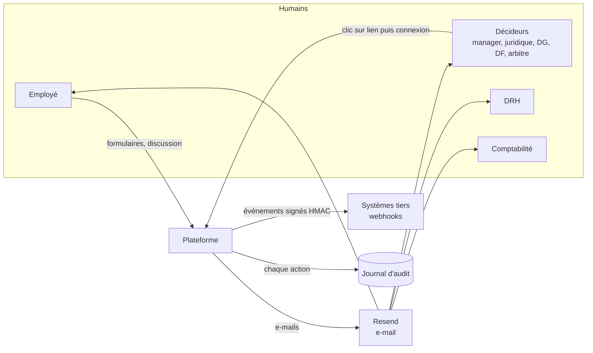

### 9.2 Les e-mails envoyés (tous via Resend)

| E-mail | Déclencheur | Destinataire | Contenu principal |
|---|---|---|---|
| Invitation | Création de compte ou renvoi | Nouvel employé | Lien d'activation, 7 jours |
| Réinitialisation | Mot de passe oublié | Employé | Lien, 2 heures |
| **Demande à valider** | Soumission | Décideur de l'étape 1 | Résumé, bloc budgétaire (notes de frais, achats), liens Approuver et Refuser |
| **Escalade** | Étape 1 approuvée et étape 2 requise | Décideur de l'étape 2 | Même principe ; lien « Signer » pour un signataire |
| **Rappel automatique** | Étape en attente depuis 48 h | Décideur | Nouveaux liens ; les anciens sont révoqués |
| **Relance manuelle** | Action du demandeur ou de la DRH | Décideur | Nouveaux liens |
| **Issue de la demande** | Décision finale | Demandeur | Approbation ou refus avec motif |
| **Information congé** | Décision finale d'un congé | Chaque DRH actif | Nom, période, jours, décision |
| **Synthèse comptabilité** | Note de frais validée | Adresse comptabilité (si configurée) | Ligne de synthèse |
| **Régularisation** | Régularisation par un manager ou la DRH | Employé concerné | Décision et motif |
| **Discussion** | Suspension, nouveau message | L'autre partie de l'échange | Notification |

Un e-mail qui échoue **ne fait jamais échouer** l'action principale : l'échec est journalisé dans les logs, et la relance permet de rattraper.

### 9.3 La discussion bidirectionnelle (« En attente d'informations »)

Problème résolu : sans elle, un approbateur qui a un doute sur un justificatif n'a que le **refus**, ce qui oblige le demandeur à tout ressaisir.

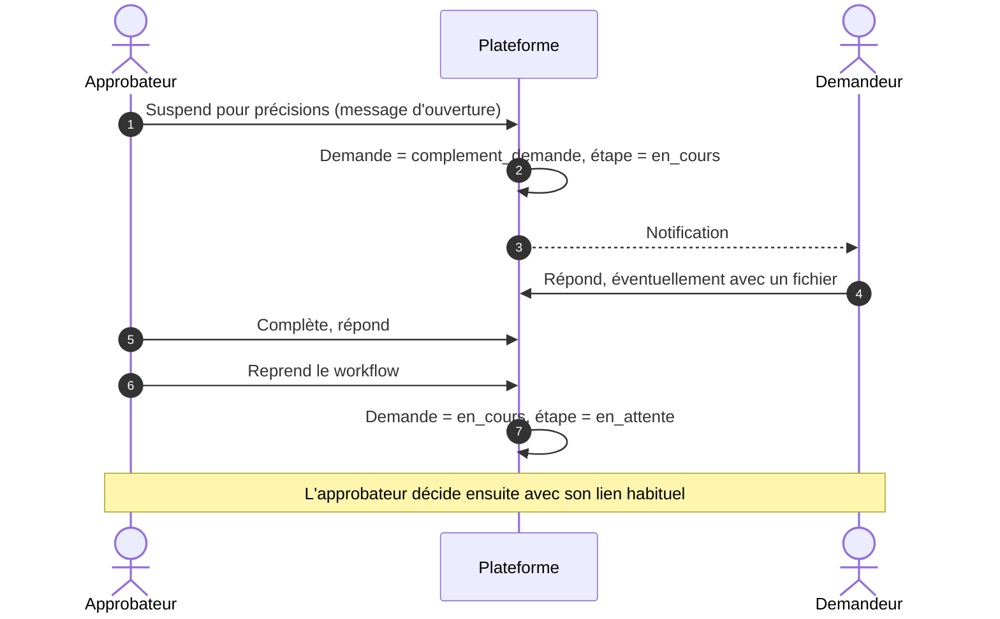

| Règle | Détail |
|---|---|
| **Qui suspend et reprend** | Uniquement l'**approbateur attendu** de l'étape en cours |
| **Qui écrit** | Le **demandeur** et l'**approbateur** de l'étape |
| **Qui lit** | Les participants et la DRH |
| **Fichiers** | PDF, Word, PNG, JPEG, **40 Mo** maximum (contrôlé dans le navigateur avant l'envoi, puis par le serveur) |
| **Effet sur les rappels** | Aucun rappel tant que l'étape est suspendue |
| **Annulation** | Le demandeur peut se retirer même pendant la discussion |
| **Conservation** | Les messages ne sont jamais supprimés |
| **Générique** | Fonctionne pour les trois processus |
| **Côté demandeur** | Bouton **Discussion** sur la demande (statut « Précisions demandées ») : s'ouvre dans une **boîte de dialogue centrée** qui rappelle la demande concernée. Ses messages sont repérés par « (vous) » et tous sont horodatés |
| **Côté approbateur** | La page de décision bascule sur la discussion tant que la demande est suspendue ; « Reprendre le workflow » rend le formulaire de décision |
| **Temps réel** | Le panneau se rafraîchit seul toutes les 10 s : une réponse apparaît sans recharger la page, et la liste descend sur le dernier message |
| **E-mails** | Chaque message envoie un e-mail **avec un lien** : vers « Mes demandes » pour le demandeur ; vers un lien de décision pour l'approbateur (la page de décision affiche la discussion). Les liens de décision déjà émis **ne sont pas révoqués** par la discussion : l'approbateur a souvent la page ouverte, et la révoquer provoquait une erreur 401 au clic sur « Reprendre » |

*Vérifié (05/10/2026) dans deux navigateurs indépendants, de la suspension à l'approbation, pour les trois processus, en écran large et sur téléphone, avec pièce jointe et lien de décision ouvert sans session : `scripts/verification/interface/discussion_e2e.py`. Le statut s'affiche « Précisions demandées » sur les trois pages.*

### 9.4 Les webhooks sortants (vers d'autres systèmes)

Notifications techniques, pour brancher un ERP, un outil de messagerie ou la comptabilité.

| Point | État |
|---|---|
| Événements | Demande soumise, étape approuvée, étape refusée, complément demandé, circuit terminé, demande annulée, dérogation déclenchée |
| Contenu envoyé | Type d'événement, identifiant de la demande, horodatage (rien de personnel) |
| Authenticité | Signature HMAC-SHA256 avec un secret par abonnement |
| Filtrage | Par processus et par type d'événement |
| **⚠ Limites** | **Une seule tentative** (pas de réessai), **aucune route pour créer un abonnement** (il faut passer par la base), pas de contrôle anti-SSRF |

### 9.5 Le journal d'audit

Chaque action du circuit et chaque action d'administration est écrite dans une table que la base **refuse de modifier ou supprimer**.

| Consultation | Qui |
|---|---|
| Journal complet, avec filtres | DRH, Direction générale, Contrôleur de gestion |
| Historique d'un dossier | Le demandeur, la DRH et les approbateurs de la demande |

Actions consignées : soumission, décisions, relances, rappels, annulation, modification, régularisation, pièces jointes, discussion, **tentatives de lien invalide**, **tentatives d'usurpation**, et 11 actions d'administration (comptes, soldes, types de congé, jours fériés, enveloppes, taux de change).


---

# PARTIE 2 — LE TECHNIQUE

## 10. Les technologies utilisées

Versions relevées dans `requirements.txt`, `frontend/package.json` et les Dockerfiles.

| Couche | Technologie | Rôle dans le projet |
|---|---|---|
| **Langage backend** | Python 3.12 | Tout le backend |
| **Framework API** | **FastAPI** 0.115 | Routes HTTP, injection de dépendances (`Depends`), documentation OpenAPI automatique |
| **Validation** | **Pydantic** 2.9, pydantic-settings | Valide chaque donnée reçue (schémas) et lit la configuration depuis l'environnement |
| **Base de données** | **PostgreSQL** 16 (image Docker en développement) | Stockage de toutes les données |
| **Accès aux données** | **SQLAlchemy** 2.0 asynchrone, pilote `asyncpg` | Modèles et requêtes, sans bloquer le serveur |
| **Migrations** | **Alembic** 1.14 | Versionne le schéma (15 migrations) |
| **Authentification** | `python-jose` (JWT, HS256), `passlib` + `bcrypt` | Jetons de session ; hachage des mots de passe |
| **Chiffrement au repos** | `cryptography` (Fernet) | Secrets des abonnements webhook |
| **Jetons de décision** | Modules standard `secrets` et `hashlib` | Jeton aléatoire, empreinte SHA-256 |
| **E-mail** | **Resend** (SDK 2.4) | Envoi des e-mails transactionnels |
| **Webhooks sortants** | `httpx` 0.27 | Appels HTTP vers les systèmes tiers |
| **PDF** | **WeasyPrint** 63 | Fiche de confirmation d'absence, bon de commande |
| **Serveur** | Uvicorn, Gunicorn 23 | Exécution en production |
| **Tests backend** | pytest, pytest-asyncio, aiosqlite | Tests sur base SQLite en mémoire |
| **Frontend** | **Next.js** 16, **React** 19, TypeScript | Interface web |
| **Style** | **Tailwind CSS** 4, **shadcn/ui** (composants Radix) | Mise en forme et composants |
| **Tests frontend** | Vitest, Testing Library, jsdom | Tests des composants et pages |
| **Conteneurs** | Docker, docker-compose | Développement local et image de production |
| **Hébergement cible** | NubieCloud (NubiDeploy, NubiStack, NubiS3) | **Non encore déployé** |

**Pourquoi ces choix** (justifications du CDC technique, §3 et §9.2) : FastAPI pour la validation stricte et la documentation automatique ; PostgreSQL pour l'intégrité entre entités ; jeton **opaque** haché plutôt que JWT pour les liens e-mail, car une vérification en base est de toute façon nécessaire (un jeton auto-porteur ajouterait une seconde source de vérité et exposerait son contenu).

---

## 11. Architecture globale

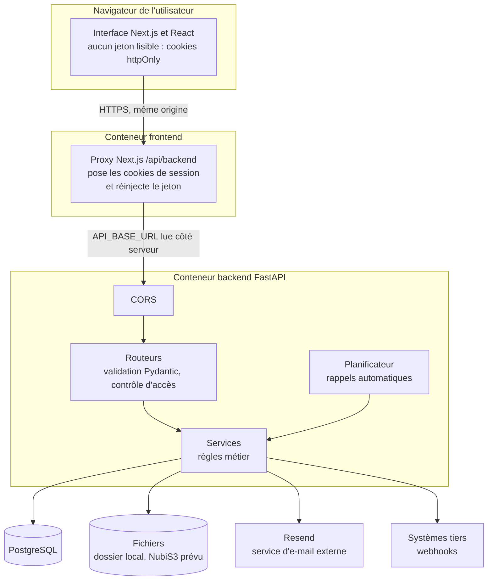

**Trois couches strictement séparées** :

1. **Frontend** : tout ce que l'utilisateur voit. Il ne parle **jamais** à la base : uniquement à l'API.
2. **Backend** : toute la logique métier derrière une frontière unique, l'API.
3. **Données et infrastructure** : PostgreSQL, fichiers, e-mail.

**Le proxy Next.js** (`frontend/src/app/api/backend/[...path]/route.ts`) : le navigateur appelle toujours `/api/backend/...` sur sa propre origine ; le serveur Next.js relaie vers FastAPI. Intérêts : l'adresse réelle du backend n'est jamais connue du navigateur, aucune configuration CORS n'est nécessaire, et **c'est lui qui gère la session** :

- à la connexion, il reçoit les jetons du backend, les place dans des **cookies `httpOnly`** et ne renvoie au navigateur que `{"connecte": true}` ;
- à chaque appel, il lit le cookie et ajoute lui-même l'en-tête `Authorization` avant de relayer au backend ;
- il gère le renouvellement (`/auth/refresh`, le jeton de rafraîchissement vient du cookie, jamais du navigateur) et la déconnexion (`/auth/deconnexion`, propre au proxy : il efface les cookies).

**Le planificateur** est une simple boucle `asyncio` lancée au démarrage du backend (`lifespan` dans `main.py`) : aucun service externe (cron, Celery) à déployer.

---

## 12. Organisation du code

```text
workflow-main/
├── app/                        BACKEND
│   ├── main.py                 Point d'entrée : monte les routeurs, CORS, démarre le planificateur
│   ├── core/                   Briques transverses
│   │   ├── config.py           Tous les réglages (variables d'environnement)
│   │   ├── database.py         Moteur SQLAlchemy et session par requête (get_db)
│   │   ├── security.py         Hachage bcrypt, création et lecture des JWT
│   │   ├── chiffrement.py      Chiffrement au repos des secrets (webhooks)
│   │   └── dependencies.py     get_current_user, get_current_user_optional, exiger_roles
│   ├── models/                 18 tables (SQLAlchemy) et énumérations
│   ├── schemas/                Formes des données échangées avec le frontend (Pydantic)
│   ├── routers/                15 modules de routes HTTP (dont `dashboard`, non implémenté) : orchestrent
│   └── services/               Logique métier
│       ├── routing_engine.py   Qui décide à chaque étape
│       ├── decision_tokens.py  Jetons des liens e-mail
│       ├── extensions/         verrou_rh, suivi_budgetaire (+ 3 stubs TODO : bons_commande, communication, derogations)
│       ├── email_service.py, webhooks.py, audit.py, rappels.py, planificateur.py
│       ├── documents.py, facturation.py, devises.py, calendrier.py ...
├── alembic/versions/           15 migrations du schéma
├── tests/                      unit/, integration/ (SQLite) et postgres/ (concurrence, vrai PostgreSQL)
├── scripts/                    Bootstrap du premier DRH, données de démo, rôles PostgreSQL, vérifications réelles
├── frontend/                   FRONTEND Next.js
│   └── src/
│       ├── app/                Pages (App Router), dont le proxy /api/backend
│       ├── components/         Composants (actions, discussion, signature, pièces jointes...)
│       ├── hooks/useAuth.tsx   Session utilisateur
│       └── lib/                api.ts (client HTTP), rôles, dates, montants
├── Dockerfile, docker-compose.yml, alembic.ini, requirements.txt
```

**La règle d'architecture** (CDC §3.4) : trois responsabilités séparées.

| Élément | Dossier | Question à laquelle il répond |
|---|---|---|
| **Schéma Pydantic** | `schemas/` | « Quelle forme ont les données qui entrent et sortent ? » |
| **Modèle SQLAlchemy** | `models/` | « Comment est stocké chaque objet en base ? » |
| **Service** | `services/` | « Quelles sont les règles métier ? » |
| **Routeur** | `routers/` | « Quelle URL, qui a le droit, dans quel ordre appeler quoi ? » |

> **Nuance à connaître** : le CDC voulait que les règles vivent dans les services, testables sans serveur. C'est vrai pour le routage, les jetons, le verrou RH ou le budget. Mais une bonne partie de l'orchestration de chaque processus vit directement dans les routeurs (`conges.py`, `notes_frais.py`, `achats.py`, `decisions.py`). C'est pourquoi `decisions.py` fait plus de 600 lignes.

---

## 13. Le trajet d'une requête

Exemple : un employé clique sur « Envoyer » dans le formulaire de congé.

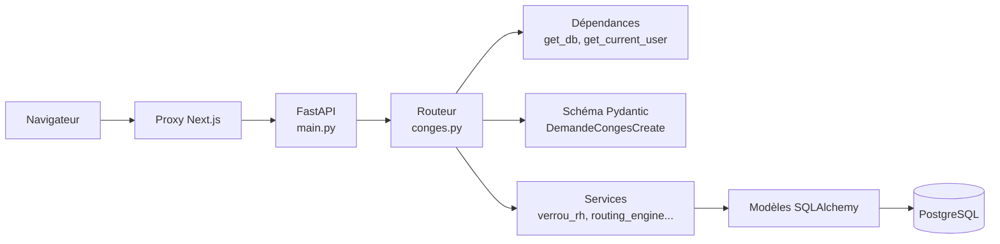

1. **Validation** : le corps JSON est validé par le schéma Pydantic *avant* d'entrer dans la fonction. Une date de fin antérieure à la date de début est rejetée ici (`@field_validator`).
2. **Injection de dépendances** : `Depends(get_db)` ouvre une session de base **par requête** ; `Depends(get_current_user)` décode le JWT, vérifie que c'est bien un jeton **d'accès** (pas de rafraîchissement) et que le compte est actif. Sans jeton valide : **401**.
3. **Contrôle par rôle** : `Depends(exiger_roles(...))` renvoie **403** si le rôle n'est pas autorisé.
4. **Logique** : la fonction du routeur appelle les services, écrit via SQLAlchemy, fait `commit`.
5. **Réponse** : convertie en JSON.

---

## 14. Le graphe des appels entre modules

**Comment le lire** : une flèche `A → B` signifie « le module A importe et utilise le module B ». Ce graphe est **généré automatiquement** depuis les imports du code source (analyse de l'arbre syntaxique Python), pas dessiné à la main. Trois services utilisés par presque tous les routeurs sont **volontairement omis des flèches** pour la lisibilité : `audit` (journal), `email_service` (envoi) et `webhooks` (notifications tiers).

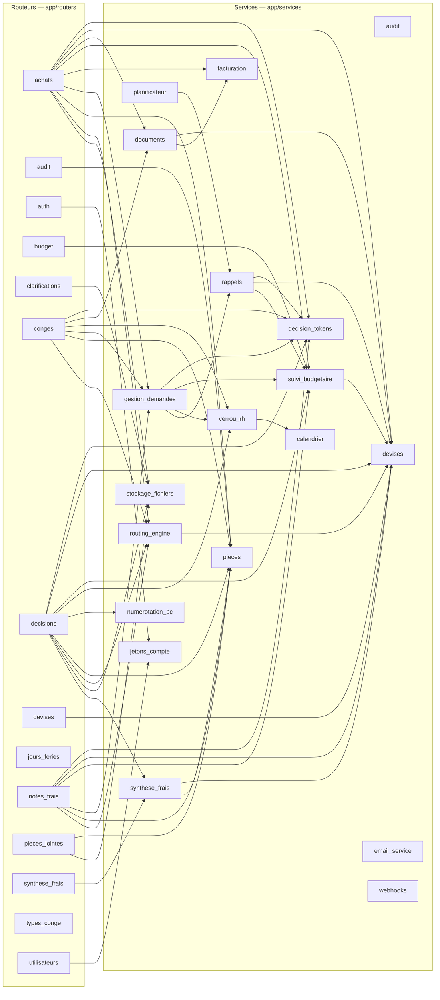

**Ce que le graphe montre** :

- `decisions` est le routeur le plus connecté : il concentre la fin de chaque circuit (routage de l'étape suivante, débit du solde ou du budget, numéro de bon de commande, e-mails de clôture).
- `gestion_demandes` (annulation et relance) est **partagé** par `conges`, `notes_frais` et `achats` ; il appelle `verrou_rh` pour **rendre les jours réservés** quand un congé est annulé.
- `numerotation_bc` n'est appelé que par `decisions`, à la validation finale d'un achat.
- `rappels` sert deux fois : au planificateur automatique et à la relance manuelle (`gestion_demandes`).
- `suivi_budgetaire` est appelé à la soumission (contrôle), à la décision (affichage du bloc budgétaire) et à la clôture (débit).
- `planificateur` est démarré par `main.py`, qui n'apparaît pas ici car il ne fait que monter les routeurs.

### Qui décide de quoi (résumé)

| Question | Module responsable |
|---|---|
| Qui doit décider à cette étape ? | `routing_engine` |
| Le lien de décision est-il valide ? | `decision_tokens` |
| Le solde de congés est-il suffisant, et comment le réserver, le rendre, le confirmer ? | `verrou_rh` (utilise `calendrier` pour les jours fériés et les week-ends) |
| Le budget du service est-il suffisant ? | `suivi_budgetaire` |
| Combien vaut ce montant dans la devise de référence ? | `devises` |
| Combien coûte cette commande, TVA par ligne ? | `facturation` |
| Quel numéro de bon de commande attribuer ? | `numerotation_bc` (compteur verrouillé) |
| Comment envoyer un e-mail ? | `email_service` (seul module qui connaît Resend) |
| Comment enregistrer une trace ? | `audit` |
| Comment annuler ou relancer ? | `gestion_demandes` |
| Comment relancer automatiquement ? | `planificateur` puis `rappels` |
| Comment produire un PDF ? | `documents` |
| Où stocker un fichier ? | `stockage_fichiers` |

---

## 15. Les séquences techniques détaillées

### 15.1 Soumission d'un congé (`POST /api/v1/conges/`)

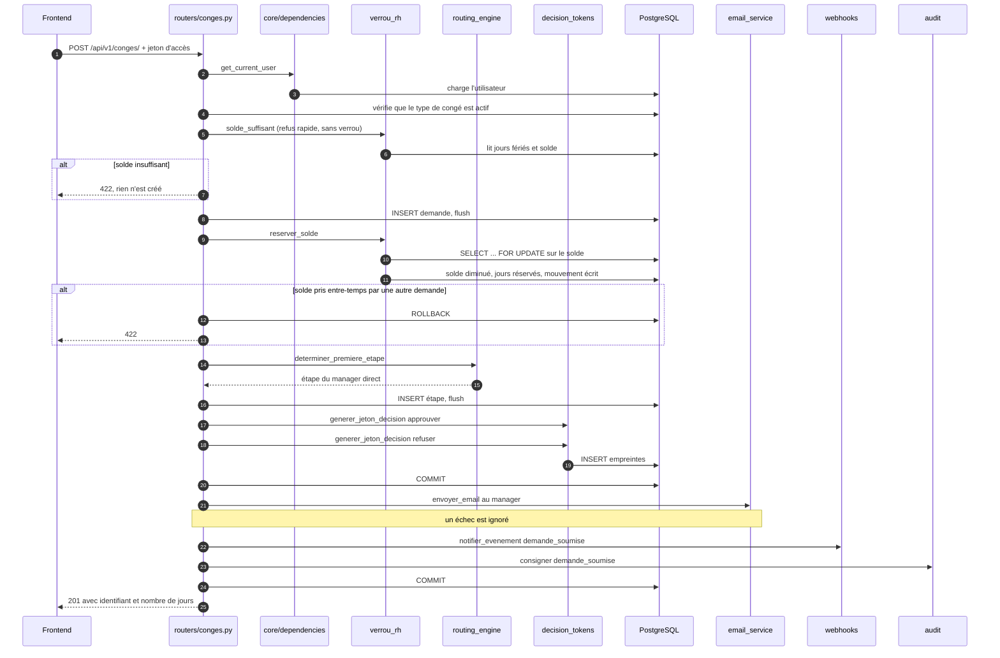

**À retenir** : la demande, **la réservation du solde**, l'étape et les jetons sont écrits dans **une même transaction** (premier `COMMIT`). L'e-mail, le webhook et l'audit viennent **après** : leur échec ne peut pas annuler la demande.

**Pourquoi deux contrôles du solde ?** Le premier est un refus rapide, sans verrou. Le second (`reserver_solde`) fait foi : il prend un verrou de ligne sur le solde de l'employé. Deux soumissions simultanées sont alors **sérialisées par la base** : la seconde voit le solde déjà diminué par la première. Testé sur PostgreSQL : 10 soumissions simultanées de 3 jours sur 10 jours de solde en acceptent exactement 3.

### 15.2 Décision par lien e-mail (`POST /api/v1/decisions/{jeton}`)

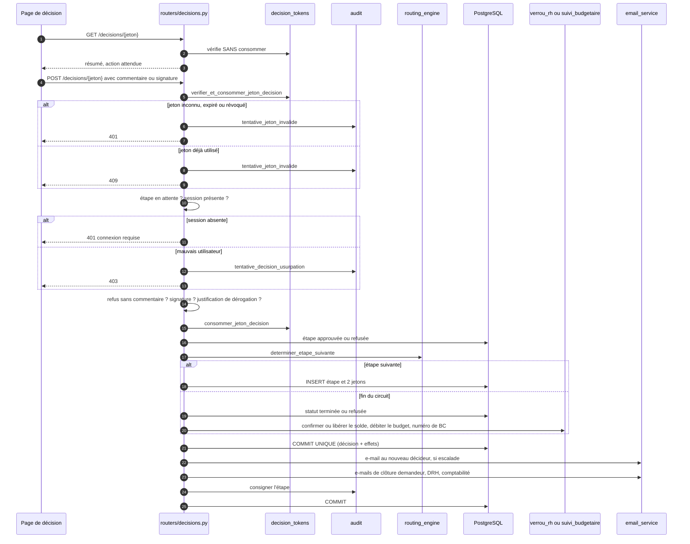

**Deux points de conception importants** :

- **Vérifier et consommer sont deux actes distincts.** Le jeton n'est consommé qu'une fois toutes les validations passées. Sinon, la tentative d'un usurpateur (rejetée à l'étape « session ») brûlerait le lien du vrai décideur.
- **La vérification du statut de l'étape** empêche deux décisions simultanées : la seconde trouve une étape déjà traitée (409).

> **Décision atomique (R18, corrigé)** — La décision et ses effets sur les ressources (solde de congés, budget, numéro de bon de commande) sont validés par **un seul `COMMIT`** : tout est enregistré, ou rien. Un test simule une panne pendant le débit et vérifie que ni l'étape ni la demande ne sont modifiées. Seuls les e-mails, webhooks et traces d'audit viennent après, car leur échec ne doit pas annuler une décision.

### 15.3 Rappels automatiques

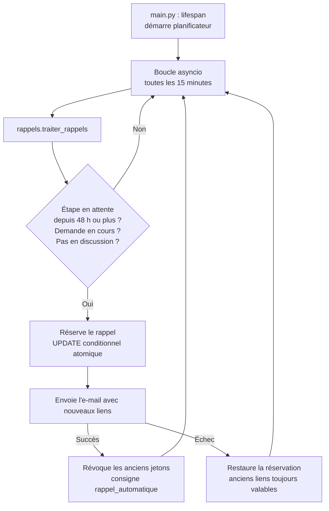

La réservation par `UPDATE` conditionnel garantit qu'**aucun doublon** n'est envoyé même si plusieurs instances du backend tournent en parallèle.

---

## 16. Le modèle de données

18 tables relevées dans les modèles SQLAlchemy (elles étaient 15 avant la campagne de correction du 29-30/09 : ajout de `mouvements_conges`, `bons_commande` et `compteurs_bon_commande`).

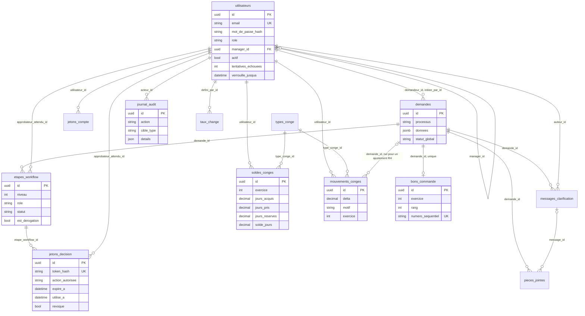

Tables sans lien direct : `enveloppes_budgetaires` (par service et exercice), `jours_feries`, `abonnements_webhook`, `compteurs_bon_commande` (un compteur par exercice), `types_demande` (définie mais **non utilisée** par le code).

### Rôle de chaque table

| Table | Contenu |
|---|---|
| `utilisateurs` | Comptes, rôle, manager (`manager_id`, clé étrangère vers la même table), compteur d'échecs de connexion et date de verrouillage |
| `demandes` | **Une ligne par soumission**, quel que soit le processus ; les champs propres à chaque processus sont dans la colonne JSON `donnees` |
| `etapes_workflow` | Une ligne par décideur d'une demande : niveau, rôle, statut, commentaire, signature, compteur de rappels |
| `jetons_decision` | Empreintes des liens e-mail : expiration, utilisation, révocation |
| `jetons_compte` | Empreintes des liens d'invitation et de réinitialisation |
| `messages_clarification` | Fil de discussion |
| `pieces_jointes` | Références de fichiers (contrat, justificatifs, pièces de discussion) |
| `soldes_conges` | Solde par employé, type de congé et exercice : acquis, pris, **réservés** (demandes en cours), disponible |
| `mouvements_conges` | **Journal de chaque variation du solde** (solde initial, réservation, libération, ajustement RH). Le solde disponible en est la somme ; protégé en ajout seul par le rôle PostgreSQL restreint |
| `bons_commande` | Numéro attribué à chaque achat validé ; unicité en base |
| `compteurs_bon_commande` | Dernier rang attribué par exercice, verrouillé pendant l'attribution |
| `types_conge` | Types de congé et taux d'acquisition (paramètre prévu, aucun job ne l'utilise encore) |
| `jours_feries` | Jours non décomptés, fixes ou récurrents |
| `enveloppes_budgetaires` | Budget alloué et consommé par service et exercice |
| `taux_change` | Taux par devise et date d'effet |
| `journal_audit` | Traces **inaltérables** |
| `abonnements_webhook` | Systèmes tiers abonnés (secret de signature **chiffré**) |

> **Choix de modélisation** : une seule table `demandes` avec une colonne JSON (JSONB sous PostgreSQL) pour les champs propres à chaque processus. Avantage : un seul moteur pour les trois processus, pas de migration pour un nouveau champ. Contrepartie **assumée** : les champs de calcul (montant, dates) ne sont pas dupliqués dans des colonnes indexées comme le prévoyait le CDC (§4.1) ; le faire toucherait une quarantaine d'endroits du code pour un bénéfice faible.

---

## 17. La sécurité

| Mécanisme | Où | Ce qu'il garantit |
|---|---|---|
| **Mots de passe hachés (bcrypt)** | `core/security.py` | Aucun mot de passe en clair, sel unique par mot de passe |
| **JWT d'accès et de rafraîchissement** | `core/security.py` | Session de 45 min, renouvelable 14 jours ; un jeton de rafraîchissement **ne peut pas** servir d'accès |
| **Session en cookies `httpOnly`** | Proxy Next.js | Aucun script de la page ne peut lire ni voler un jeton (faille XSS sans effet sur la session) ; `SameSite=Strict` bloque les actions déclenchées depuis un site tiers ; le cookie de rafraîchissement n'est envoyé qu'à `/auth/refresh` ; `Secure` (HTTPS) activé en production |
| **Limitation des connexions** | `routers/auth.py` | Verrouillage 15 min après 5 échecs, compteur incrémenté atomiquement, même le bon mot de passe est refusé pendant le verrou, échecs et verrouillages tracés dans l'audit |
| **Secrets webhook chiffrés** | `core/chiffrement.py` | Chiffrement Fernet au repos : une fuite de la base ne permet pas de forger des notifications signées |
| **Accès aux demandes** | Routeurs | Une demande n'est lisible que par son demandeur, son manager, la DRH et ses approbateurs ; les autres reçoivent 404 (l'existence du dossier n'est pas révélée) |
| **Concurrence maîtrisée** | `verrou_rh`, `numerotation_bc` | Verrous de ligne sur le solde et sur le compteur de bons de commande ; débit du budget atomique ; testés sur un vrai PostgreSQL |
| **Contrôle d'accès centralisé** | `core/dependencies.py` | `get_current_user` et `exiger_roles` appliqués route par route |
| **Jetons de décision opaques** | `decision_tokens.py` | 32 octets aléatoires, seule l'empreinte SHA-256 en base, usage unique, expiration, révocation |
| **Option B (jeton + session)** | `routers/decisions.py` | Un lien transféré ne permet pas de décider : l'identité connectée doit être celle attendue |
| **Anti-énumération de comptes** | `routers/auth.py` | Réponse identique à « mot de passe oublié » que le compte existe ou non |
| **Échappement HTML** | `escape(...)` dans les e-mails | Les textes libres des demandeurs (commentaire, motif, objet, description) ne peuvent pas injecter de HTML. **Limite** : les noms de compte, saisis par la DRH, ne sont pas échappés partout |
| **Journal d'audit inaltérable** | Déclencheurs SQL, garde ORM, rôle PostgreSQL restreint | Aucune modification ni suppression, même par l'application |
| **Validation des fichiers** | `stockage_fichiers.py` | Types acceptés (PDF, Word, PNG, JPEG), 40 Mo, clé de stockage opaque |
| **Backend masqué** | Proxy Next.js | Le navigateur ne connaît pas l'adresse du backend |
| **Un e-mail qui échoue ne casse rien** | Routeurs | Principe du CDC §13.4 |

**Limite à connaître sur le journal** : les déclencheurs bloquent aussi le propriétaire de la table, mais un `ALTER TABLE ... DISABLE TRIGGER` explicite les neutralise. D'où l'exigence de déploiement : **l'application ne doit pas se connecter avec le propriétaire des tables** ; `scripts/roles_postgresql.sql` crée un rôle sans droit de modification sur `journal_audit` **ni sur `mouvements_conges`** (vérifié : `UPDATE`, `DELETE` et `TRUNCATE` sont refusés). Le fichier `docker-compose.yml` utilise encore le propriétaire (acceptable en développement seulement).

**Limites assumées sur la session** : (1) un compte verrouillé répond 429 alors qu'un e-mail inconnu répond toujours 401 ; après plusieurs essais, cela révèle qu'un compte existe. C'est le compromis usuel d'un verrouillage par compte. (2) Le parcours par cookies a été vérifié au niveau HTTP, par tests de composants et dans Chromium (via Playwright, mode sans affichage) (connexion par le formulaire, cookies `HttpOnly`/`Strict`, aucun jeton lisible par le JavaScript) ; **pas dans Firefox ni Safari**, et l'expiration naturelle d'une session n'a pas été attendue. (3) En production, `COOKIE_SECURE` doit rester à `true`.

---

## 18. Le frontend

| Élément | Détail |
|---|---|
| **Pages publiques** | Connexion, activation de compte (`/activer-compte/[jeton]`), mot de passe oublié, réinitialisation, **page de décision** (`/decisions/[jeton]`) |
| **Pages connectées** (groupe `(app)`) | Mes demandes, nouvelle demande (congé), notes de frais, achats, régularisation, agenda équipe, synthèse des frais, journal d'audit, administration |
| **Menu selon le rôle** | Régularisation et agenda : manager, DRH ; administration : DRH ; journal d'audit : DRH, Direction générale, Contrôleur de gestion ; synthèse : DRH, Direction financière, Contrôleur de gestion |
| **Client API** | `lib/api.ts` : **ne manipule aucun jeton** (ils sont dans des cookies `httpOnly` hors de portée du JavaScript) ; **renouvelle la session** automatiquement en cas d'expiration (un seul renouvellement partagé entre appels simultanés, car le jeton de rafraîchissement tourne), renvoie vers la connexion si impossible. Un simple indicateur non sensible (« une session semble ouverte ») évite des appels inutiles pour un visiteur anonyme |
| **Composants clés** | Actions de demande (annuler, relancer), panneau de discussion, pad de signature, pièces jointes, lignes d'achat avec TVA, champ de devise, historique du dossier |

**Mise en page : seule la zone de contenu défile.** Le cadre de l'application occupe exactement la hauteur de l'écran et ne défile jamais ; la barre latérale (avec le menu utilisateur ancré en bas) reste fixe, et **seule la zone `<main>` défile**. Sur un écran très bas, c'est la navigation qui défile dans la barre, le menu utilisateur restant visible. Au changement de page, la zone de contenu revient en haut (le navigateur ne le fait plus tout seul, puisque ce n'est plus la fenêtre qui défile).

**Tableaux et textes longs.** Chaque tableau est enveloppé dans un composant `TableScroll` : trop large pour son cadre, il **défile à l'intérieur** au lieu d'être coupé. Dates, montants et statuts ne passent jamais à la ligne ; les textes libres ont une largeur bornée et un mot sans espace trop long est coupé ; les noms de fichiers sont tronqués avec « … » et affichés en entier dans une infobulle. Sur écran de bureau (1332 px), plus aucun tableau ne défile.

> **Le menu masque, le backend refuse.** Le masquage d'un écran est un confort d'interface ; la vraie protection est le contrôle de rôle côté serveur.

---

## 19. Configuration, exécution et tests

### 19.1 Configuration (`core/config.py`, variables d'environnement)

| Réglage | Valeur par défaut | Effet |
|---|---|---|
| `access_token_expire_minutes` | 45 | Durée de la session |
| `refresh_token_expire_days` | 14 | Durée du renouvellement |
| `decision_token_expire_hours` | 336 (14 jours) | Validité d'un lien de décision |
| `decision_requires_active_session` | vrai | **Option B** activée |
| `rappel_frequence_heures` | 48 | Fréquence des rappels (0 ou moins : désactivés) |
| `rappel_verification_minutes` | 15 | Fréquence de contrôle du planificateur |
| `devise_reference` | EUR | Devise des budgets, soldes et seuil |
| `notes_frais_seuil_direction_financiere` | 500 | Seuil du second niveau, dans la devise de référence |
| `comptabilite_email` | vide | Vide : aucun e-mail de synthèse |
| `resend_api_key`, `email_from` | vide, exemple | Sans clé, tout envoi échoue (journalisé) |
| `frontend_base_url` | `http://localhost:3000` | Base des liens contenus dans les e-mails |
| `conges_report_solde_illimite` | vrai | Report illimité (**la décision de plafonner à 10 jours n'est pas appliquée**, ROADMAP R1) |
| `conges_unite_jour_entier` | vrai | **Appliqué** : un solde en demi-journée est refusé |
| `conges_exclure_weekends` | faux | Jours calendaires ; `vrai` = du lundi au vendredi. **Règle à faire trancher par la DRH** |
| `connexion_max_tentatives` | 5 | Échecs consécutifs avant verrouillage |
| `connexion_duree_verrouillage_minutes` | 15 | Durée du verrouillage |
| `webhook_encryption_key` | vide | Clé Fernet des secrets webhook ; vide = dérivée de `SECRET_KEY` (**définir une clé dédiée en production**) |
| `webhook_max_retries` | 5 | **Défini mais non utilisé** (aucun réessai codé, ROADMAP R5) |
| `COOKIE_SECURE` (frontend) | vrai en production | Cookies de session envoyés en HTTPS seulement |

### 19.2 Lancer le projet en local

`docker-compose.yml` démarre trois services : **db** (PostgreSQL 16), **api** (Uvicorn avec rechargement, port 8000), **frontend** (Next.js, port 3000). Le frontend appelle l'API via `API_BASE_URL` (`http://api:8000` dans le réseau Docker).

### 19.3 Tests

| Niveau | Contenu |
|---|---|
| **Unitaires** (15 fichiers) | Jetons, routage, verrou RH, facturation, devises, sécurité, calendrier, PDF, immuabilité du journal, chiffrement des secrets |
| **Intégration** (27 fichiers) | Chaque processus de bout en bout, décisions, dérogations, discussion, rappels, audit, comptes, pièces jointes, conformité au CDC, **réservation du solde, numérotation des bons de commande, limitation des connexions, contrôle d'accès** |
| **Concurrence sur PostgreSQL** (`tests/postgres`) | Soumissions simultanées contre un même solde, attributions simultanées de numéros de bon de commande : ne tournent que si `WORKFLOWS_TEST_POSTGRES_URL` est défini |
| **Frontend** (24 fichiers, 207 tests) | Composants, pages, client API, **proxy de session** (attributs des cookies, absence de jeton dans les réponses) |
| **Interface en vrai navigateur** (`scripts/verification/interface/`) | Mesure, dans Chromium, les débordements de chaque page à 4 largeurs, la barre latérale fixe, la fenêtre très basse, la page de décision avec discussion |
| **Vérifications réelles** | `scripts/verification/verifier_corrections_postgres.py` (19 contrôles, rôle restreint, vraies routes HTTP) et `simuler_circuit_*` |

Les tests automatisés tournent sur **SQLite en mémoire**, qui sérialise tout et **ignore les verrous de ligne** : il ne peut donc pas prouver la protection contre les accès simultanés. C'est pourquoi `tests/postgres` existe. Méthode appliquée lors de la campagne de correction : pour chaque défaut, **retirer volontairement la correction et vérifier que les tests échouent** ; sans cela, un test qui passe ne prouve rien.

---

# PARTIE 3 — ÉCARTS CONNUS ET QUESTIONS PROBABLES

## 20. Ce qu'il faut savoir avant de présenter

Ces points sont réels. Mieux vaut les annoncer que se les faire signaler. Les numéros renvoient à la `ROADMAP.md`.

### 20.1 Défauts relevés à la relecture du code, désormais corrigés

Une relecture complète du code (29/09) avait relevé les défauts ci-dessous. Ils sont **tous traités** (30/09), chacun avec des tests, et pour la concurrence sur un vrai PostgreSQL. C'est un point à **présenter comme un acquis** : les défauts ont été trouvés, corrigés et prouvés.

| Réf. | Défaut relevé | Correction |
|---|---|---|
| R17 | Pas de réservation du solde : deux demandes rapprochées pouvaient dépasser le solde | Réservation sous verrou de ligne + journal des mouvements ; 8 soumissions simultanées sur 5 jours de solde : une seule acceptée |
| R18 | Décision et débit dans deux transactions | Un seul `COMMIT` |
| R19 | Route de consultation d'une demande sans authentification | Accès réservé ; 404 pour les tiers |
| R21 | Numéro de bon de commande par comptage (doublon possible) | Compteur verrouillé + unicité en base ; 12 attributions simultanées : 12 numéros distincts |
| R22 | Secret des webhooks en clair | Chiffrement Fernet |
| R23 | Jetons dans `localStorage` | Cookies `httpOnly` + `SameSite=Strict` |
| R9 | Pas de limitation des connexions | Verrouillage 5 échecs / 15 min |
| R4 | « Jours entiers » non appliqué | Demi-journée refusée |
| — | `npm ci` échouait : image frontend de production impossible à construire | Dépendance alignée sur Node 22 |

### 20.1 bis Ce qui reste ouvert (à annoncer)

| Réf. | Point | Nature |
|---|---|---|
| **R20 / G2bis** | Règle de décompte d'un congé (jours calendaires ou lundi-vendredi) | **Décision de la DRH.** Le comportement par défaut n'a pas changé ; l'affichage est honnête et la règle est configurable |
| R1 à R3 | Plafond de report de 10 jours non appliqué ; pas de job d'acquisition ni de plafonnement | Développement, en attente de réponses DRH (taux, sort du surplus) |
| R5 à R7 | Webhooks : une seule tentative, aucune route pour créer un abonnement, pas de contrôle anti-SSRF | Développement |
| R8 | Pas de suivi de livraison des e-mails (webhooks entrants Resend) | Développement, dépend de la vérification du domaine |
| R10 | Pas de purge des jetons de plus de 90 jours | Développement |
| R24 (partie) | Montant et dates restent dans le JSON au lieu de colonnes dénormalisées (CDC §4.1) | Écart de conception assumé |

### 20.2 Ce qui n'est pas encore fait côté infrastructure

- Aucun déploiement sur NubieCloud ; PostgreSQL de production à construire ; stockage S3 (NubieS3) raccordé depuis le 08/10 (repli sur dossier local si les variables S3_* sont vides).
- Domaine d'envoi Resend non vérifié : aucun e-mail réel n'a pu être observé de bout en bout.
- Dérogation de souveraineté Resend (données hébergées aux États-Unis) à faire valider par la Direction.

### 20.3 Points de conception à connaître

- **Le décideur est le « premier compte actif » du rôle** (Direction financière, Juridique, Direction générale, arbitre) : s'il existe plusieurs comptes du même rôle, l'un d'eux est choisi sans règle d'ordre. Prévoir un seul compte par rôle, ou faire évoluer le routage.
- **Une dérogation supprime les niveaux suivants** : sur un achat, l'arbitre décide seul, sans avis juridique ni signature de la Direction générale.
- **La modification après dépôt n'existe que pour les congés** ; elle ne réenvoie pas de notification au manager, qui décide sur l'e-mail initial avec les anciennes dates (R25).
- **La clé de chiffrement des secrets webhook** est dérivée de `SECRET_KEY` tant qu'aucune clé dédiée n'est définie : changer `SECRET_KEY` rendrait ces secrets illisibles (R27). À définir en production.
- **Le circuit actuel est linéaire** : pas de destinataires de groupe (unanime, majoritaire) ni de rôles étendus, non requis par le cahier fonctionnel.

## 21. Questions probables et réponses

**Pourquoi avoir développé plutôt qu'acheté une solution ?**
C'est un arbitrage assumé dans le CDC (§1) en faveur de la maîtrise du code, des données et des intégrations avec les systèmes de l'organisation. Contrepartie reconnue : une maintenance continue à budgéter.

**Un décideur peut-il valider depuis son téléphone sans se connecter ?**
Non, et c'est voulu. Le lien authentifie la validité de la demande, pas la personne qui clique : un e-mail transféré permettrait sinon de décider à sa place. Le CDC fonctionnel exige cette double vérification ; la connexion est demandée une seule fois, puis la session est renouvelée automatiquement.

**Et si l'e-mail n'arrive pas ?**
Trois filets : la relance manuelle (nouveaux liens), les rappels automatiques toutes les 48 heures, et le tableau « Mes demandes ». Aujourd'hui, un rebond côté Resend n'est pas visible dans l'application (suivi de livraison non implémenté, R8).

**Peut-on falsifier l'historique ?**
Pas avec les droits de l'application : la base refuse modification, suppression et vidage du journal d'audit **et du journal des mouvements de solde**, et le rôle applicatif n'a que lecture et insertion (vérifié sur PostgreSQL : `UPDATE`, `DELETE` et `TRUNCATE` sont refusés). Seul un administrateur de base disposant des droits de propriétaire pourrait le contourner ; le journal n'est pas chaîné cryptographiquement.

**Où sont hébergées les données ?**
Prévu sur NubieCloud (base, fichiers), **sauf les e-mails** qui transitent par Resend, hébergé aux États-Unis. Le contenu des e-mails est réduit à un résumé et des liens, jamais les pièces jointes. Rien n'est encore déployé.

**Que se passe-t-il si deux personnes décident en même temps ?**
Le lien est à usage unique et le statut de l'étape est vérifié : la seconde décision reçoit une erreur 409. Et comme la décision et le débit du solde ou du budget sont dans **une seule transaction**, il n'existe pas d'état intermédiaire (décision enregistrée sans débit).

**Un salarié peut-il dépasser son solde de congés en soumettant plusieurs demandes à la fois ?**
Non. Les jours sont **réservés à la soumission**, sous verrou de ligne : la seconde demande voit le solde déjà diminué. Testé avec de vraies requêtes simultanées sur PostgreSQL (10 demandes de 3 jours pour 10 jours de solde : exactement 3 acceptées).

**Un pirate qui injecte un script dans la page peut-il voler la session ?**
Pas en lisant un jeton : les jetons sont dans des cookies `httpOnly`, invisibles du JavaScript. Les cookies sont aussi `SameSite=Strict`, ce qui empêche un site tiers de déclencher des actions au nom de l'utilisateur. Un script injecté pourrait encore faire des appels depuis la page tant qu'elle est ouverte : `httpOnly` limite le vol de session, il ne remplace pas la prévention des failles XSS.

**Peut-on deviner un mot de passe par essais successifs ?**
Difficilement : après 5 échecs, le compte est verrouillé 15 minutes, même pour le bon mot de passe. Compromis connu : un compte verrouillé répond différemment d'un e-mail inconnu, ce qui peut révéler son existence.

**Peut-on ajouter un quatrième processus ?**
Oui, le moteur est générique : ajouter une valeur à `TypeProcessus`, un routeur de soumission, un schéma, et les règles dans `routing_engine.determiner_premiere_etape` et `determiner_etape_suivante`. La décision, les jetons, la discussion, l'audit, les relances et les webhooks s'appliquent sans changement.

**Combien d'utilisateurs supporte la plateforme ?**
Non mesuré. Aucun test de charge n'existe dans le projet.

**Quelle est la couverture de test ?**
Relancé le 30/09/2026 : **435 tests backend** (382 avant la campagne de correction), **3 tests de concurrence sur un vrai PostgreSQL**, **207 tests frontend** (172 avant), plus un script de vérification de bout en bout à 19 contrôles avec le rôle PostgreSQL restreint. Pour les défauts corrigés, le retrait volontaire de la correction fait échouer les tests (vérifié). Limites : navigateur testé = Chromium uniquement, et aucun test de charge.

**Où en est-on par rapport au cahier des charges ?**
Les trois processus, les cinq extensions (bon de commande, verrou RH, suivi budgétaire, dérogations, discussion), l'Option B, le journal inaltérable et les rappels sont livrés, et les défauts d'intégrité et de sécurité relevés à la relecture sont corrigés. Restent : les règles RH non appliquées (plafond de report, acquisition), les webhooks complets, le suivi de livraison des e-mails, et **tout le déploiement** (NubieCloud, domaine Resend). Une décision de la DRH est aussi attendue sur le décompte des jours de congé.

## 22. Ordre conseillé pour une démonstration

1. Le DRH crée un employé ; l'employé active son compte.
2. L'employé soumet un congé avec un solde insuffisant : **blocage immédiat**.
3. Il resoumet avec un solde suffisant ; le manager reçoit l'e-mail. **Le solde baisse dès cet instant** (jours réservés) : une seconde demande qui dépasserait le reste est refusée.
4. Le manager clique **sans être connecté** : la connexion est exigée (Option B).
5. Le manager approuve ; les jours réservés deviennent des jours pris ; l'employé et la DRH sont prévenus ; fiche PDF. (Variante : le manager refuse, les jours sont rendus.)
6. Une note de frais au-dessus du seuil : deux niveaux d'approbation, bloc budgétaire.
7. Un achat : avis juridique, signature de la Direction générale, bon de commande PDF.
8. Le journal d'audit : toutes les actions, y compris une tentative d'usurpation.
9. Sécurité : cinq mots de passe erronés verrouillent le compte (réponse 429) ; dans les outils du navigateur, les cookies de session sont marqués `HttpOnly` et aucun jeton n'apparaît dans les réponses.

---

## 23. Glossaire

| Terme | Sens |
|---|---|
| **Workflow** | Circuit de validation d'une demande |
| **Étape** | Un passage chez un décideur ; une demande en a une ou deux |
| **Approbateur / Signataire** | Rôle d'étape : décide / signe |
| **Jeton de décision** | Chaîne aléatoire contenue dans le lien de l'e-mail, à usage unique |
| **Empreinte (hash)** | Résultat irréversible du calcul SHA-256 : on stocke l'empreinte, jamais le jeton |
| **Option B** | Exiger une session connectée en plus du jeton, avec correspondance d'identité |
| **Verrou RH** | Contrôle **et réservation** du solde de congés à la soumission |
| **Réservation** | Jours retirés du solde disponible dès la soumission, rendus en cas de refus ou d'annulation, transformés en jours pris à l'approbation |
| **Mouvement** | Ligne du journal `mouvements_conges` : chaque variation du solde y est écrite ; le solde disponible en est la somme |
| **Verrou de ligne** | Mécanisme de la base qui fait attendre la seconde opération tant que la première n'est pas terminée, pour éviter deux lectures du même solde |
| **Cookie `httpOnly`** | Cookie que le navigateur conserve et renvoie mais qu'aucun script de la page ne peut lire |
| **Transaction** | Groupe d'écritures en base validées ensemble ou pas du tout |
| **Suivi budgétaire** | Contrôle et affichage du budget disponible du service |
| **Dérogation** | Circuit d'arbitrage exceptionnel en cas de dépassement budgétaire ou de demande motivée |
| **Régularisation** | Congé créé et décidé après coup par un manager ou la DRH |
| **Devise de référence** | Devise commune (EUR par défaut) dans laquelle sont comparés budgets, soldes et seuils |
| **Append-only** | Table où l'on peut seulement ajouter des lignes |
| **JWT** | Jeton de session signé, valable un temps limité |
| **Proxy** | Relais entre le navigateur et le backend |
| **Webhook** | Appel HTTP automatique vers un autre système lors d'un événement |
| **Migration (Alembic)** | Script qui fait évoluer le schéma de la base de façon versionnée |
| **Injection de dépendances** | Mécanisme de FastAPI qui fournit automatiquement à chaque route sa session, son utilisateur connecté, etc. |
| **CDC** | Cahier des charges |
